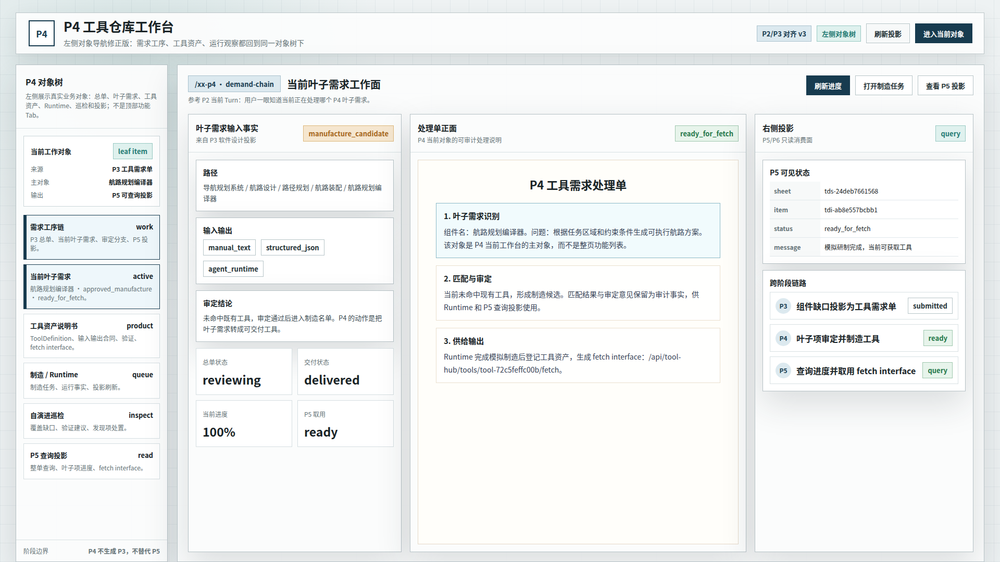
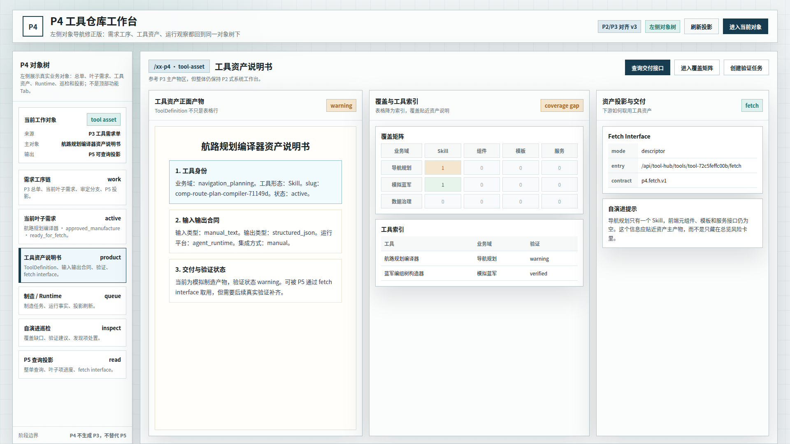
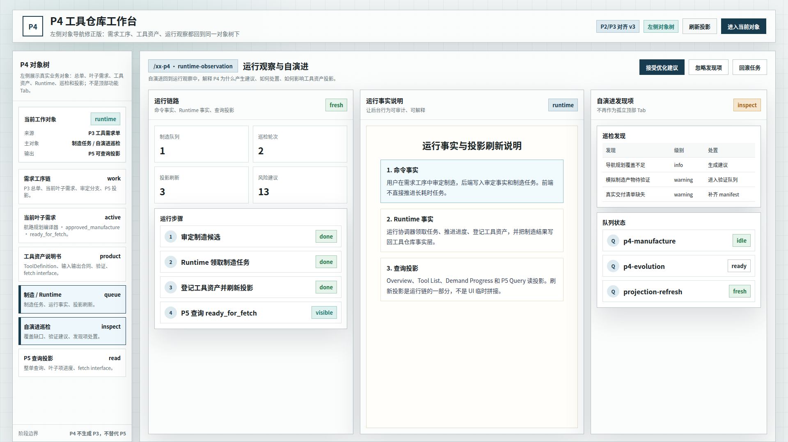

# CodeFactoryV2 P4 工具仓库左侧对象导航修正版 v3

生成时间：2026-05-13 00:23:07

- 文档角色：`P4 工具仓库` 新设计草案评审入口
- 版本目录：`DOC/CODEX_DOC/08_原型与附图/2026-05-13-002307-CodeFactoryV2-P4工具仓库左侧对象导航修正版-v3/`
- 当前状态：待用户确认
- 目标路由：后续可映射到 `/xx-p4` 或新版 P4 独立工作台
- 页面归属：`P4` 工具资产运营中台
- 页面主对象：`ToolDemandSheet`、`ToolDemandItem`、`ToolDefinition`、`ToolManufacturePlanView`、`EvolutionRun`、`ItemProgressView`
- 目标画板规格：三张评审图均为 `1920 x 1080`
- 源文件：`source/p4-left-object-nav-prototype.html`

## 1. 本版定位

本版回应用户对 `P4 v2` 的批注：v2 仍使用顶部横向 Tab，与 `P2`、`P3` 的左侧对象导航组织方式不一致，字体和系统工作台质感也没有充分贴近 P2/P3。

因此 v3 做结构性修正：

1. 取消顶部横向 Tab，不再把 P4 做成顶部功能页切换。
2. 改为左侧 `P4 对象树`：需求工序链、当前叶子需求、工具资产说明书、制造 / Runtime、自演进巡检、P5 查询投影都回到同一个左侧对象导航下。
3. 整体字体使用 P2 风格的无衬线工作台字体栈：`Noto Sans CJK SC`、`Microsoft YaHei`、`PingFang SC`、`sans-serif`。
4. P3 的纸面 / 主产物感只用于主区中的工具资产说明书、处理单、运行事实说明，不扩展为全页面风格。

## 2. 非目标

1. 不直接修改现有 React 实现。
2. 不把本版视为已批准 UI 标准。
3. 不重新定义 P4 后端对象模型。
4. 不新增超出现有 P4 能力边界的业务流程。
5. 不把 P2/P3 的业务对象照搬到 P4；只参考其页面组织形态和视觉约束。

## 3. 共用事实源与设计依据

| 事实源 | 对本版原型的约束 |
| --- | --- |
| 用户本轮批注 | P2/P3 的 Tab 页和功能区域规划不是顶部 Tab；P4 v3 必须先改成左侧导航，并重新分析字体和样式一致性 |
| `P2 Brainstorming Lab 原型 v2` | 左侧对象树是主导航；整体是硬边界、浅色系统工作台，无衬线中文字体 |
| `P3 Design Lab 原型 v1` | 左侧输入事实、右侧主产物与投影关系要分清；P3 的文档感适合主产物区，不适合全局替代 P2 工作台骨架 |
| `P4 运行态原型 v1` | 当前 P4 已有功能和数据关系必须保留，不做空想新系统 |
| `P4 P2/P3 对齐设计草案 v2` | v2 的对象归并方向可继承，但顶部横向 Tab 和风格不一致需要修正 |
| `P4-工具仓库设计.md` | P4 是工具资产运营中台，主链是 P3 需求单到 P5 可消费供给 |

## 4. 设计草案原则

本版把 v2 的对象型顶部 Tab 撤回为左侧对象导航。左侧不是功能菜单，而是 P4 当前工作对象树：

`需求工序链 -> 当前叶子需求 -> 工具资产说明书 -> 制造 / Runtime -> 自演进巡检 -> P5 查询投影`

调整理由：

1. P2 的核心不是“Tab 名称”，而是左侧对象树承载当前 Lab 对象；P4 应照此处理。
2. P3 的核心不是全局纸面风格，而是输入事实、正面产物和投影消费之间的清晰关系。
3. P4 已有实现包含需求链、工具资产、Runtime、自演进和 P5 投影，本版只重排表达形态，不发明新能力。
4. 顶部保留页面标题和主动作，不承担一级页面切换。

## 5. 画板规格与布局预算

| 区域 | 规格 / 预算 | 设计说明 |
| --- | --- | --- |
| 主画板 | `1920 x 1080` | 桌面整页设计草案 |
| 顶部栏 | 约 `80px` | 页面标题、版本状态、主动作；无顶部横向 Tab |
| 左侧对象树 | 约 `292px` | 借鉴 P2：真实业务对象树和当前工作对象，不是图号目录 |
| 主工作区 | 自适应主区 | 当前对象的处理面、正面产物和运行事实 |
| 右侧投影 / 发现区 | 约 `420px` | P5/P6 只读投影、跨阶段链路、运行发现和处置动作 |
| 主产物纸面区 | 局部使用 | 借鉴 P3 的产物说明感，仅用于文档式内容 |

## 6. 图文证据链

### 6.1 P4 左侧对象导航 - 当前叶子需求

**评阅状态：待用户确认**

**画板规格：** `1920 x 1080`

**设计依据：**

1. P2 左侧对象树要求用户先看见当前业务对象，而不是先看见顶部功能 Tab。
2. P4 的当前处理对象应是 `ToolDemandItem`，其上游来自 P3 工具需求单，下游投影到 P5。
3. 当前已有功能已经支持需求单、叶子项、审定分支、制造结果和 P5 查询投影。

**需要用户判断：**

1. 左侧对象树是否比顶部 Tab 更符合 P2/P3 的组织方式。
2. “当前叶子需求工作面”是否能作为 P4 日常主入口。

**允许偏差：**

- 真实实现可以调整左侧对象树密度。
- 操作按钮可随后端权限和接口成熟度调整。



### 6.2 P4 左侧对象导航 - 工具资产说明书

**评阅状态：待用户确认**

**画板规格：** `1920 x 1080`

**设计依据：**

1. P3 的软件设计说明是正面产物，不只是列表；P4 的 `ToolDefinition` 也应有正面产物表达。
2. P2 的全局工作台风格应继续保持，因此工具资产说明书只在主区局部呈现纸面感。
3. 当前实现已有 `ToolDefinition`、覆盖矩阵、fetch interface 和工具清单。

**需要用户判断：**

1. 是否认可“工具资产说明书”作为 P4 主产物表达。
2. 资产说明书、覆盖矩阵和 fetch interface 的三栏关系是否清楚。

**允许偏差：**

- 工具资产说明书可改为更正式的文档详情页。
- 工具清单仍可保留，但不应继续占据主表达权重。



### 6.3 P4 左侧对象导航 - 运行观察与自演进

**评阅状态：待用户确认**

**画板规格：** `1920 x 1080`

**设计依据：**

1. P4 设计文档强调后台运行时、制造队列、巡检和投影刷新是一套统一运行语义。
2. 用户批注指出 v2 结构先要对齐 P2/P3；本图将自演进巡检作为左侧对象树中的运行观察对象，而不是顶部独立 Tab。
3. 当前实现已有制造任务、巡检轮次、风险建议和投影刷新结果。

**需要用户判断：**

1. 自演进是否应该从独立主 Tab 降为运行观察对象的一部分。
2. 运行链路 + 巡检发现项 + 队列状态的组合是否足够解释 P4 的后台行为。

**允许偏差：**

- 真实实现可以把队列状态和发现项拆成二级视图。
- 回滚、忽略、接受建议的按钮是否开放取决于后端能力。



## 7. 原始材料说明

本版无外部原始图片。详见：

- `original/README.md`

本版参考的正式原型包：

- `DOC/CODEX_DOC/08_原型与附图/2026-05-01-123341-CodeFactoryV2-P2-Brainstorming-Lab原型-v2/`
- `DOC/CODEX_DOC/08_原型与附图/2026-05-01-192945-CodeFactoryV2-P3-Design-Lab原型-v1/`
- `DOC/CODEX_DOC/08_原型与附图/2026-05-12-210013-CodeFactoryV2-P4工具仓库运行态原型-v1/`
- `DOC/CODEX_DOC/08_原型与附图/2026-05-12-234921-CodeFactoryV2-P4工具仓库P2P3对齐设计草案-v2/`

## 8. 原型到实现映射

| 原型区块 | 当前实现来源 | 后续实现含义 |
| --- | --- | --- |
| 左侧 P4 对象树 | `P4ToolHubPage`、`P4InputChainWorkspace`、`P4EvolutionWorkspace` | 一级组织改成对象导航，替代顶部横向 Tab |
| 当前叶子需求工作面 | `P4InputChainWorkspace`、`P4SupplyResultPreview` | 以 `ToolDemandItem` 为主对象承载审定、匹配、制造和交付 |
| 工具资产说明书 | `P4RegistryWorkspace`、`getToolDefinitions` | 将 `ToolDefinition` 从表格行提升为 P4 正面产物 |
| 覆盖与工具索引 | `P4CoverageMatrix`、工具清单接口 | 贴近资产主产物，解释覆盖缺口 |
| 制造 / Runtime | `getManufacturePlans`、Runtime 协调器相关实现 | 将制造队列、运行事实、投影刷新统一展示 |
| 自演进巡检 | `P4EvolutionWorkspace` | 作为运行观察对象，不再作为顶部孤立功能页 |
| P5 查询投影 | `P5DemandQueryPanel`、P5 查询 API | 明确 P5/P6 只读消费边界 |

## 9. 允许偏差与不可接受偏差

允许偏差：

1. 后续实现可以继续复用 Ant Design 组件。
2. 左侧对象树可以在现有 `/xx-p4` 内渐进替换。
3. 当前数据 ID、示例工具名和指标可随运行态变化。
4. 主产物纸面区可在实现时替换为更正式的详情组件。

不可接受偏差：

1. 继续使用顶部横向 Tab 作为 P4 一级组织。
2. 继续把左侧对象树做成没有业务含义的图号目录。
3. 让工具资产继续只是表格行，而不是 P4 的正面产物。
4. 让 P4 主工作面脱离当前叶子需求对象。
5. 把自演进巡检做成和制造 / Runtime / 投影刷新无关的孤立页面。
6. 全局字体、间距和硬边界质感明显偏离 P2/P3 既有系统工作台。

## 10. 查看与再生成

直接打开源文件：

```bash
xdg-open DOC/CODEX_DOC/08_原型与附图/2026-05-13-002307-CodeFactoryV2-P4工具仓库左侧对象导航修正版-v3/source/p4-left-object-nav-prototype.html
```

重新生成三张评审图：

```bash
corepack pnpm --dir apps/web exec node \
  "$PWD/DOC/CODEX_DOC/08_原型与附图/2026-05-13-002307-CodeFactoryV2-P4工具仓库左侧对象导航修正版-v3/source/capture-p4-v3-prototype.mjs"
```

## 11. 自测结论与后续处理

已完成自测：

1. 截图脚本成功生成三张评审图。
2. 三张图片均为 `1920 x 1080`。
3. 已人工抽查截图，无错误页、顶部横向 Tab、明显重叠或主要裁切。
4. 三张图分别对应 `当前叶子需求`、`工具资产说明书`、`运行观察与自演进`，不是重复状态。

当前状态：`待用户确认`。

建议用户优先评审：

1. 左侧对象导航是否已经对齐 P2/P3。
2. P4 的字体、硬边界、主区纸面比例是否比 v2 更接近 P2/P3。
3. 是否可以把本版作为后续 P4 前端整改和设计文档回写依据。
