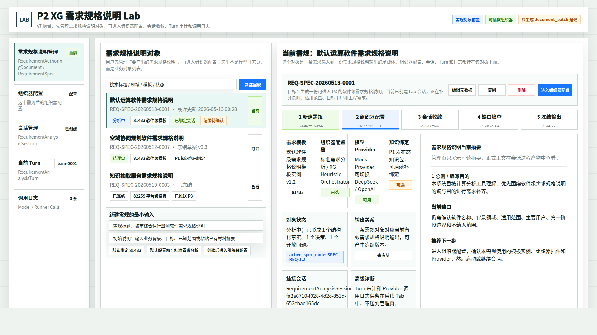
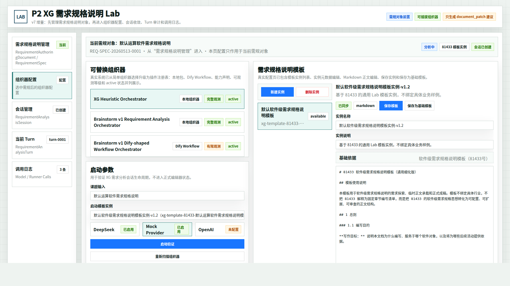
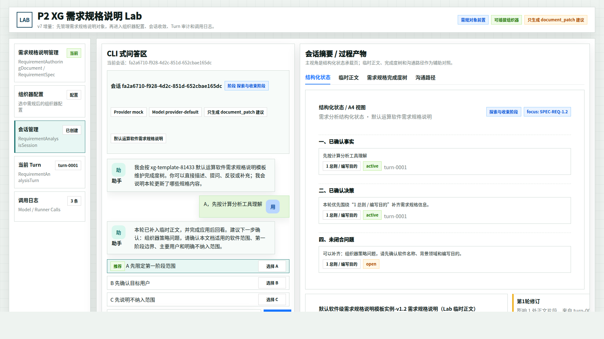
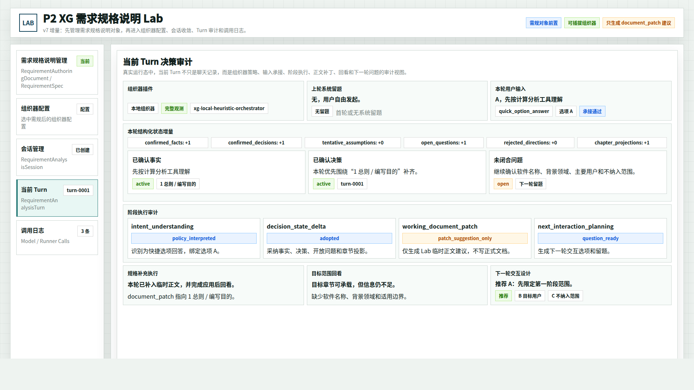
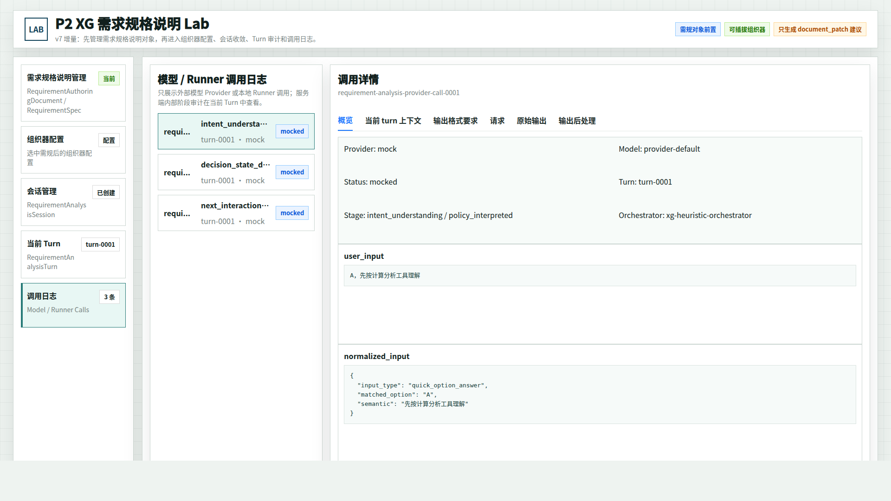

# CodeFactoryV2 P2 Brainstorming Lab 需规管理前置原型 v7

生成时间：2026-05-13 00:33:00

- 文档角色：`P2 Brainstorming Lab` 需规对象管理前置版原型评审入口
- 版本目录：`DOC/CODEX_DOC/08_原型与附图/2026-05-13-003300-CodeFactoryV2-P2-Brainstorming-Lab需规管理前置原型-v7/`
- 当前状态：待用户确认
- 目标路由：`/p2-requirement-analysis-lab` 或后续合并后的 P2 需求规格说明工作台入口
- 页面归属：`P2` 需求分析系统
- 源文件：`source/p2-brainstorming-lab-spec-management-prototype.html`

## 1. 本版定位

v7 在 v6 真实系统对齐版基础上增加一个新的第一 Tab：`需求规格说明管理`。

本版回应的用户判断是：用户首先要管理的是“需求规格说明”这个业务对象。新建、打开或编辑一个需规对象后，才进入当前已有的组织器配置、会话管理、当前 Turn 和调用日志。

因此 v7 不推翻 v6 的 Lab 结构，而是在它前面补一个对象管理层：

```text
需求规格说明管理 -> 组织器配置 -> 会话管理 -> 当前 Turn -> 调用日志
```

## 2. 设计判断

本版将对象层和运行层分开：

| 层级 | 设计含义 |
| --- | --- |
| 需求规格说明管理 | 用户侧业务对象。负责新建、打开、复制、删除、查看状态和进入配置 |
| 组织器配置 | 选中某个需规对象后，配置模板实例、组织器、Provider 和启动参数 |
| 会话管理 | 围绕当前需规对象进行 CLI 问答和过程产物查看 |
| 当前 Turn | 解释当前需规对象下某一轮为什么这样处理 |
| 调用日志 | 追溯当前需规对象下模型 Provider / Runner 调用证据 |

`需求规格说明` 不是单条聊天消息，也不是单个 Lab 会话。它是“一条需求输入到一份当前有效需求规格说明输出”的承载对象。

## 3. 继承关系

v7 继承 v6：

- 保留真实系统的顶部栏和左侧 Tab 结构。
- 保留组织器配置页复杂度。
- 保留会话过程产物、当前 Turn 审计和调用日志。
- 只新增第一个 Tab，并在组织器配置页顶部增加当前需规对象上下文。

v7 修正 v6 的一个产品层缺口：v6 能解释真实 Lab 怎么运行，但没有解释用户从哪个“需规对象”开始工作。

## 4. 评审图

### 4.1 需求规格说明管理 Tab

- 评阅状态：待用户确认
- 画板规格：`1920 x 1080`
- 设计依据：用户明确要求最上面先有需规管理，能够新建需求规格说明，然后进入或编辑，再进入当前组织器配置流程
- 需要用户判断的问题：这个 Tab 是否应作为 P2 Lab 的第一 Tab，还是未来应成为独立 P2 首页
- 允许偏差：字段名、状态名、按钮文案可调整
- 不可接受偏差：不能让用户仍然从组织器配置开始创建工作对象



### 4.2 组织器配置 Tab - 选中需规后

- 评阅状态：待用户确认
- 画板规格：`1920 x 1080`
- 设计依据：组织器配置仍保持 v6 的真实系统复杂度，但顶部增加当前需规对象上下文，说明配置作用于哪个需规对象
- 需要用户判断的问题：顶部对象上下文是否足以表达“从需规管理进入配置”
- 允许偏差：上下文条的信息密度可调整
- 不可接受偏差：不能把配置页重新简化成单一组织器选择



### 4.3 会话管理 Tab - 结构化状态

- 评阅状态：待用户确认
- 画板规格：`1920 x 1080`
- 设计依据：会话仍沿用 v6 真实系统视图，表示当前需规对象下的会话收敛过程
- 需要用户判断的问题：后续是否也需要在会话页顶部补当前需规对象上下文
- 允许偏差：会话 id、模板 id、turn id 可随真实数据变化
- 不可接受偏差：不能把结构化状态、临时正文、完成度树和沟通路径合并成普通摘要



### 4.4 当前 Turn Tab

- 评阅状态：待用户确认
- 画板规格：`1920 x 1080`
- 设计依据：当前 Turn 仍作为当前需规对象下的单轮审计视图
- 需要用户判断的问题：需规对象 id 是否也应进入 Turn 审计头部
- 允许偏差：审计块顺序可随实现协议微调
- 不可接受偏差：不能把 Turn 审计降级成普通聊天记录



### 4.5 调用日志 Tab

- 评阅状态：待用户确认
- 画板规格：`1920 x 1080`
- 设计依据：调用日志仍保留 v6 的 Provider / Runner 调用边界，挂在当前需规对象和会话之下
- 需要用户判断的问题：日志列表是否需要增加需规对象列或过滤器
- 允许偏差：日志条数、阶段名、Provider 可随真实运行变化
- 不可接受偏差：不能把服务端内部审计和 Provider 调用日志混在一起



## 5. 原型到实现映射

| 原型区块 | 实现含义 |
| --- | --- |
| 需求规格说明管理 Tab | 新增的用户侧对象入口；可映射到 `RequirementAuthoringDocument` / `RequirementSpec` / 未来 `RequirementAnalysisWorkItem` |
| 新建需规 | 创建业务对象，并默认绑定模板实例和配置档 |
| 当前需规对象 | 选中对象后，后续配置、会话、Turn、日志都围绕该对象展开 |
| 进入组织器配置 | 从对象层进入 v6 已有 Lab 配置层 |
| 配置页顶部上下文 | 表明配置作用于当前需规对象，而不是全局配置 |
| 会话 / Turn / 日志 | 继续复用 v6 真实运行系统结构 |

## 6. 非目标

1. 本版不决定是否合并 `/requirement-authoring` 和 `/p2-requirement-analysis-lab`。
2. 本版不改真实代码。
3. 本版不回写主设计文档。
4. 本版不删除 v6 的组织器配置、会话、Turn 和调用日志结构。

## 7. 查看与再生成

打开源文件：

```bash
xdg-open DOC/CODEX_DOC/08_原型与附图/2026-05-13-003300-CodeFactoryV2-P2-Brainstorming-Lab需规管理前置原型-v7/source/p2-brainstorming-lab-spec-management-prototype.html
```

重新生成首图：

```bash
base="$PWD/DOC/CODEX_DOC/08_原型与附图/2026-05-13-003300-CodeFactoryV2-P2-Brainstorming-Lab需规管理前置原型-v7"
google-chrome --headless=new --disable-gpu --no-sandbox --window-size=1920,1080 \
  --screenshot="$base/01-1920x1080-需求规格说明管理Tab.png" \
  "file://$base/source/p2-brainstorming-lab-spec-management-prototype.html#spec"
```

将 `#spec` 替换为 `#config`、`#session`、`#turn`、`#log` 可生成其余状态。

## 8. 评审结论与后续处理

当前结论：`待用户确认`。

如果用户确认 v7 方向，下一步再讨论是否把“需求规格说明管理”并入当前 Lab，还是独立成 P2 首页并从首页跳转到 Lab 高级诊断。
