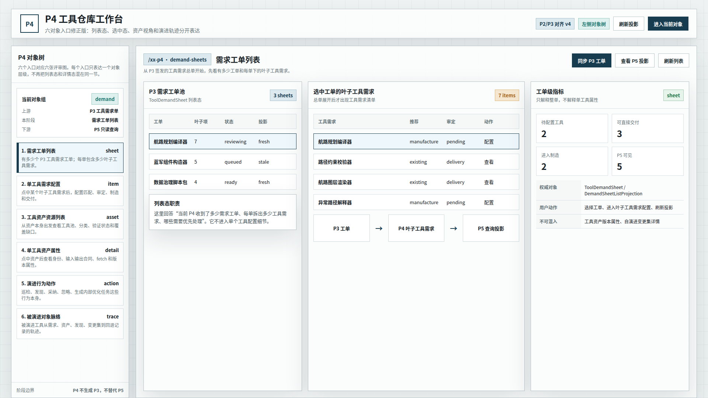
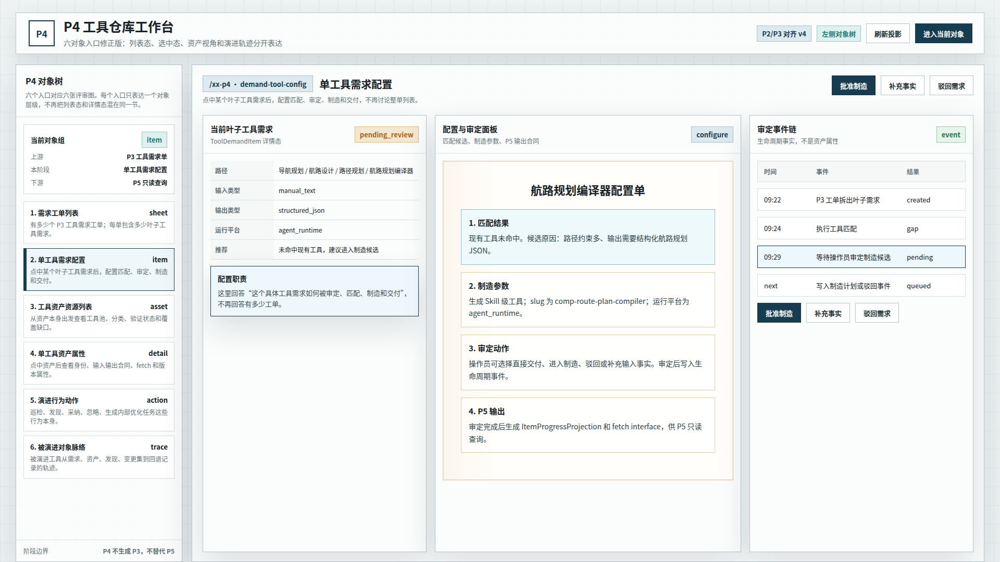
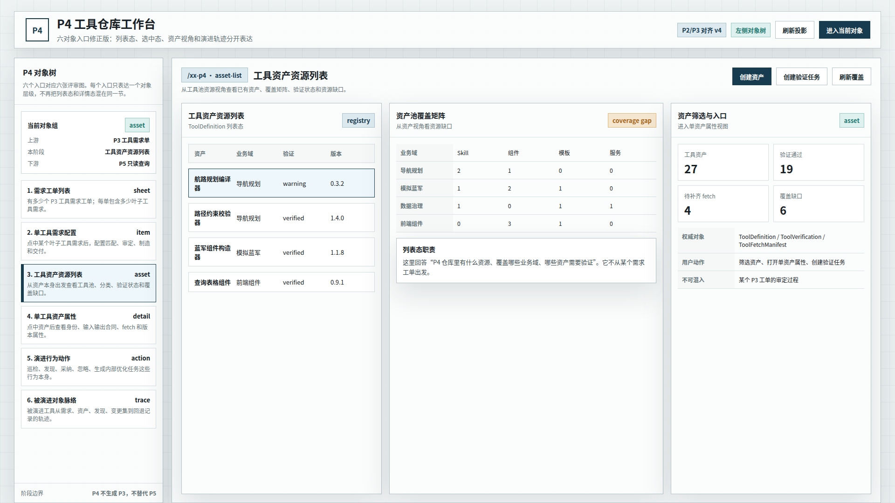
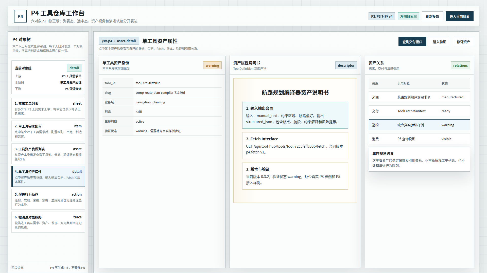
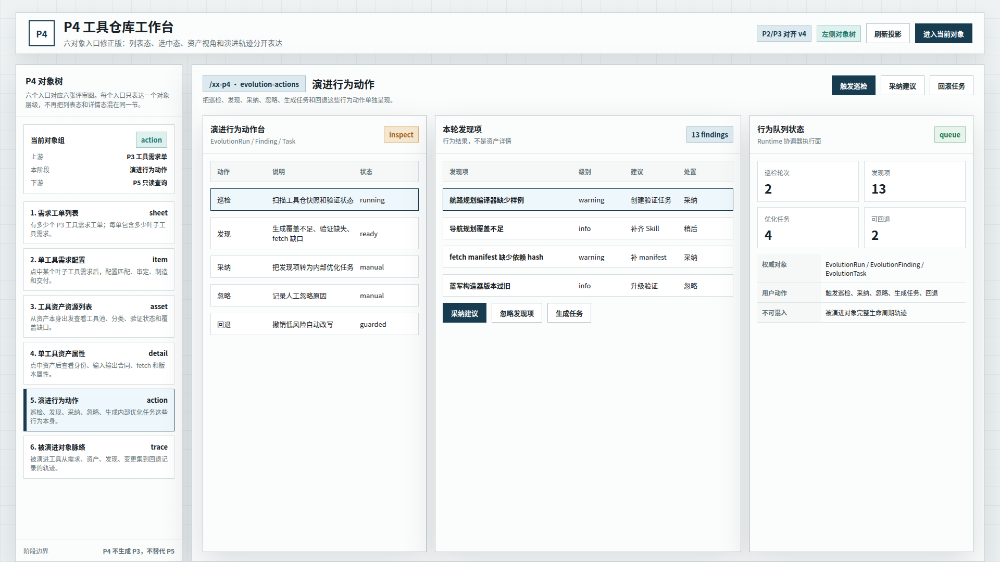
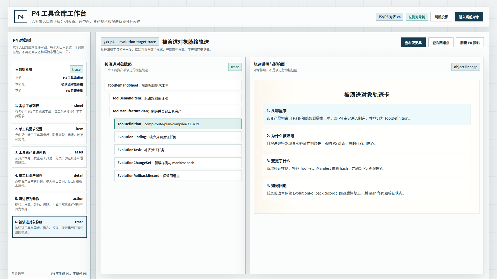

# CodeFactoryV2 P4 工具仓库六对象入口修正版 v4

生成时间：2026-05-13 00:44:15

- 文档角色：`P4 工具仓库` 六对象入口设计草案评审入口
- 版本目录：`DOC/CODEX_DOC/08_原型与附图/2026-05-13-004415-CodeFactoryV2-P4工具仓库六对象入口修正版-v4/`
- 当前状态：待用户确认
- 目标路由：后续可映射到 `/xx-p4` 或新版 P4 独立工作台
- 页面归属：`P4` 工具资产运营中台
- 页面主对象：`ToolDemandSheet`、`ToolDemandItem`、`ToolDefinition`、`ToolFetchManifest`、`EvolutionRun`、`EvolutionFinding`、`EvolutionTask`、`EvolutionChangeSet`、`EvolutionRollbackRecord`
- 目标画板规格：六张评审图均为 `1920 x 1080`
- 源文件：`source/p4-six-object-entry-prototype.html`

## 1. 本版定位

本版回应用户对 `P4 v3` 的批注：v3 左侧有 6 个入口，但第六章和评审图只按 3 个粗状态解释，无法说明每个入口的对象关系。

因此 v4 不再用三张图概括 P4，而是按 6 个左侧对象入口拆成 6 张评审图：

1. 需求工单列表。
2. 单工具需求配置。
3. 工具资产资源列表。
4. 单工具资产属性。
5. 演进行为动作。
6. 被演进对象脉络轨迹。

本版继续继承 v3 的正确修正：左侧对象导航、P2 风格无衬线工作台、P3 主产物纸面感只用于局部产物说明区。

## 2. 非目标

1. 不直接修改现有 React 实现。
2. 不把本版视为已批准 UI 标准。
3. 不重新定义 P4 后端对象模型。
4. 不新增超出现有 P4 能力边界的业务流程。
5. 不把 P2/P3 的业务对象照搬到 P4；只参考其页面组织形态和视觉约束。

## 3. 共用事实源与设计依据

| 事实源 | 对本版原型的约束 |
| --- | --- |
| 用户本轮批注 | 六个左侧入口必须有清楚对应关系；需求、资产、演进都要区分列表态和选中态 / 行为态和对象轨迹 |
| `P2 Brainstorming Lab 原型 v2` | 左侧对象树是主导航；整体是硬边界、浅色系统工作台，无衬线中文字体 |
| `P3 Design Lab 原型 v1` | 输入事实、正面产物和投影关系要分清；纸面感用于主产物说明 |
| `P4-工具仓库设计.md` | 正式对象包括需求单、叶子需求、工具资产、制造交付、自演进对象、运行对象和查询投影 |
| `P4 左侧对象导航修正版 v3` | 左侧导航方向成立，但粒度过粗，被 v4 替代 |

## 4. 六对象入口组织原则

v4 的左侧入口不是普通功能菜单，而是 P4 工作对象的六个观察层级。

| 入口 | 对象层级 | 说明 |
| --- | --- | --- |
| 需求工单列表 | `ToolDemandSheet` 列表态 | 回答 P4 当前收到多少 P3 工单、每单有多少叶子工具需求 |
| 单工具需求配置 | `ToolDemandItem` 详情态 | 点中某个工具需求后，配置匹配、审定、制造和交付 |
| 工具资产资源列表 | `ToolDefinition` 列表态 | 从资产本身出发，看仓库里有什么资源、覆盖哪些业务域 |
| 单工具资产属性 | `ToolDefinition` 详情态 | 点中某个资产后，看身份、输入输出合同、fetch、版本、验证和引用关系 |
| 演进行为动作 | `EvolutionRun / Finding / Task` 行为态 | 表达巡检、发现、采纳、忽略、生成任务和回退这些动作 |
| 被演进对象脉络轨迹 | 被演进 `ToolDefinition` 的对象轨迹 | 从被演进对象出发追踪需求、资产、发现、变更集和回退记录 |

## 5. 画板规格与布局预算

| 区域 | 规格 / 预算 | 设计说明 |
| --- | --- | --- |
| 主画板 | `1920 x 1080` | 桌面整页设计草案 |
| 顶部栏 | 约 `80px` | 页面标题、版本状态、主动作；无顶部横向 Tab |
| 左侧对象树 | 约 `320px` | 六个对象入口稳定存在，并与六张评审图一一对应 |
| 主工作区 | 自适应主区 | 按当前入口切换列表、详情、行为或轨迹表达 |
| 右侧投影 / 指标区 | 约 `430px` | 只表达当前入口的指标、边界或操作，不混入其他对象层级 |
| 主产物纸面区 | 局部使用 | 只用于配置单、资产说明书、对象轨迹说明等文档式内容 |

## 6. 图文证据链

### 6.1 需求工单列表

**评阅状态：待用户确认**

**画板规格：** `1920 x 1080`

**设计依据：**

1. 用户明确指出第一层应先有需求列表，即有多少个需求工单。
2. `P4-工具仓库设计.md` 将 `ToolDemandSheet` 定义为来自 P3 的工具需求总单。
3. 该入口只表达整单列表和每单叶子工具需求概况，不进入单个工具配置细节。

**需要用户判断：**

1. “P3 需求工单池 -> 选中工单的叶子工具需求”是否清楚。
2. 该图是否足够表达需求工单列表态。



### 6.2 单工具需求配置

**评阅状态：待用户确认**

**画板规格：** `1920 x 1080`

**设计依据：**

1. 用户指出每个工单点开后会对应很多工具，某个具体工具需要做配置。
2. `ToolDemandItem` 是进入 P4 实际处理的叶子工具需求项。
3. 该入口聚焦匹配、审定、制造参数、P5 输出和生命周期事件链。

**需要用户判断：**

1. “单工具需求配置”是否与“需求工单列表”分得足够清楚。
2. 配置单是否覆盖匹配、审定、制造和交付这四个核心动作。



### 6.3 工具资产资源列表

**评阅状态：待用户确认**

**画板规格：** `1920 x 1080`

**设计依据：**

1. 用户指出工具资产说明书前面也应先有工具资产的资源列表。
2. `ToolDefinition` 是工具资产定义、形态、分类、输入输出、宿主约束和版本的权威对象。
3. 该入口从资产池视角表达工具资源、业务域、验证状态和覆盖缺口，不从需求工单出发。

**需要用户判断：**

1. 工具资产列表和覆盖矩阵是否足够表达资产池资源视角。
2. 该入口是否应作为进入单资产属性的前置页面。



### 6.4 单工具资产属性

**评阅状态：待用户确认**

**画板规格：** `1920 x 1080`

**设计依据：**

1. 用户指出点中某个资产之后，应从资产本身视角查看属性，而不是继续从需求层面出发。
2. `ToolDefinition`、`ToolVerification` 和 `ToolFetchManifest` 共同构成资产详情表达。
3. 本图把输入输出合同、fetch interface、版本验证和引用关系作为单资产属性表达。

**需要用户判断：**

1. “资产属性说明书”是否已经摆脱需求配置视角。
2. 资产关系区是否能解释来源、交付、巡检和消费引用。



### 6.5 演进行为动作

**评阅状态：待用户确认**

**画板规格：** `1920 x 1080`

**设计依据：**

1. 用户指出演进也要区分：一部分是演进行为动作本身。
2. `EvolutionRun`、`EvolutionFinding`、`EvolutionTask` 是自演进巡检模块的行为对象。
3. 本图只表达触发巡检、发现、采纳、忽略、生成任务、回退这些动作和队列，不讲某个对象的完整轨迹。

**需要用户判断：**

1. 演进行为动作是否应该独立于被演进对象轨迹。
2. 行为队列是否能解释自演进不是孤立页面，而是 P4 内部治理动作。



### 6.6 被演进对象脉络轨迹

**评阅状态：待用户确认**

**画板规格：** `1920 x 1080`

**设计依据：**

1. 用户指出另一部分应是被演进对象的脉络和轨迹。
2. `EvolutionChangeSet` 与 `EvolutionRollbackRecord` 需要绑定具体被演进对象，否则无法解释变更影响。
3. 本图从被演进工具资产出发，串联需求、制造、资产、发现、任务、变更集和回退记录。

**需要用户判断：**

1. 该轨迹是否足够解释“这个工具为什么被演进、变了什么、如何回退”。
2. 被演进对象轨迹是否应该与演进行为按钮区分开。



## 7. 原始材料说明

本版无外部原始图片。详见：

- `original/README.md`

本版来自 v3 批注修正。详见：

- `REVIEW_RESPONSE.md`

## 8. 原型到实现映射

| v4 入口 | 当前实现来源 | 后续实现含义 |
| --- | --- | --- |
| 需求工单列表 | `P4DemandSheetTree`、`P4InputChainWorkspace`、需求单查询接口 | 从整单列表进入某个工单，而不是直接跳到工具详情 |
| 单工具需求配置 | `P4DemandItemBoard`、`P4SupplyResultPreview`、审定接口 | 以 `ToolDemandItem` 为主对象承载匹配、审定、制造和交付 |
| 工具资产资源列表 | `P4RegistryWorkspace`、`P4CoverageMatrix`、工具资产查询接口 | 从资产池视角管理工具资源和覆盖缺口 |
| 单工具资产属性 | `P4RegistryWorkspace`、`getToolDefinitions`、fetch manifest 查询 | 将 `ToolDefinition` 详情做成资产正面产物 |
| 演进行为动作 | `P4EvolutionWorkspace`、巡检配置和发现项决策接口 | 将巡检、发现、采纳、忽略、任务和回退作为行为工作台 |
| 被演进对象脉络轨迹 | `P4EvolutionWorkspace`、资产详情、生命周期事件、回退记录 | 将被演进对象的来源、变更和影响串成可审计轨迹 |

## 9. 允许偏差与不可接受偏差

允许偏差：

1. 后续实现可以继续复用 Ant Design 组件。
2. 六个入口可以在现有 `/xx-p4` 内渐进替换。
3. 当前数据 ID、示例工具名和指标可随运行态变化。
4. 主产物纸面区可在实现时替换为更正式的详情组件。

不可接受偏差：

1. 继续用 3 张粗状态图解释 6 个左侧入口。
2. 把需求工单列表和单工具需求配置混成同一对象层级。
3. 把工具资产资源列表和单资产属性混成同一对象层级。
4. 把演进行为动作和被演进对象轨迹混成同一对象层级。
5. 继续使用顶部横向 Tab 作为 P4 一级组织。
6. 全局字体、间距和硬边界质感明显偏离 P2/P3 既有系统工作台。

## 10. 查看与再生成

直接打开源文件：

```bash
xdg-open DOC/CODEX_DOC/08_原型与附图/2026-05-13-004415-CodeFactoryV2-P4工具仓库六对象入口修正版-v4/source/p4-six-object-entry-prototype.html
```

重新生成六张评审图：

```bash
corepack pnpm --dir apps/web exec node \
  "$PWD/DOC/CODEX_DOC/08_原型与附图/2026-05-13-004415-CodeFactoryV2-P4工具仓库六对象入口修正版-v4/source/capture-p4-v4-prototype.mjs"
```

## 11. 自测结论与后续处理

已完成自测：

1. 截图脚本成功生成六张评审图。
2. 六张图片均为 `1920 x 1080`。
3. 已人工抽查截图，无错误页、顶部横向 Tab、明显重叠或主要裁切。
4. 六张图分别对应左侧六个对象入口，不再用三张图概括六个入口。

当前状态：`待用户确认`。

建议用户优先评审：

1. 六个左侧入口与六张图的一一对应是否成立。
2. 需求侧、资产侧、演进侧的列表态 / 详情态 / 行为态 / 轨迹态是否分清。
3. 是否可以把本版作为后续 P4 前端整改和设计文档回写依据。
