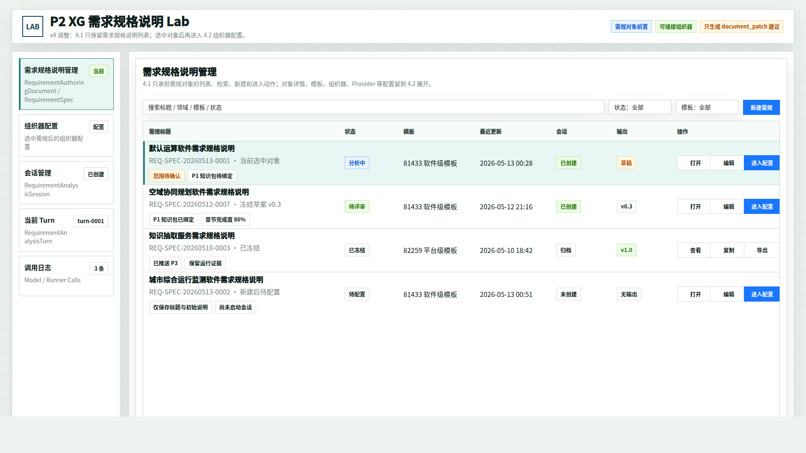
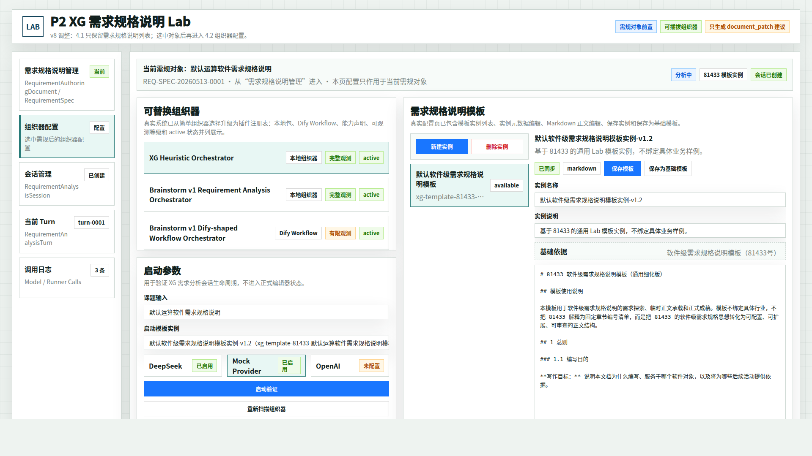
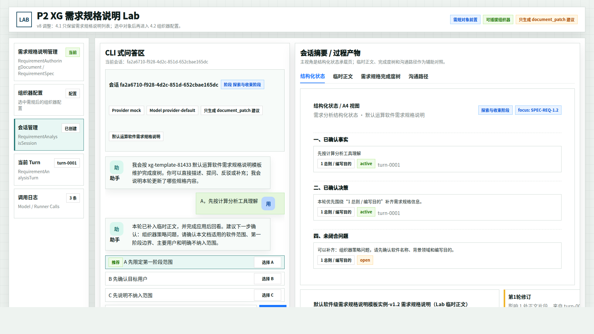
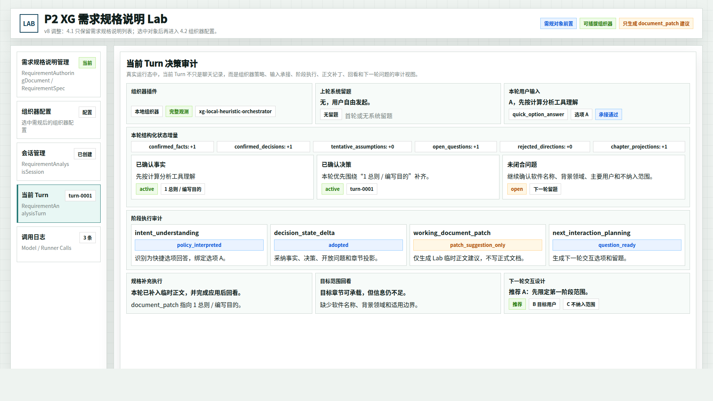
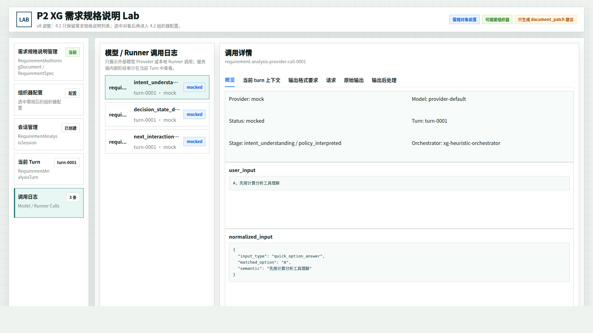

# CodeFactoryV2 P2 Brainstorming Lab 需规列表简化原型 v8

生成时间：2026-05-13 00:58:00

- 文档角色：`P2 Brainstorming Lab` 需规对象列表简化版原型评审入口
- 版本目录：`DOC/CODEX_DOC/08_原型与附图/2026-05-13-005800-CodeFactoryV2-P2-Brainstorming-Lab需规列表简化原型-v8/`
- 当前状态：待用户确认
- 目标路由：`/p2-requirement-analysis-lab` 或后续 P2 需求规格说明工作台入口
- 页面归属：`P2` 需求分析系统
- 页面主对象：需求规格说明对象列表
- 目标画板规格：`1920 x 1080`
- 源文件：`source/p2-brainstorming-lab-spec-list-prototype.html`

## 1. 本版定位

v8 继承 v7 的方向：P2 Lab 的最前面需要出现 `需求规格说明管理`，让用户先新建、打开或编辑一份需求规格说明，再进入组织器配置、会话、当前 Turn 和调用日志。

本版只吸收用户对 v7 的收敛批注：4.1 不需要右侧“当前需规”详情配置，也不在本轮强行合并 4.1 与 4.2。4.1 只作为需规列表页，负责检索、筛选、新建、打开、编辑和进入配置。

```text
4.1 需求规格说明管理：列表入口
4.2 组织器配置：选中需规对象后的配置工作台
4.3 会话管理：围绕当前需规对象继续收敛
4.4 当前 Turn：单轮审计
4.5 调用日志：Provider / Runner 调用证据
```

## 2. 本轮设计判断

| 区域 | v8 处理 |
| --- | --- |
| 4.1 需求规格说明管理 | 单栏列表页，不展示当前需规详情配置 |
| 右侧当前需规面板 | 从 4.1 移除，避免把配置层提前塞入管理页 |
| 新建需规 | 保留为列表页主按钮；具体模板、组织器、Provider 在 4.2 确认 |
| 进入配置 | 保留为行内主动作，表达从业务对象进入 Lab 配置层 |
| 4.2 组织器配置 | 继续沿用 v7 / v6 的复杂组织器配置，不因 4.1 简化而回退 |

## 3. 继承关系

v8 继承 v7：

- 保留 `需求规格说明管理` 作为第一 Tab。
- 保留左侧导航顺序：需求规格说明管理、组织器配置、会话管理、当前 Turn、调用日志。
- 保留组织器配置页的真实系统复杂度。
- 保留配置页顶部当前需规对象上下文。

v8 修正 v7：

- 4.1 从“双栏对象管理 + 当前需规详情”改为“单栏需规列表”。
- 4.1 不再展示模板绑定、组织器配置档、Provider、知识绑定、会话摘要等详情。
- 本轮不讨论是否把 4.1 和 4.2 合并为一个页面。

## 4. 图文证据链

### 4.1 需求规格说明管理 Tab

- 评阅状态：待用户确认
- 画板规格：`1920 x 1080`
- 设计依据：用户明确要求“4.1 用第一页就行”“简单一点，就是需规的列表就行”“右侧当前需规先移除”
- 需要用户判断的问题：4.1 作为纯列表入口的字段密度和行内动作是否合适
- 允许偏差：列表字段、筛选项、行内按钮文案可调整
- 不可接受偏差：4.1 不应再次出现右侧当前需规详情配置，也不应把组织器配置内容提前合并进来



### 4.2 组织器配置 Tab - 选中需规后

- 评阅状态：待用户确认
- 画板规格：`1920 x 1080`
- 设计依据：用户只要求简化 4.1，并未要求降低当前真实系统的组织器配置复杂度；4.2 继续表达插件注册表、模板、Provider 和运行配置
- 需要用户判断的问题：4.2 顶部保留当前需规对象上下文是否足够
- 允许偏差：上下文条字段可调整
- 不可接受偏差：不能把组织器配置页简化回单一选择器



### 4.3 会话管理 Tab - 结构化状态

- 评阅状态：待用户确认
- 画板规格：`1920 x 1080`
- 设计依据：会话页继续沿用 v6 真实系统视图，表示当前需规对象下的会话收敛过程
- 需要用户判断的问题：后续是否也需要在会话页顶部补当前需规对象上下文
- 允许偏差：会话 id、模板 id、turn id 可随真实数据变化
- 不可接受偏差：不能把结构化状态、临时正文、完成度树和沟通路径合并成普通摘要



### 4.4 当前 Turn Tab

- 评阅状态：待用户确认
- 画板规格：`1920 x 1080`
- 设计依据：当前 Turn 仍作为当前需规对象下的单轮审计视图
- 需要用户判断的问题：需规对象 id 是否也应进入 Turn 审计头部
- 允许偏差：审计块顺序可随实现协议微调
- 不可接受偏差：不能把 Turn 审计降级成普通聊天记录



### 4.5 调用日志 Tab

- 评阅状态：待用户确认
- 画板规格：`1920 x 1080`
- 设计依据：调用日志仍保留 v6 的 Provider / Runner 调用边界，挂在当前需规对象和会话之下
- 需要用户判断的问题：日志列表是否需要增加需规对象列或过滤器
- 允许偏差：日志条数、阶段名、Provider 可随真实运行变化
- 不可接受偏差：不能把服务端内部审计和 Provider 调用日志混在一起



## 5. 原始材料说明

本版没有新增外部原始图片。`original/README.md` 记录继承事实源和用户批注来源。

## 6. 原型到实现映射

| 原型区块 | 实现含义 |
| --- | --- |
| 需求规格说明管理 Tab | 用户侧业务对象列表；可映射到 `RequirementAuthoringDocument` / `RequirementSpec` / 未来 `RequirementAnalysisWorkItem` |
| 新建需规 | 创建业务对象，只收最小输入；后续配置在 4.2 完成 |
| 打开 / 编辑 | 进入对象查看或元数据编辑；不在 4.1 展开组织器配置 |
| 进入配置 | 从选中需规对象进入 4.2 组织器配置 |
| 配置页顶部上下文 | 表明配置作用于当前需规对象，而不是全局配置 |
| 会话 / Turn / 日志 | 继续复用 v6 真实运行系统结构 |

## 7. 非目标

1. 本版不决定是否合并 4.1 和 4.2。
2. 本版不决定是否把需规管理做成独立 P2 首页。
3. 本版不改真实代码。
4. 本版不回写主设计文档。
5. 本版不删除 v6 / v7 的组织器配置、会话、Turn 和调用日志结构。

## 8. 允许偏差与不可接受偏差

允许偏差：

- 列表字段可随真实数据模型调整。
- 状态名、模板名、按钮文案可随产品术语统一。
- 行高和列宽可在实现中按浏览器字体自然微调。

不可接受偏差：

- 4.1 再次出现右侧当前需规详情配置。
- 4.1 把模板、组织器、Provider、知识绑定等 4.2 内容合并展示成详情工作台。
- 组织器配置页被回退成过度简化的单一选择页。

## 9. 查看与再生成

打开源文件：

```bash
xdg-open DOC/CODEX_DOC/08_原型与附图/2026-05-13-005800-CodeFactoryV2-P2-Brainstorming-Lab需规列表简化原型-v8/source/p2-brainstorming-lab-spec-list-prototype.html
```

重新生成首图：

```bash
base="$PWD/DOC/CODEX_DOC/08_原型与附图/2026-05-13-005800-CodeFactoryV2-P2-Brainstorming-Lab需规列表简化原型-v8"
google-chrome --headless=new --disable-gpu --no-sandbox --window-size=1920,1080 \
  --screenshot="$base/01-1920x1080-需求规格说明管理Tab.png" \
  "file://$base/source/p2-brainstorming-lab-spec-list-prototype.html#spec"
```

将 `#spec` 替换为 `#config`、`#session`、`#turn`、`#log` 可生成其余状态。

## 10. 评审结论与后续处理

当前结论：`待用户确认`。

如果 v8 的 4.1 列表方向成立，后续再单独讨论是否需要把 4.1 做成独立 P2 首页，或是否在未来某一版合并 4.1 与 4.2。
