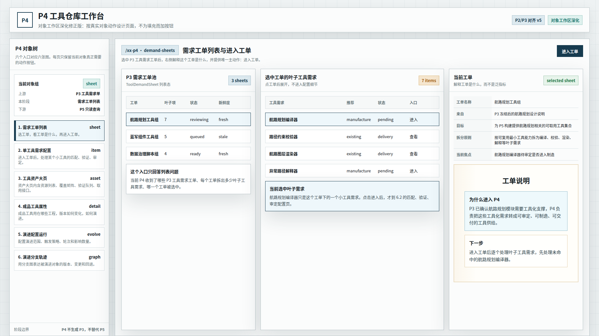
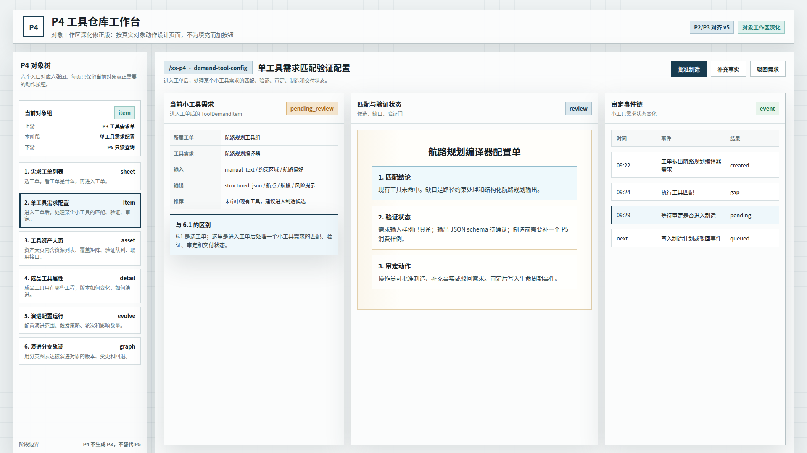
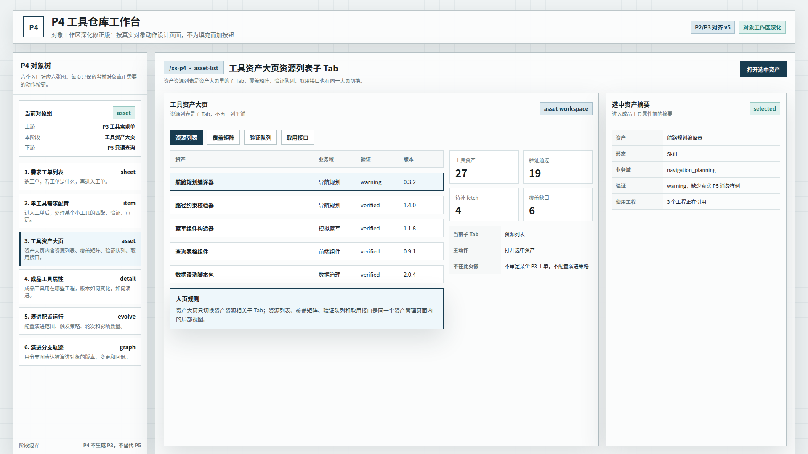
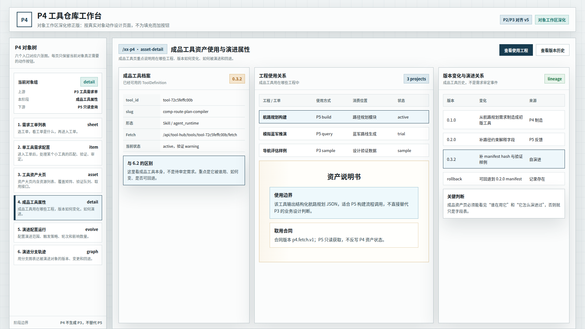
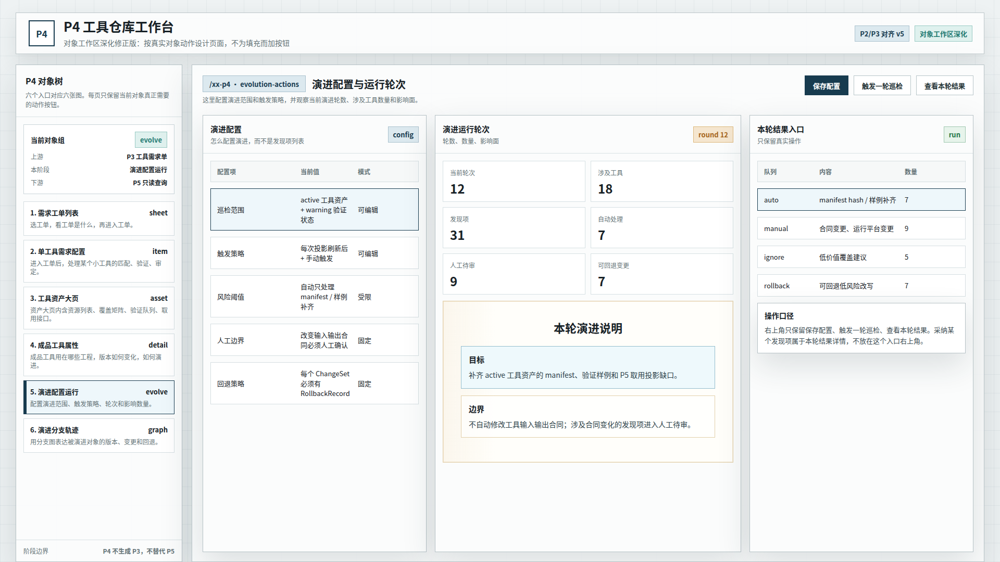
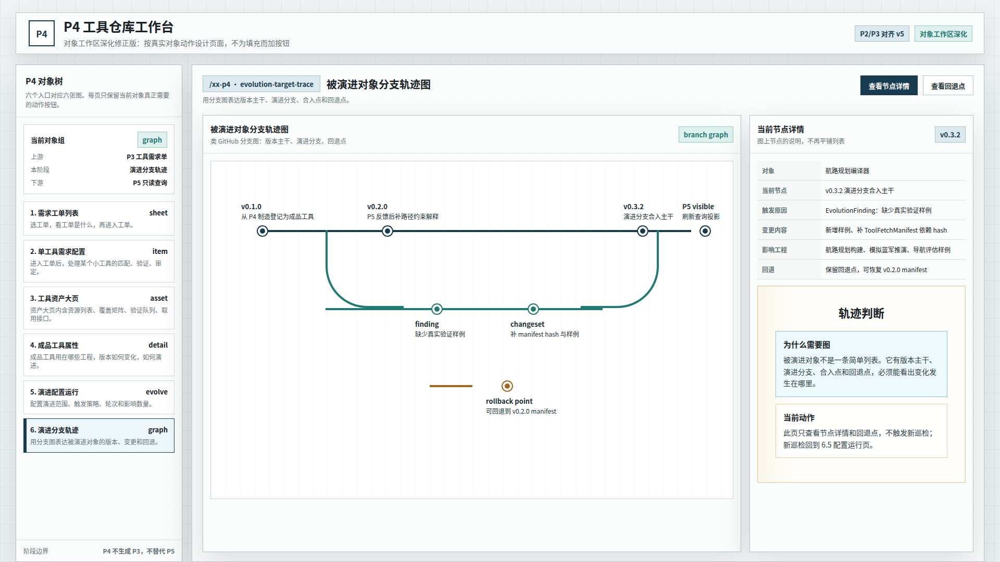

# CodeFactoryV2 P4 工具仓库对象工作区深化修正版 v5

生成时间：2026-05-13 01:07:20

- 文档角色：`P4 工具仓库` 对象工作区深化设计草案评审入口
- 版本目录：`DOC/CODEX_DOC/08_原型与附图/2026-05-13-010720-CodeFactoryV2-P4工具仓库对象工作区深化修正版-v5/`
- 当前状态：待用户确认
- 目标路由：后续可映射到 `/xx-p4` 或新版 P4 独立工作台
- 页面归属：`P4` 工具资产运营中台
- 页面主对象：`ToolDemandSheet`、`ToolDemandItem`、`ToolDefinition`、`ToolFetchManifest`、`EvolutionRun`、`EvolutionFinding`、`EvolutionTask`、`EvolutionChangeSet`、`EvolutionRollbackRecord`
- 目标画板规格：六张评审图均为 `1920 x 1080`
- 源文件：`source/p4-object-workspace-deepened-prototype.html`

## 1. 本版定位

本版回应用户对 `P4 v4` 的批注：v4 虽然拆出 6 个入口，但多个工作区仍在套同一种三列模板，右上角按钮存在为填充而添加的问题。

因此 v5 按对象真实工作方式重做：

1. `6.1` 改成需求工单列表与当前工单进入面。
2. `6.3` 改成资产大页内部子 Tab。
3. `6.4` 改成成品工具使用工程、版本变化和演进关系。
4. `6.5` 改成演进配置、运行轮次和影响数量。
5. `6.6` 改成类似 GitHub 分支的版本 / 演进 / 回退轨迹图。
6. 所有右上角按钮按当前对象真实动作收敛，删除无明确业务语义的按钮。

## 2. 非目标

1. 不直接修改现有 React 实现。
2. 不把本版视为已批准 UI 标准。
3. 不重新定义 P4 后端对象模型。
4. 不新增超出现有 P4 能力边界的业务流程。
5. 不把 P2/P3 的业务对象照搬到 P4；只参考其页面组织形态和视觉约束。

## 3. 共用事实源与设计依据

| 事实源 | 对本版原型的约束 |
| --- | --- |
| 用户本轮批注 | 工作区必须按对象真实动作设计，不应套模板；按钮必须有业务必要性 |
| `P2 Brainstorming Lab 原型 v2` | 左侧对象树是主导航；整体是硬边界、浅色系统工作台，无衬线中文字体 |
| `P3 Design Lab 原型 v1` | 输入事实、正面产物和投影关系要分清；纸面感用于主产物说明 |
| `P4-工具仓库设计.md` | 正式对象包括需求单、叶子需求、工具资产、制造交付、自演进对象、运行对象和查询投影 |
| `P4 六对象入口修正版 v4` | 六入口方向成立，但工作区结构和按钮语义过粗，被 v5 深化 |

## 4. 对象工作区原则

v5 的核心原则是：每个入口必须回答当前对象自己的问题，只保留当前对象真正需要的动作。

| 入口 | 工作区回答的问题 | 右上角动作原则 |
| --- | --- | --- |
| 需求工单列表 | 当前有哪些 P3 工单，选中工单是什么，如何进入工单 | 只保留 `进入工单` |
| 单工具需求配置 | 一个小工具需求如何匹配、验证、审定、制造或驳回 | 保留审定动作 |
| 工具资产大页 | 工具资产资源如何按资源、覆盖、验证、取用接口管理 | 只保留打开选中资产 |
| 成品工具属性 | 成品工具用在哪些工程、版本如何变化、如何演进和回退 | 查看使用工程、查看版本历史 |
| 演进配置运行 | 演进如何配置，本轮涉及多少工具和影响面 | 保存配置、触发巡检、查看本轮结果 |
| 演进分支轨迹 | 被演进对象的版本主干、演进分支、合入点和回退点 | 查看节点详情、查看回退点 |

## 5. 画板规格与布局预算

| 区域 | 规格 / 预算 | 设计说明 |
| --- | --- | --- |
| 主画板 | `1920 x 1080` | 桌面整页设计草案 |
| 顶部栏 | 约 `80px` | 页面标题和版本状态；不承载主业务按钮 |
| 左侧对象树 | 约 `320px` | 六个对象入口稳定存在 |
| 主工作区 | 自适应主区 | 按当前入口呈现列表、配置、大页、属性、运行或轨迹 |
| 右侧对象面板 | 约 `430px` | 只表达当前对象的详情、摘要或判断 |
| 主产物纸面区 | 局部使用 | 只用于工单说明、配置单、资产说明、轨迹判断等文档式内容 |

## 6. 图文证据链

### 6.1 需求工单列表与进入工单

**评阅状态：待用户确认**

**画板规格：** `1920 x 1080`

**设计依据：**

1. 用户指出右栏不应是泛化工单指标，而应解释当前选中工单是什么。
2. 本图左栏是 P3 需求工单池，中栏是选中工单下的叶子工具需求，右栏是当前工单说明。
3. 右上角只保留 `进入工单`，因为该页的主动作就是进入选中工单。

**需要用户判断：**

1. 当前工单说明是否替代了无意义的泛指标。
2. 从工单列表进入工单的路径是否清楚。



### 6.2 单工具需求匹配验证配置

**评阅状态：待用户确认**

**画板规格：** `1920 x 1080`

**设计依据：**

1. 该页是进入工单后处理某个小工具需求。
2. 用户认可这一方向“差不多”，本版保留匹配、验证、审定、制造和交付状态。
3. 右上角只保留真实审定动作：批准制造、补充事实、驳回需求。

**需要用户判断：**

1. 该页是否与 6.1 的工单列表态分清。
2. 匹配验证状态是否足够支撑后续实现。



### 6.3 工具资产大页资源列表子 Tab

**评阅状态：待用户确认**

**画板规格：** `1920 x 1080`

**设计依据：**

1. 用户指出工具资产资源列表应是一个大页，不应三列平铺。
2. 本图将资源列表、覆盖矩阵、验证队列、取用接口做成同一资产大页内的子 Tab。
3. 当前截图展示 `资源列表` 子 Tab，其余子 Tab 作为同页切换入口存在。

**需要用户判断：**

1. 资产大页 + 子 Tab 是否符合资产管理入口的形态。
2. 右侧选中资产摘要是否足够作为进入成品工具属性的前置。



### 6.4 成品工具资产使用与演进属性

**评阅状态：待用户确认**

**画板规格：** `1920 x 1080`

**设计依据：**

1. 用户指出该页与 6.2 的区别在于它是成品工具，不是待配置需求。
2. 本图重点表达工具用在哪些工程中、版本如何变化、如何被演进和回退。
3. 成品工具页必须能看见使用工程和版本演进，否则只是字段表。

**需要用户判断：**

1. “用在哪些工程中”是否已经成为主表达。
2. 版本变化和演进关系是否足够清楚。



### 6.5 演进配置与运行轮次

**评阅状态：待用户确认**

**画板规格：** `1920 x 1080`

**设计依据：**

1. 用户指出该页必须思考怎么配置演进、演进回合数和涉及数量。
2. 本图左栏为演进配置，中栏为当前轮次与影响数量，右栏为本轮结果入口。
3. 右上角只保留保存配置、触发一轮巡检、查看本轮结果。

**需要用户判断：**

1. 演进配置项是否足够表达自演进的控制边界。
2. 轮次、涉及工具、发现项、自动处理、人工待审、可回退变更这些指标是否适合进入主区。



### 6.6 被演进对象分支轨迹图

**评阅状态：待用户确认**

**画板规格：** `1920 x 1080`

**设计依据：**

1. 用户指出演进轨迹至少应有类似 GitHub 分支图的表达。
2. 本图使用版本主干、演进分支、合入点和回退点表达被演进对象轨迹。
3. 右侧只显示当前节点详情和轨迹判断，不触发新巡检；新巡检回到 6.5。

**需要用户判断：**

1. 分支图是否比 v4 列表更能表达被演进对象轨迹。
2. 右侧节点详情是否足够解释当前版本、触发原因、变更内容和回退能力。



## 7. 原始材料说明

本版无外部原始图片。详见：

- `original/README.md`

本版来自 v4 批注修正。详见：

- `REVIEW_RESPONSE.md`

## 8. 原型到实现映射

| v5 入口 | 当前实现来源 | 后续实现含义 |
| --- | --- | --- |
| 需求工单列表与进入工单 | `P4DemandSheetTree`、`P4InputChainWorkspace` | 右侧改为选中工单说明和进入工单动作 |
| 单工具需求匹配验证配置 | `P4DemandItemBoard`、`P4SupplyResultPreview` | 保持单小工具需求的匹配、验证、审定和交付工作面 |
| 工具资产大页资源列表子 Tab | `P4RegistryWorkspace`、`P4CoverageMatrix` | 资产资源相关能力归入同一大页的子 Tab |
| 成品工具资产使用与演进属性 | `P4RegistryWorkspace`、工具详情接口、P5 查询投影 | 强化成品工具使用工程、版本变化和演进关系 |
| 演进配置与运行轮次 | `P4EvolutionWorkspace`、巡检配置和发现项接口 | 自演进页先表达配置、轮次和影响数量，再进入结果详情 |
| 被演进对象分支轨迹图 | `P4EvolutionWorkspace`、资产版本、ChangeSet、RollbackRecord | 将被演进对象轨迹做成版本分支图 |

## 9. 允许偏差与不可接受偏差

允许偏差：

1. 后续实现可以继续复用 Ant Design 组件。
2. 子 Tab 的名称可以随实现调整，但资产大页结构应保留。
3. 分支轨迹图可以用 SVG、Canvas 或图组件实现。
4. 示例数据、版本号和指标可随运行态变化。

不可接受偏差：

1. 继续把 6.1 右栏做成泛化指标面板。
2. 继续把资产大页做成三个平铺列。
3. 成品工具属性页看不到使用工程和版本演进。
4. 演进页看不到配置、轮次、涉及数量和影响面。
5. 被演进对象轨迹继续用普通列表替代分支图。
6. 右上角继续放无明确业务语义的填充按钮。

## 10. 查看与再生成

直接打开源文件：

```bash
xdg-open DOC/CODEX_DOC/08_原型与附图/2026-05-13-010720-CodeFactoryV2-P4工具仓库对象工作区深化修正版-v5/source/p4-object-workspace-deepened-prototype.html
```

重新生成六张评审图：

```bash
corepack pnpm --dir apps/web exec node \
  "$PWD/DOC/CODEX_DOC/08_原型与附图/2026-05-13-010720-CodeFactoryV2-P4工具仓库对象工作区深化修正版-v5/source/capture-p4-v5-prototype.mjs"
```

## 11. 自测结论与后续处理

已完成自测：

1. 截图脚本成功生成六张评审图。
2. 六张图片均为 `1920 x 1080`。
3. 已人工抽查截图，无错误页、顶部横向 Tab、明显重叠或主要裁切。
4. 已修正 `6.6` 分支轨迹图右侧节点越界问题。
5. 右上角按钮已按当前对象真实动作收敛。

当前状态：`待用户确认`。
