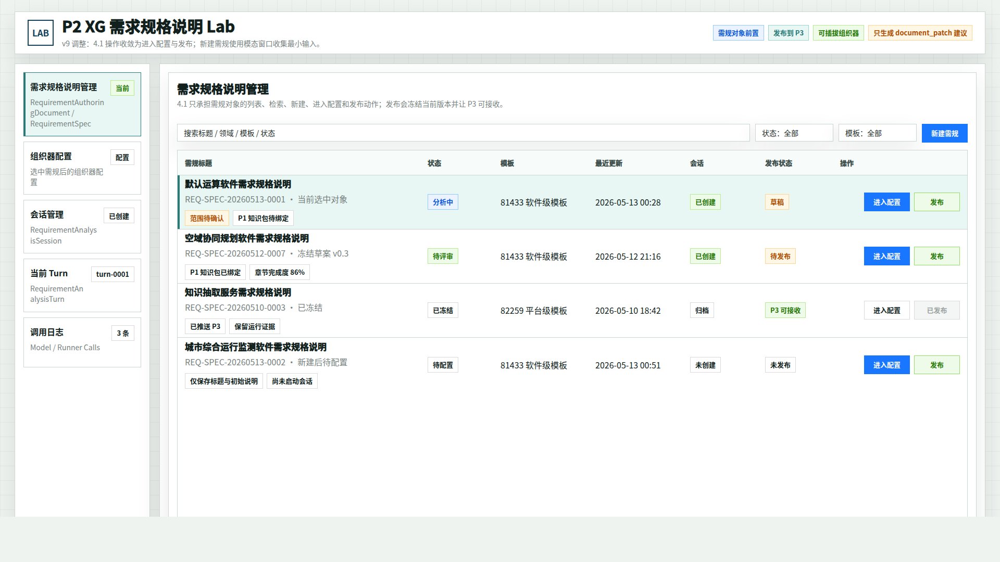
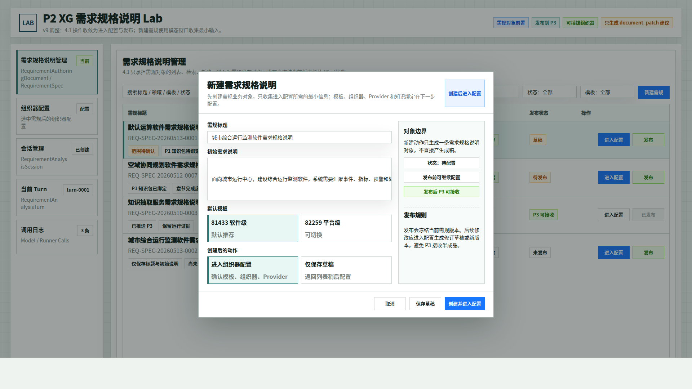
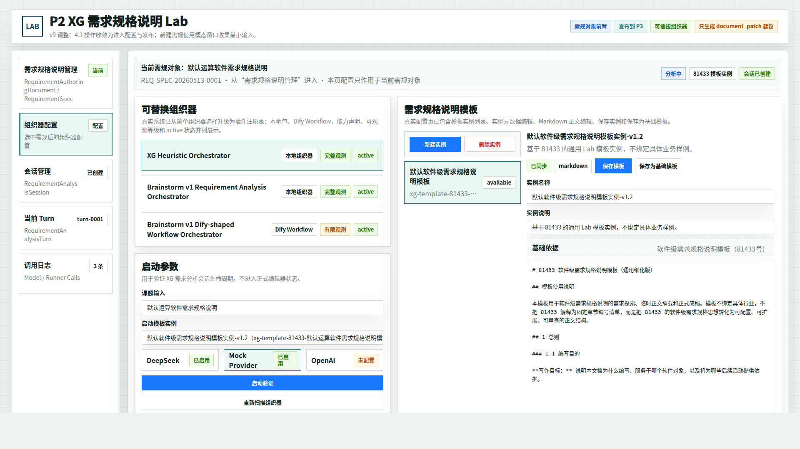
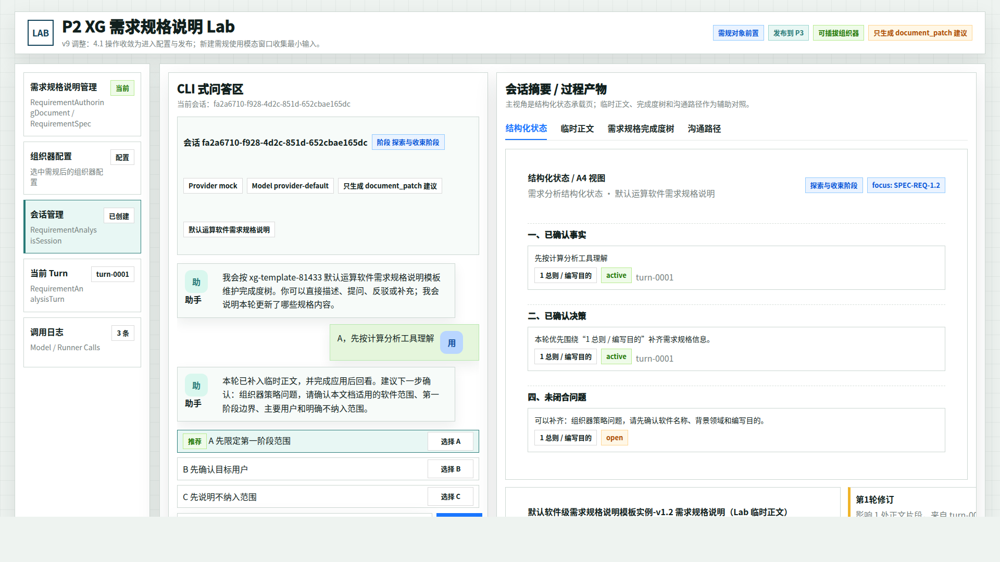
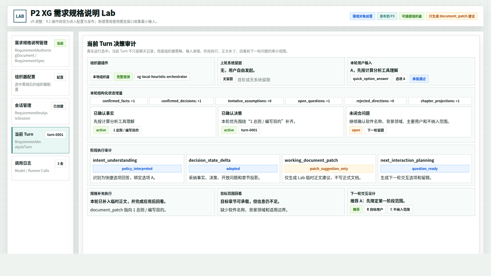
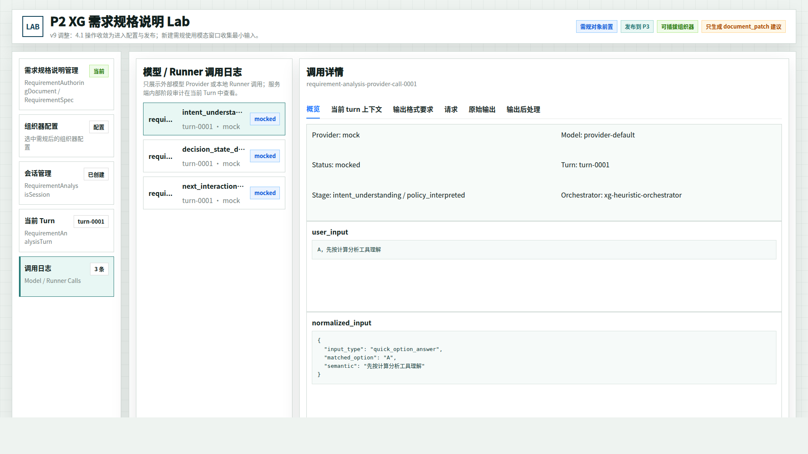

# CodeFactoryV2 P2 Brainstorming Lab 需规发布与新建弹窗原型 v9

生成时间：2026-05-13 01:26:00

- 文档角色：`P2 Brainstorming Lab` 需规列表动作与新建弹窗修正版原型评审入口
- 版本目录：`DOC/CODEX_DOC/08_原型与附图/2026-05-13-012600-CodeFactoryV2-P2-Brainstorming-Lab需规发布与新建弹窗原型-v9/`
- 当前状态：待用户确认
- 目标路由：`/p2-requirement-analysis-lab` 或后续 P2 需求规格说明工作台入口
- 页面归属：`P2` 需求分析系统
- 页面主对象：需求规格说明对象列表、新建需规模态窗口、发布到 P3 的边界动作
- 目标画板规格：`1920 x 1080`
- 源文件：`source/p2-brainstorming-lab-spec-publish-modal-prototype.html`

## 1. 本版定位

v9 继承 v8 的 4.1 简化方向：`需求规格说明管理` 仍然只是列表页，不展开右侧当前需规详情，也不合并 4.1 与 4.2。

本版只处理两条新的评审批注：

1. 列表右侧的 `打开 / 编辑 / 进入配置` 语义重复，应收敛为 `进入配置` 和 `发布`。
2. 点击 `新建需规` 后应弹出模态窗口，本版补充新建窗口状态图。

## 2. 本轮设计判断

| 区域 | v9 处理 |
| --- | --- |
| 行内动作 | 每条需规只保留 `进入配置` 与 `发布` 两个主动作 |
| 进入配置 | 打开当前需规的配置工作台，可继续编辑模板、组织器、Provider、知识绑定和会话配置 |
| 发布 | 冻结当前需规版本，并把该版本标记为 P3 可接收 |
| 已发布状态 | 显示 `P3 可接收` 和 `已发布`，避免继续把发布态当成普通草稿编辑 |
| 新建需规 | 通过模态窗口收集标题、初始说明、默认模板和创建后动作 |

发布的产品语义：发布不是普通导出按钮，而是 P2 向 P3 交付需求规格说明的边界动作。发布后如果需要修改，应回到配置生成修订草稿或新版本，再重新发布，避免 P3 接收半成品。

## 3. 继承关系

v9 继承 v8：

- 4.1 仍为单栏需规列表。
- 4.1 不恢复右侧当前需规详情。
- 4.2 继续作为选中需规后的组织器配置工作台。
- 组织器配置、会话、当前 Turn、调用日志保持真实系统对齐版复杂度。

v9 修正 v8：

- 删除列表行内 `打开 / 编辑 / 进入配置` 三连操作。
- 将行内操作收敛为 `进入配置 / 发布`。
- 新增 `新建需求规格说明` 模态窗口状态图。

## 4. 图文证据链

### 4.1 需求规格说明管理 Tab

- 评阅状态：待用户确认
- 画板规格：`1920 x 1080`
- 设计依据：用户指出 `打开 / 编辑 / 进入配置` 基本都是进入配置，应改成 `进入配置` 和 `发布`
- 需要用户判断的问题：发布态是否应显示为 `P3 可接收`，以及已发布对象是否还允许从 `进入配置` 创建修订草稿
- 允许偏差：发布状态命名、按钮文案可调整
- 不可接受偏差：不能继续保留三个语义重复的行内操作按钮



### 4.2 新建需规模态窗口

- 评阅状态：待用户确认
- 画板规格：`1920 x 1080`
- 设计依据：用户明确要求右上角 `新建需规` 按钮需要弹出模态窗口，并需要补充窗口设计
- 需要用户判断的问题：新建窗口是否只收集最小输入，还是还要在这里加入更多模板和知识绑定字段
- 允许偏差：字段顺序、默认模板文案、创建后动作选项可调整
- 不可接受偏差：新建需规不能直接塞入完整组织器配置；完整配置仍在 4.2 完成



### 4.3 组织器配置 Tab - 选中需规后

- 评阅状态：待用户确认
- 画板规格：`1920 x 1080`
- 设计依据：4.1 的 `进入配置` 仍跳转到当前真实系统复杂度的组织器配置页
- 需要用户判断的问题：发布前是否必须经过配置页完成某些必填检查
- 允许偏差：上下文条字段可调整
- 不可接受偏差：不能把组织器配置页简化回单一选择器



### 4.4 会话管理 Tab - 结构化状态

- 评阅状态：待用户确认
- 画板规格：`1920 x 1080`
- 设计依据：会话页继续沿用 v6 真实系统视图，表示当前需规对象下的会话收敛过程
- 需要用户判断的问题：后续是否也需要在会话页顶部补当前需规对象上下文
- 允许偏差：会话 id、模板 id、turn id 可随真实数据变化
- 不可接受偏差：不能把结构化状态、临时正文、完成度树和沟通路径合并成普通摘要



### 4.5 当前 Turn Tab

- 评阅状态：待用户确认
- 画板规格：`1920 x 1080`
- 设计依据：当前 Turn 仍作为当前需规对象下的单轮审计视图
- 需要用户判断的问题：需规对象 id 是否也应进入 Turn 审计头部
- 允许偏差：审计块顺序可随实现协议微调
- 不可接受偏差：不能把 Turn 审计降级成普通聊天记录



### 4.6 调用日志 Tab

- 评阅状态：待用户确认
- 画板规格：`1920 x 1080`
- 设计依据：调用日志仍保留 v6 的 Provider / Runner 调用边界，挂在当前需规对象和会话之下
- 需要用户判断的问题：日志列表是否需要增加需规对象列或过滤器
- 允许偏差：日志条数、阶段名、Provider 可随真实运行变化
- 不可接受偏差：不能把服务端内部审计和 Provider 调用日志混在一起



## 5. 原始材料说明

本版没有新增外部原始图片。`original/README.md` 记录继承事实源和用户批注来源。

## 6. 原型到实现映射

| 原型区块 | 实现含义 |
| --- | --- |
| 需求规格说明管理 Tab | 用户侧业务对象列表；可映射到 `RequirementAuthoringDocument` / `RequirementSpec` / 未来 `RequirementAnalysisWorkItem` |
| 进入配置 | 进入当前需规对象的组织器配置与后续编辑流程 |
| 发布 | 冻结当前需求规格说明版本，形成 P3 可接收输入 |
| 已发布 | 当前版本不可作为普通草稿直接编辑；后续修改应形成修订草稿或新版本 |
| 新建需规模态窗口 | 创建业务对象的最小输入入口 |
| 创建并进入配置 | 创建对象后跳到 4.2 组织器配置 |
| 会话 / Turn / 日志 | 继续复用 v6 真实运行系统结构 |

## 7. 非目标

1. 本版不决定发布后的版本控制细节。
2. 本版不决定 P3 接收后的下游页面形态。
3. 本版不把新建窗口扩展成完整配置页。
4. 本版不改真实代码。
5. 本版不回写主设计文档。

## 8. 允许偏差与不可接受偏差

允许偏差：

- 发布按钮文案可改为 `发布到 P3`、`提交发布` 或其他统一术语。
- 新建窗口字段可随真实模型微调。
- 已发布对象是否允许进入配置查看，可在实现时根据权限和版本规则细化。

不可接受偏差：

- 列表行继续出现 `打开 / 编辑 / 进入配置` 三个重复动作。
- 发布被设计成普通导出按钮，而不是 P2 到 P3 的状态边界。
- 新建窗口直接承载完整组织器配置，导致 4.1 与 4.2 再次被混在一起。

## 9. 查看与再生成

打开源文件：

```bash
xdg-open DOC/CODEX_DOC/08_原型与附图/2026-05-13-012600-CodeFactoryV2-P2-Brainstorming-Lab需规发布与新建弹窗原型-v9/source/p2-brainstorming-lab-spec-publish-modal-prototype.html
```

重新生成首图：

```bash
base="$PWD/DOC/CODEX_DOC/08_原型与附图/2026-05-13-012600-CodeFactoryV2-P2-Brainstorming-Lab需规发布与新建弹窗原型-v9"
google-chrome --headless=new --disable-gpu --no-sandbox --window-size=1920,1080 \
  --screenshot="$base/01-1920x1080-需求规格说明管理Tab.png" \
  "file://$base/source/p2-brainstorming-lab-spec-publish-modal-prototype.html#spec"
```

将 `#spec` 替换为 `#spec-new`、`#config`、`#session`、`#turn`、`#log` 可生成其余状态。

## 10. 评审结论与后续处理

当前结论：`待用户确认`。

如果 v9 的发布语义和新建弹窗方向成立，后续再讨论发布状态机、P3 接收合同、已发布后的修订版本规则。
