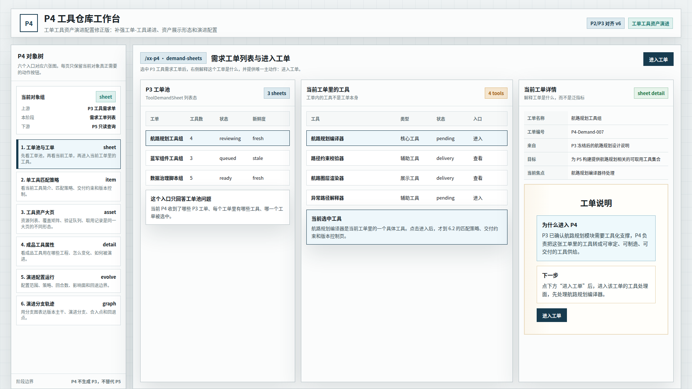
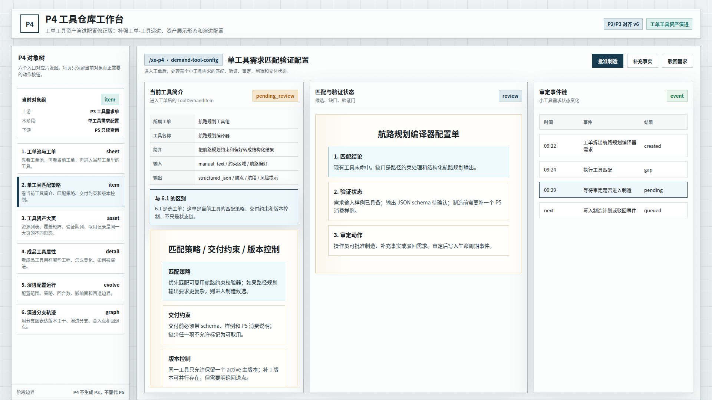
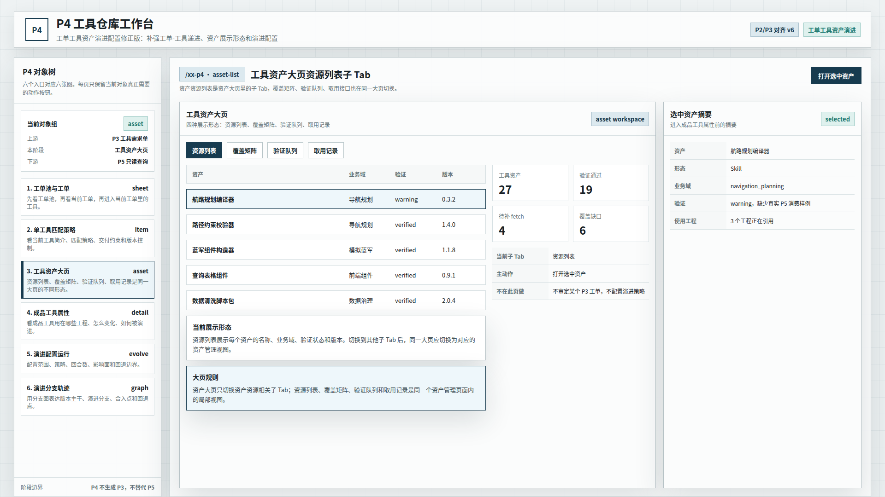
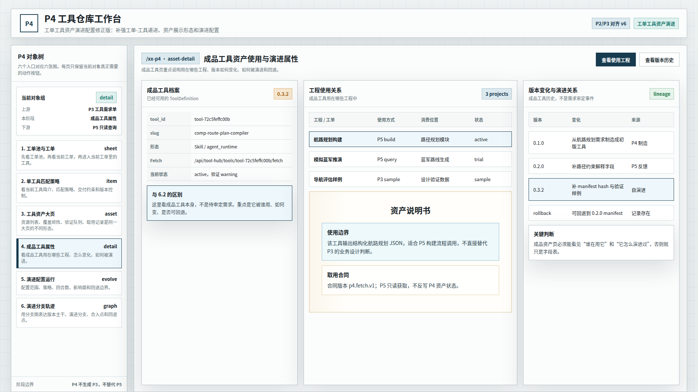
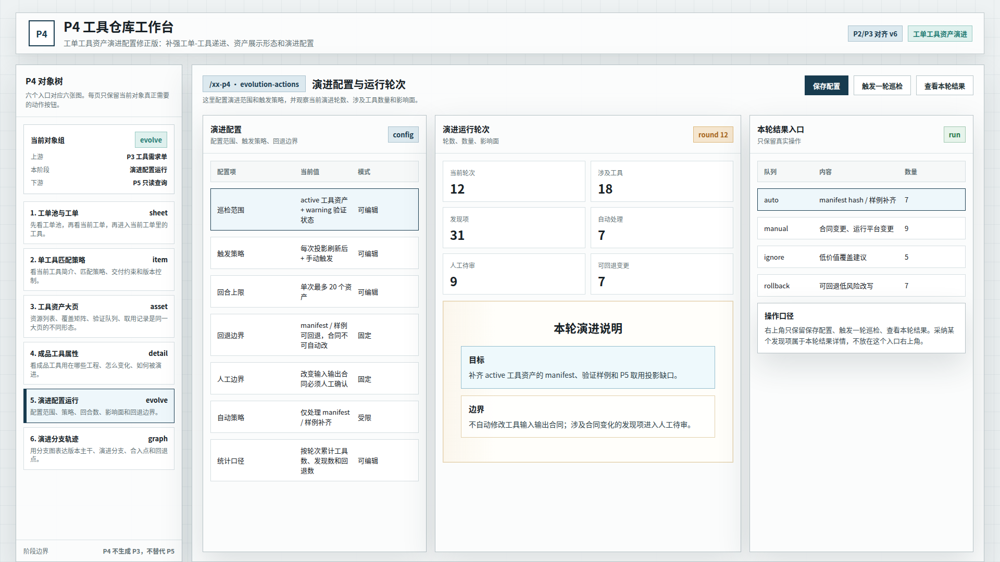
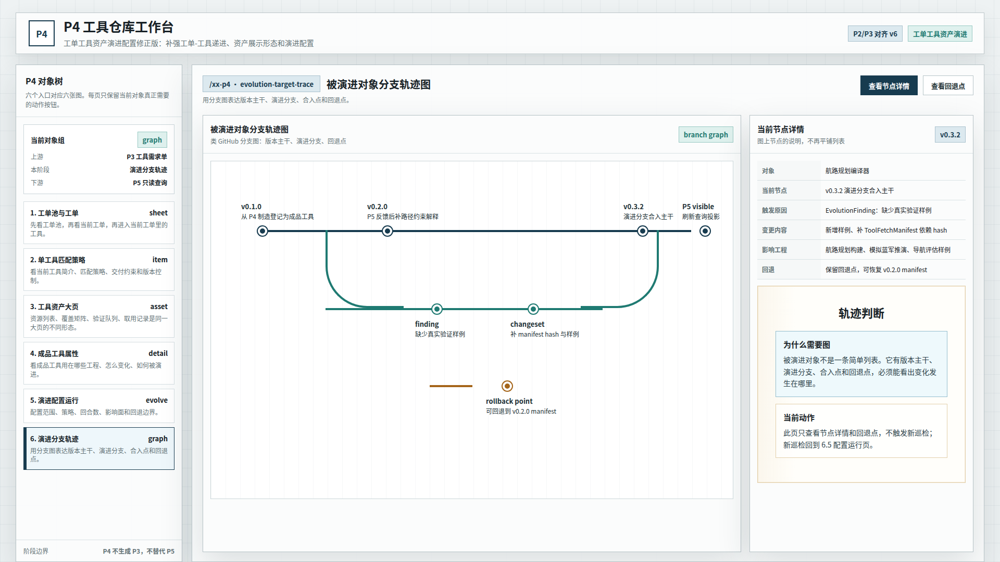

# CodeFactoryV2 P4 工具仓库工单工具资产演进配置修正版 v6

生成时间：2026-05-13 01:39:00

- 文档角色：`P4 工具仓库` 工单工具资产演进配置设计草案评审入口
- 版本目录：`DOC/CODEX_DOC/08_原型与附图/2026-05-13-013900-CodeFactoryV2-P4工具仓库工单工具资产演进配置修正版-v6/`
- 当前状态：待用户确认
- 目标路由：后续可映射到 `/xx-p4` 或新版 P4 独立工作台
- 页面归属：`P4` 工具资产运营中台
- 页面主对象：`ToolDemandSheet`、`ToolDemandItem`、`ToolDefinition`、`ToolFetchManifest`、`EvolutionRun`、`EvolutionFinding`、`EvolutionTask`、`EvolutionChangeSet`、`EvolutionRollbackRecord`
- 目标画板规格：六张评审图均为 `1920 x 1080`
- 源文件：`source/p4-object-workspace-deepened-prototype.html`

## 1. 本版定位

本版回应用户对 `P4 v5` 的批注：v5 的对象工作区方向成立，但 `6.1`、`6.2`、`6.3`、`6.5` 仍需继续细化。

本版重点修正：

1. `6.1` 明确三层递进：`工单池 -> 工单 -> 工具`。
2. `6.2` 按用户确认的方向，改为 `匹配策略 / 交付约束 / 版本控制`。
3. `6.3` 强调资产大页的四种展示形态：`资源列表 / 覆盖矩阵 / 验证队列 / 取用记录`。
4. `6.5` 加厚演进配置，补充回合上限、回退边界、人工边界、自动策略和统计口径。

## 2. 非目标

1. 不直接修改现有 React 实现。
2. 不把本版视为已批准 UI 标准。
3. 不重新定义 P4 后端对象模型。
4. 不新增超出现有 P4 能力边界的业务流程。
5. 不把 P2/P3 的业务对象照搬到 P4；只参考其页面组织形态和视觉约束。

## 3. 共用事实源与设计依据

| 事实源 | 对本版原型的约束 |
| --- | --- |
| 用户本轮批注 | `6.1` 必须是工单池、工单、工具三层递进；`6.2` 偏向匹配策略、交付约束、版本控制；`6.3` 四种资产展示形态都要体现；`6.5` 演进配置要更完整 |
| `P2 Brainstorming Lab 原型 v2` | 左侧对象树是主导航；整体是硬边界、浅色系统工作台，无衬线中文字体 |
| `P3 Design Lab 原型 v1` | 输入事实、正面产物和投影关系要分清；纸面感用于主产物说明 |
| `P4-工具仓库设计.md` | 正式对象包括需求单、叶子需求、工具资产、制造交付、自演进对象、运行对象和查询投影 |
| `P4 对象工作区深化修正版 v5` | 对象工作区方向成立，但工单递进、资产展示和演进配置仍可继续深化 |

## 4. 对象工作区原则

v6 的核心原则是：每个入口必须回答当前对象自己的问题，只保留当前对象真正需要的动作。

| 入口 | 工作区回答的问题 | 右上角动作原则 |
| --- | --- | --- |
| 工单池与工单 | 当前有哪些 P3 工单、当前工单是什么、当前工单里有哪些工具 | 顶部只保留页面级状态，`进入工单` 放在当前工单说明内 |
| 单工具匹配策略 | 当前工具如何匹配、交付受哪些约束、版本如何受控 | 保留批准制造、补充事实、驳回需求 |
| 工具资产大页 | 工具资产如何以资源列表、覆盖矩阵、验证队列、取用记录展示 | 只保留打开选中资产 |
| 成品工具属性 | 成品工具用在哪些工程、版本如何变化、如何演进和回退 | 查看使用工程、查看版本历史 |
| 演进配置运行 | 演进如何配置，本轮涉及多少工具和影响面 | 保存配置、触发巡检、查看本轮结果 |
| 演进分支轨迹 | 被演进对象的版本主干、演进分支、合入点和回退点 | 查看节点详情、查看回退点 |

## 5. 画板规格与布局预算

| 区域 | 规格 / 预算 | 设计说明 |
| --- | --- | --- |
| 主画板 | `1920 x 1080` | 桌面整页设计草案 |
| 顶部栏 | 约 `80px` | 页面标题和版本状态；不承载无意义业务按钮 |
| 左侧对象树 | 约 `320px` | 六个对象入口稳定存在 |
| 主工作区 | 自适应主区 | 按当前入口呈现工单递进、工具配置、资产大页、成品工具、演进配置或轨迹图 |
| 右侧对象面板 | 约 `430px` | 只表达当前对象的详情、摘要或判断 |
| 主产物纸面区 | 局部使用 | 只用于工单说明、配置单、资产说明、轨迹判断等文档式内容 |

## 6. 图文证据链

### 6.1 工单池、工单与工具递进

**评阅状态：待用户确认**

**画板规格：** `1920 x 1080`

**设计依据：**

1. 用户指出三层递进必须是 `工单池 -> 工单 -> 工具`。
2. 本图左栏是 P3 工单池，中栏是当前工单里的工具，右栏是当前工单详情。
3. `进入工单` 放在当前工单说明内，而不是右上角。

**需要用户判断：**

1. 当前工单说明是否把“工单是什么”讲清楚。
2. 工单池、工单、工具的三层递进是否清楚。



### 6.2 单工具匹配策略交付约束版本控制

**评阅状态：待用户确认**

**画板规格：** `1920 x 1080`

**设计依据：**

1. 用户明确选择 `匹配策略 / 交付约束 / 版本控制` 作为该页的可操作内容方向。
2. 该页是进入工单后处理某个具体工具，不再停留在状态链。
3. 当前工具说明、匹配策略、交付约束和版本控制共同构成该页主表达。

**需要用户判断：**

1. 该页是否比 v5 更接近“当前工具可操作内容”。
2. 匹配策略、交付约束、版本控制是否足够支撑后续实现。



### 6.3 工具资产大页四种展示形态

**评阅状态：待用户确认**

**画板规格：** `1920 x 1080`

**设计依据：**

1. 用户指出资产大页不应只展示一种资源列表形态。
2. 本图保留一个资产大页，并显式给出四种展示形态：`资源列表`、`覆盖矩阵`、`验证队列`、`取用记录`。
3. 当前画面以资源列表为激活形态，同时说明切换后应展示对应资产管理视图。

**需要用户判断：**

1. 四种展示形态是否比单一资源列表更合理。
2. 资产大页是否仍保持为一个统一页面，而不是拆成多个孤立页面。



### 6.4 成品工具使用与演进属性

**评阅状态：待用户确认**

**画板规格：** `1920 x 1080`

**设计依据：**

1. 用户指出该页与 6.2 的区别在于它是成品工具，不是待配置需求。
2. 本图重点表达工具用在哪些工程中、版本如何变化、如何被演进和回退。
3. 成品工具页必须能看见使用工程和版本演进，否则只是字段表。

**需要用户判断：**

1. “用在哪些工程中”是否已经成为主表达。
2. 版本变化和演进关系是否足够清楚。



### 6.5 演进配置深化

**评阅状态：待用户确认**

**画板规格：** `1920 x 1080`

**设计依据：**

1. 用户指出演进配置过薄，需要仔细思考怎么配置演进。
2. 本图补充巡检范围、触发策略、回合上限、回退边界、人工边界、自动策略和统计口径。
3. 中栏保留当前轮次、涉及工具、发现项、自动处理、人工待审和可回退变更。

**需要用户判断：**

1. 演进配置项是否足够表达自演进控制边界。
2. 回合数、涉及数量和回退边界是否已经清楚。



### 6.6 被演进对象分支轨迹图

**评阅状态：待用户确认**

**画板规格：** `1920 x 1080`

**设计依据：**

1. 用户指出演进轨迹至少应有类似 GitHub 分支图的表达。
2. 本图使用版本主干、演进分支、合入点和回退点表达被演进对象轨迹。
3. 右侧只显示当前节点详情和轨迹判断，不触发新巡检；新巡检回到 6.5。

**需要用户判断：**

1. 分支图是否比普通列表更能表达被演进对象轨迹。
2. 右侧节点详情是否足够解释当前版本、触发原因、变更内容和回退能力。



## 7. 原始材料说明

本版无外部原始图片。详见：

- `original/README.md`

本版来自 v5 批注修正。详见：

- `REVIEW_RESPONSE.md`

## 8. 原型到实现映射

| v6 入口 | 当前实现来源 | 后续实现含义 |
| --- | --- | --- |
| 工单池、工单与工具递进 | `P4DemandSheetTree`、`P4InputChainWorkspace` | 建立工单池、当前工单、当前工具三层递进 |
| 单工具匹配策略交付约束版本控制 | `P4DemandItemBoard`、`P4SupplyResultPreview` | 把单工具页从状态链升级为匹配策略、交付约束和版本控制工作面 |
| 工具资产四种展示形态 | `P4RegistryWorkspace`、`P4CoverageMatrix` | 资产大页支持资源列表、覆盖矩阵、验证队列、取用记录 |
| 成品工具使用与演进属性 | `P4RegistryWorkspace`、工具详情接口、P5 查询投影 | 强化成品工具使用工程、版本变化和演进关系 |
| 演进配置深化 | `P4EvolutionWorkspace`、巡检配置和发现项接口 | 自演进页先表达配置、轮次和影响数量，再进入结果详情 |
| 被演进对象分支轨迹图 | `P4EvolutionWorkspace`、资产版本、ChangeSet、RollbackRecord | 将被演进对象轨迹做成版本分支图 |

## 9. 允许偏差与不可接受偏差

允许偏差：

1. 后续实现可以继续复用 Ant Design 组件。
2. 资产大页的四种展示形态可用 Tabs、Segmented 或左侧子导航实现。
3. 分支轨迹图可以用 SVG、Canvas 或图组件实现。
4. 示例数据、版本号和指标可随运行态变化。

不可接受偏差：

1. 继续把 `6.1` 做成工单池、工具列表和泛指标的混合页面。
2. `6.2` 看不到匹配策略、交付约束和版本控制。
3. `6.3` 只展示资源列表而没有覆盖矩阵、验证队列、取用记录这些展示形态。
4. `6.5` 演进配置仍停留在几条浅表字段。
5. 被演进对象轨迹继续用普通列表替代分支图。
6. 右上角继续放无明确业务语义的填充按钮。

## 10. 查看与再生成

直接打开源文件：

```bash
xdg-open DOC/CODEX_DOC/08_原型与附图/2026-05-13-013900-CodeFactoryV2-P4工具仓库工单工具资产演进配置修正版-v6/source/p4-object-workspace-deepened-prototype.html
```

重新生成六张评审图：

```bash
corepack pnpm --dir apps/web exec node \
  "$PWD/DOC/CODEX_DOC/08_原型与附图/2026-05-13-013900-CodeFactoryV2-P4工具仓库工单工具资产演进配置修正版-v6/source/capture-p4-v6-prototype.mjs"
```

## 11. 自测结论与后续处理

已完成自测：

1. 截图脚本成功生成六张评审图。
2. 六张图片均为 `1920 x 1080`。
3. 已人工抽查截图，无错误页、顶部横向 Tab、明显重叠或主要裁切。
4. `6.1` 已调整为工单池、工单、工具三层递进。
5. `6.2` 已调整为匹配策略、交付约束、版本控制。
6. `6.3` 已调整为资产大页四种展示形态。
7. `6.5` 已加厚演进配置。

当前状态：`待用户确认`。
