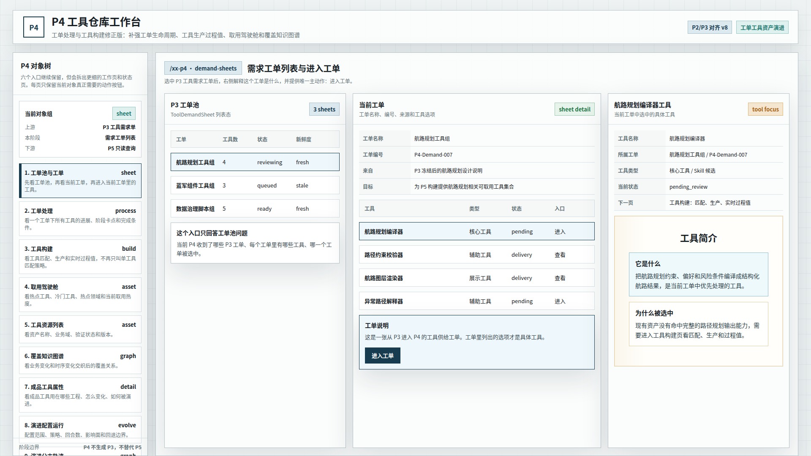
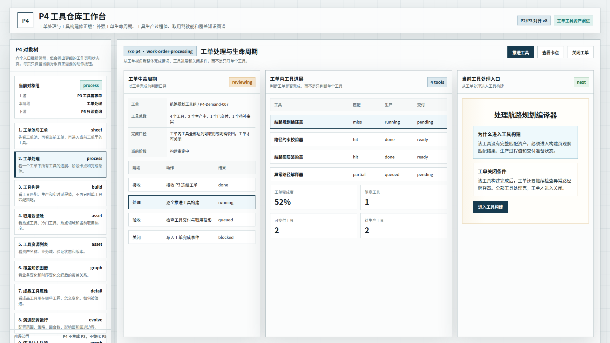
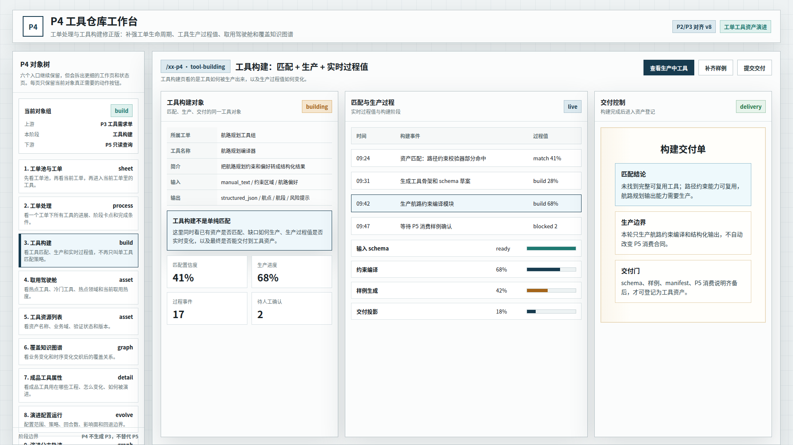
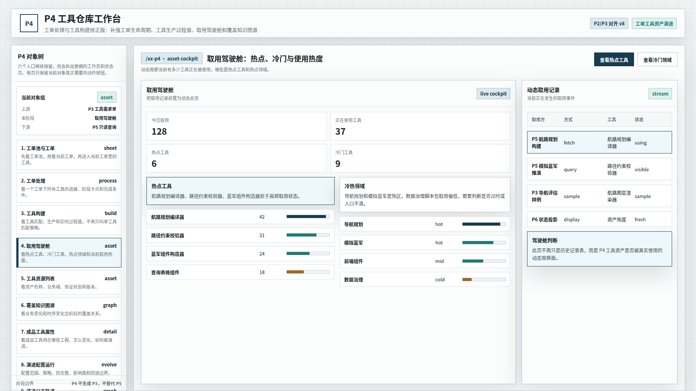
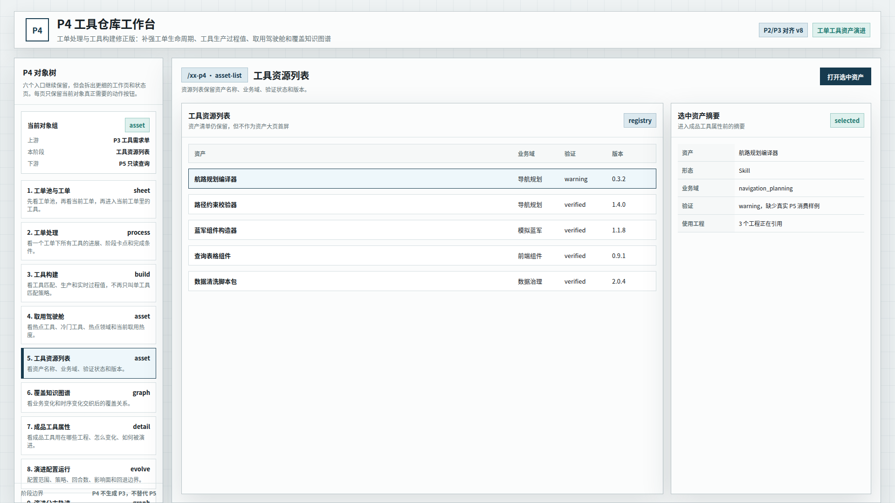
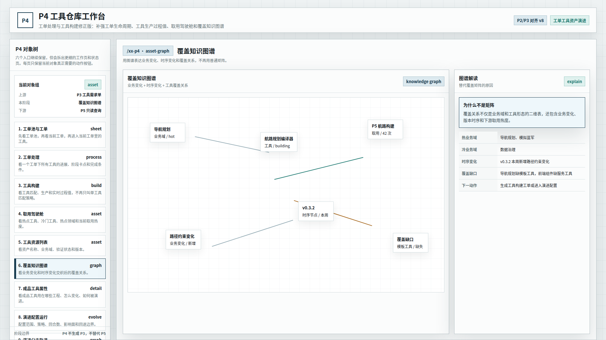
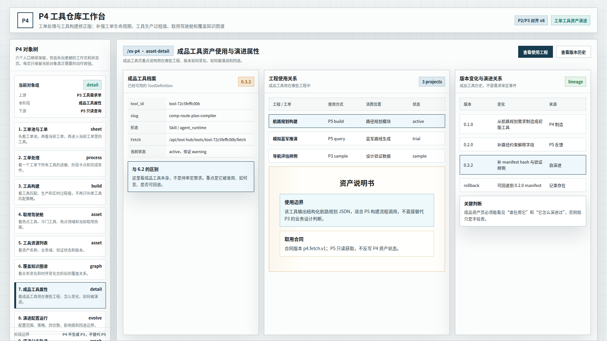
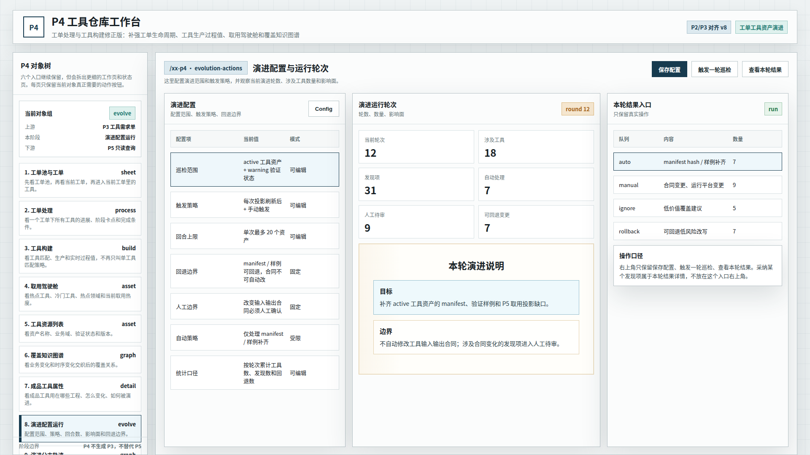
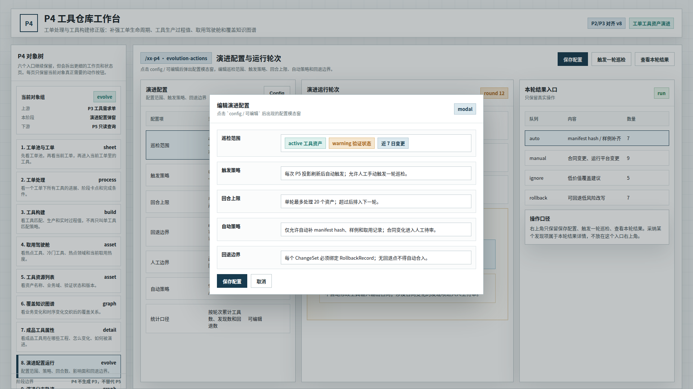
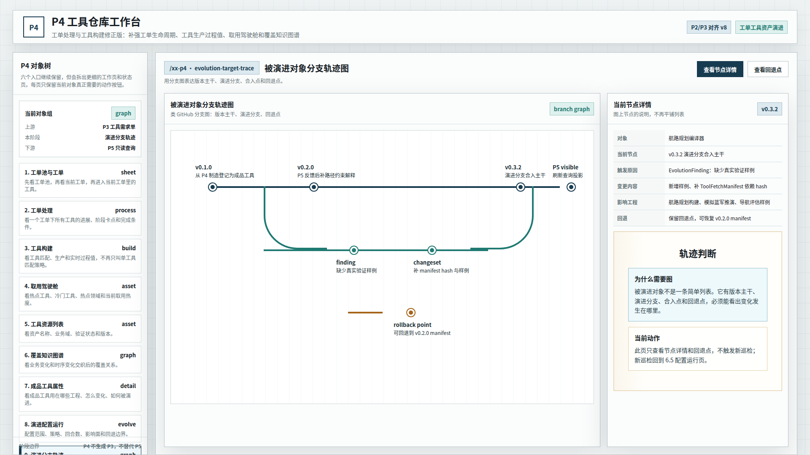

# CodeFactoryV2 P4 工单处理与工具构建知识图谱驾驶舱修正版 v8

生成时间：2026-05-13 02:35:00

- 文档角色：`P4 工具仓库` 工单处理、工具构建、取用驾驶舱和覆盖知识图谱修正版评审入口
- 版本目录：`DOC/CODEX_DOC/08_原型与附图/2026-05-13-023500-CodeFactoryV2-P4工具仓库工单处理与工具构建知识图谱驾驶舱修正版-v8/`
- 当前状态：待用户确认
- 目标路由：后续可映射到 `/xx-p4`
- 页面归属：`P4` 工具资产运营中台
- 目标画板规格：十张评审图均为 `1920 x 1080`
- 源文件：`source/p4-object-workspace-deepened-prototype.html`
- 再生成脚本：`source/capture-p4-v8-prototype.mjs`

## 1. 本版定位

本版回应用户对上一轮 P4 原型的批注。用户明确指出：不要改变原型主体结构，而是调整每个界面的内容表达，并额外增加 `工单处理` Tab 页面。前序 P4 原型包已按用户要求清理，当前评审入口只保留本 v8 包。

本版重点修正：

1. 在 `工单池与工单` 后新增 `工单处理` 页面，用于管理工单生命周期和工单内所有工具进展。
2. 将原 `单工具匹配策略` 改为 `工具构建`，表达匹配、生产、实时过程值和交付控制。
3. 将 `取用记录` 前置为 `取用驾驶舱`，展示正在使用工具、热点工具、冷门工具、热点领域和冷门领域。
4. 将 `覆盖矩阵` 改为 `覆盖知识图谱`，表达业务变化、时序变化和工具覆盖关系。
5. 删除 `验证队列` 页面，不再作为本版评审图。

## 2. 非目标

1. 不重构 P4 原型的外层工作台骨架。
2. 不直接修改现有 React 实现。
3. 不把本版视为已批准 UI 标准。
4. 不新增超出现有 P4 能力边界的业务流程。

## 3. 共用事实源与设计依据

| 事实源 | 对本版原型的约束 |
| --- | --- |
| 用户本轮批注 | 主体结构不变；增加 `工单处理` Tab；`单工具匹配策略` 改为 `工具构建`；覆盖矩阵改知识图谱；删除验证队列；取用记录前置成驾驶舱 |
| 上一轮 P4 原型评审批注 | 作为本版直接输入；前序包已清理，不再作为当前评审入口 |
| `P2 / P3` 原型系列 | 左侧对象树、硬边界浅色工作台、主工作区组织方式继续参考 |
| `P4-工具仓库设计.md` | 工单、工具需求、工具资产、取用投影和自演进对象仍是 P4 的主对象事实源 |

## 4. 图文证据链

### 4.1 工单池、工单与工具递进

**评阅状态：待用户确认**

本图保留 `工单池 -> 当前工单 -> 当前工具` 的递进关系。当前工单内仍有 `进入工单`，因为用户确认工单生命周期管理是必要页面入口。



### 4.2 工单处理：生命周期与工具进展

**评阅状态：待用户确认**

本图是新增 Tab 页面。它以工单完成为判断口径，展示工单生命周期、工单内工具进展、阻塞工具、可交付工具和进入工具构建的动作。



### 4.3 工具构建：匹配、生产、实时过程值

**评阅状态：待用户确认**

本图替代原 `单工具匹配策略`。工具构建既包含匹配，也包含生产；页面展示匹配置信度、生产进度、过程事件、待人工确认，以及输入 schema、约束编译、样例生成、交付投影等实时过程值。



### 4.4 取用驾驶舱：热点、冷门与使用热度

**评阅状态：待用户确认**

本图把取用记录前置为动态驾驶舱。它不只是历史记录表，而是展示今日取用、正在使用工具、热点工具、冷门工具、热点领域和冷门领域。



### 4.5 工具资源列表

**评阅状态：待用户确认**

资源列表保留，但不再作为资产大页首屏。它只负责展示资产名称、业务域、验证状态、版本和选中资产摘要。



### 4.6 覆盖知识图谱

**评阅状态：待用户确认**

本图替代原覆盖矩阵。覆盖关系不再只是业务域和工具形态的二维表，而是业务变化、版本时序、取用热度和覆盖缺口交织后的图谱关系。



### 4.7 成品工具使用与演进属性

**评阅状态：待用户确认**

本图沿用上一轮中成品工具页的方向：成品工具对象重点看它用在哪些工程、如何变化、如何被演进和回退。



### 4.8 演进配置深化

**评阅状态：待用户确认**

本图沿用上一轮的演进配置深化方向，展示巡检范围、触发策略、回合上限、回退边界、人工边界、自动策略和统计口径。



### 4.9 演进配置弹窗

**评阅状态：待用户确认**

本图沿用上一轮的配置弹窗状态，展示点击 `Config` 后的字段编辑形态。



### 4.10 被演进对象分支轨迹图

**评阅状态：待用户确认**

本图沿用上一轮的分支轨迹方向，用版本主干、演进分支、合入点和回退点表达被演进对象。



## 5. 原型到实现映射

| v8 图 | 后续实现含义 |
| --- | --- |
| 工单池、工单与工具递进 | 保留工单池、当前工单和当前工具递进，当前工单可进入工单处理 |
| 工单处理 | 新增面向工单生命周期的处理页，判断工单整体完成情况 |
| 工具构建 | 原单工具页改为工具构建页，展示匹配、生产和过程值 |
| 取用驾驶舱 | 取用记录前置为动态资产使用观察面 |
| 工具资源列表 | 保留资产清单，但不是首屏驾驶舱 |
| 覆盖知识图谱 | 用图谱替代覆盖矩阵 |
| 成品工具属性 | 保留成品工具使用工程和演进关系 |
| 演进配置 / 弹窗 / 轨迹 | 沿用上一轮方向，后续可继续细化 |

## 6. 查看与再生成

直接打开源文件：

```bash
xdg-open DOC/CODEX_DOC/08_原型与附图/2026-05-13-023500-CodeFactoryV2-P4工具仓库工单处理与工具构建知识图谱驾驶舱修正版-v8/source/p4-object-workspace-deepened-prototype.html
```

重新生成十张评审图：

```bash
corepack pnpm --dir apps/web exec node \
  "$PWD/DOC/CODEX_DOC/08_原型与附图/2026-05-13-023500-CodeFactoryV2-P4工具仓库工单处理与工具构建知识图谱驾驶舱修正版-v8/source/capture-p4-v8-prototype.mjs"
```

## 7. 自测结论与后续处理

已完成自测：

1. 截图脚本成功生成十张评审图。
2. 十张图片均为 `1920 x 1080`。
3. 已抽查新增关键图：工单处理、工具构建、取用驾驶舱、覆盖知识图谱。

当前状态：`待用户确认`。
