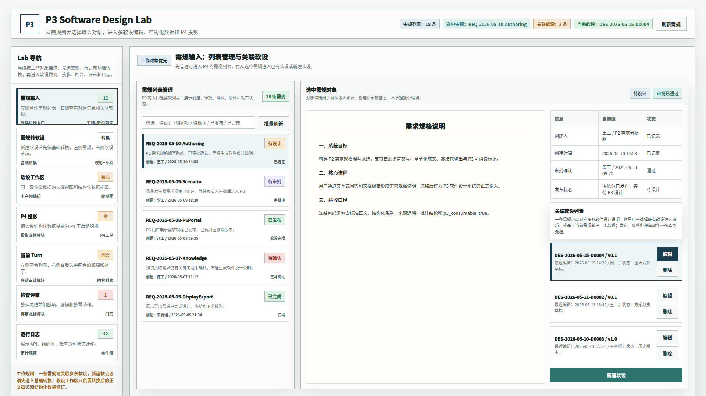
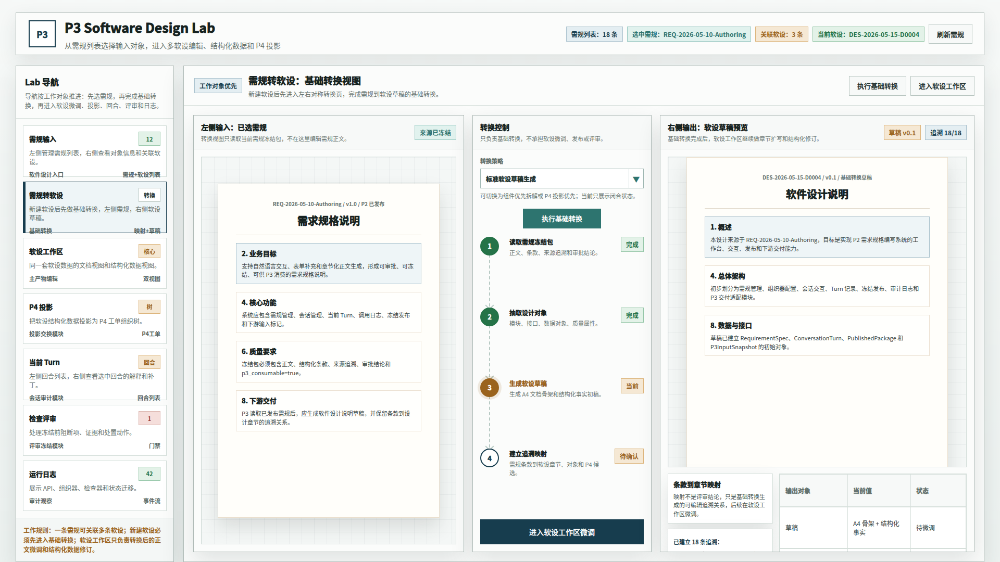
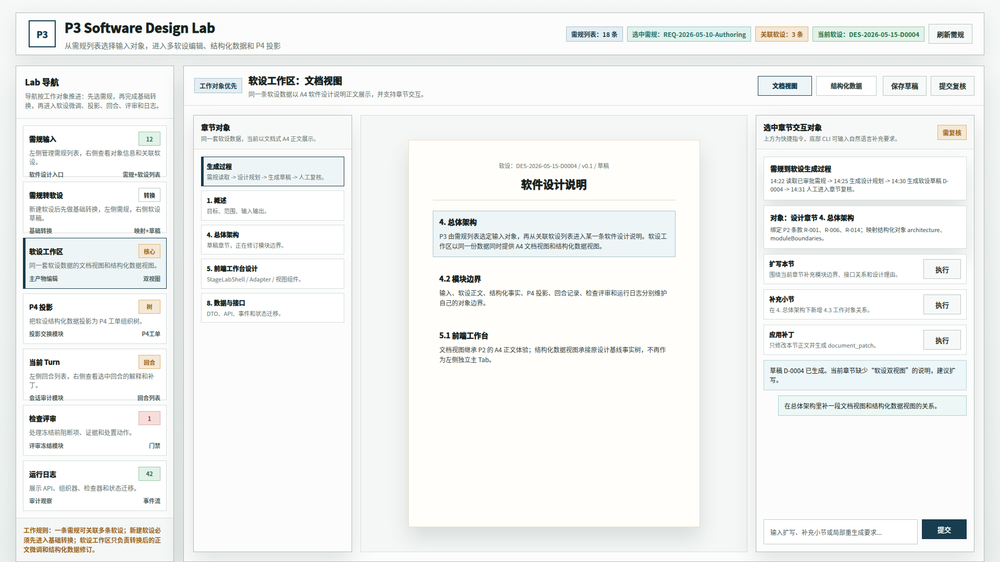
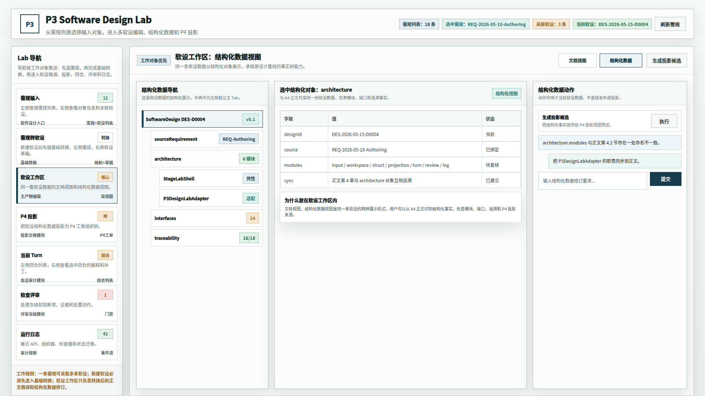
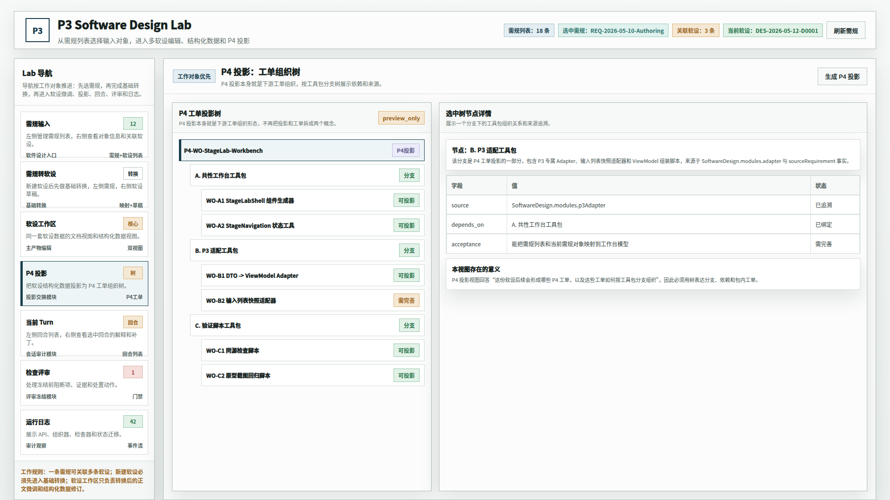
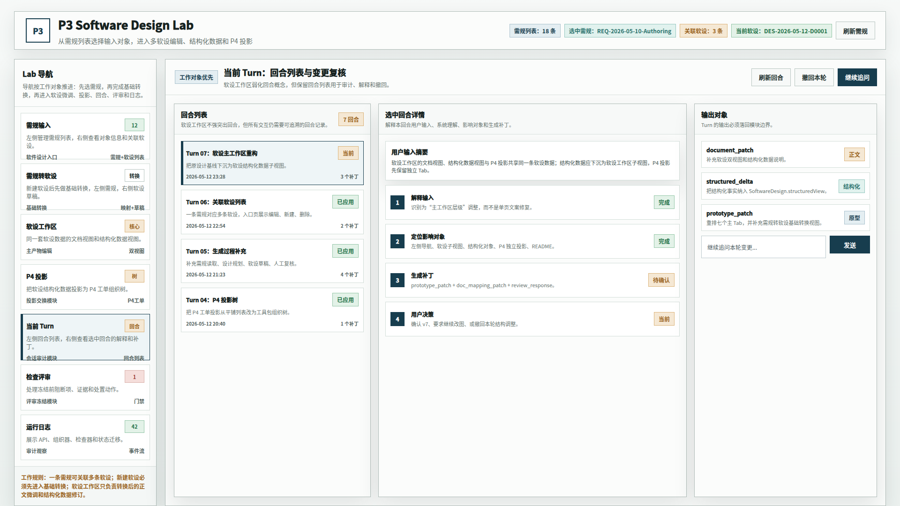
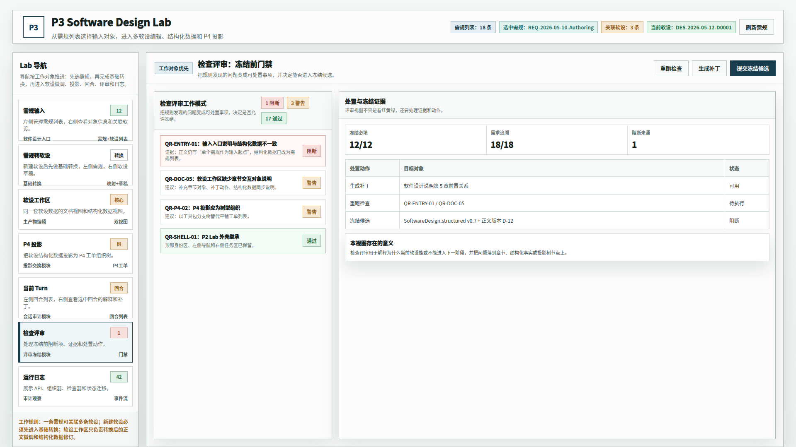
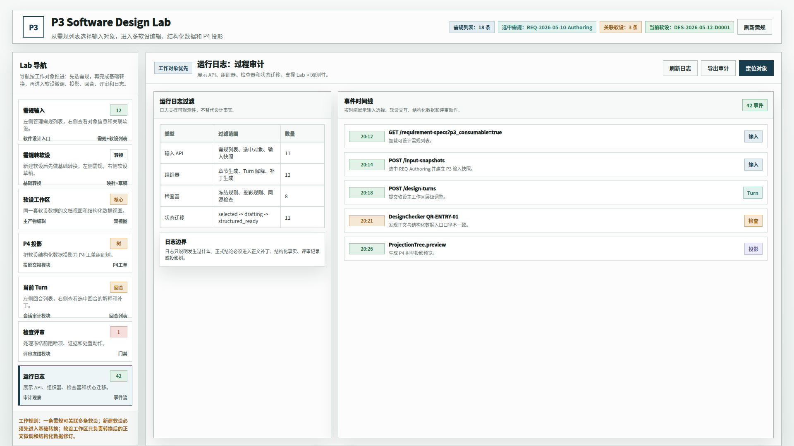

# CodeFactoryV2 P3 Design Lab 需规转软设原型 v7

## 1. 元信息

- 版本包：`2026-05-15-143041-CodeFactoryV2-P3-Design-Lab需规转软设原型-v7`
- 生成时间：2026-05-15 14:30
- 当前状态：待用户确认
- 所属范围：P3 软件设计系统 / Design Lab 原型
- 目标路由：后续实现时映射到 P3 Design Lab 主工作台
- 页面主对象：需规列表、关联软设列表、需规转软设基础转换、软件设计说明文档视图、软件设计结构化数据视图、P4 工单投影树、回合列表、检查评审、运行日志
- 目标画板：桌面整页 `1920 x 1080`

## 2. 本版定位

本版继承 v6 的动作收敛结果，只补充一个关键工作环节：`需规转软设`。

用户指出真实工作流不应从“新建软设”直接进入软设微调，而应先出现一个左右对称的转换页面：左侧是需规，右侧是软件设计说明草稿，中间是基础转换动作。基础转换完成后，才进入软设工作区做章节扩写、结构化修订和交互式微调。

本版核心调整：

1. 左侧 Lab 导航从 6 个主 Tab 调整为 7 个主 Tab：`需规输入 -> 需规转软设 -> 软设工作区 -> P4 投影 -> 当前 Turn -> 检查评审 -> 运行日志`。
2. 新增 `需规转软设` 基础转换视图，明确新建软设后的中间步骤。
3. 转换视图采用三栏关系：左侧 A4 需规冻结包，中间转换控制，右侧 A4 软设草稿预览。
4. 中间转换控制只承担基础转换：读取需规冻结包、抽取设计对象、生成软设草稿、建立追溯映射。
5. 转换策略改为闭合下拉框，只展示当前选中的 `标准软设草稿生成`，避免在静态图里误解为已展开菜单。
6. `执行基础转换` 改为普通主按钮，不再使用大箭头或大横幅。
7. 转换中间步骤改为无边框的圆点加箭头进度轨道，文字只作为进度说明，避免看起来像按钮。
8. 转换页不承担软设微调、发布、冻结、评审或 P4 正式投影。
9. 软设工作区继续作为转换后的主产物微调区，提供文档视图和结构化数据视图。

## 3. 非目标

- 不做前后端代码实现。
- 不改变 v6 已收敛的按钮口径和 P4 投影口径。
- 不把转换页设计成审批、发布或冻结页面。
- 不在转换页提供完整映射编辑器，完整映射后续在软设工作区复核。
- 不覆盖 v6 原型包。

## 4. 事实源与设计依据

- 用户 2026-05-15 批注：P3 当前缺少“需规向软设的转换页面”。
- 用户 2026-05-15 批注：真实工作流中，新建软设之后应弹出左右对称页面，左侧需规、右侧软设，中间有转换按钮。
- 用户 2026-05-15 批注：基础转换完成之后，再进入软设微调。
- 用户 2026-05-15 批注：转换策略应改成可选下拉菜单。
- 用户 2026-05-15 批注：1 到 4 的中间过程步骤应更像流程，使用圆形节点或小圆片，并用箭头连接。
- 既有 v6 原型基线：需规输入、软设工作区、P4 投影、当前 Turn、检查评审、运行日志已形成动作收敛版本。

## 5. 画板规格与布局预算

- 截图视口：`1920 x 1080`
- 顶部身份区：保留需规、关联软设、当前软设和刷新状态。
- 左侧 Lab 导航：七个主 Tab，新增 `需规转软设` 位于 `需规输入` 和 `软设工作区` 之间。
- 新增转换页：左侧需规 A4 预览，中间转换控制，右侧软设 A4 草稿预览。
- 软设工作区：继续保留文档视图 / 结构化数据两种展示形式。

## 6. 图文证据链

### 6.1 需规输入与关联软设视图

- 评阅状态：待用户确认
- 文件：`01-1920x1080-需规输入与关联软设视图.png`
- 设计依据：入口页仍负责需规列表和关联软设管理；新建软设后进入新增转换页，而不是直接进入微调。



### 6.2 需规转软设基础转换视图

- 评阅状态：待用户确认
- 文件：`02-1920x1080-需规转软设基础转换视图.png`
- 设计依据：左侧需规、右侧软设、中间执行基础转换；该页只负责生成草稿和追溯关系。
- 需要判断：这个页面是否正确体现“策略选择 -> 基础转换流程 -> 进入软设微调”。



### 6.3 软设工作区文档视图

- 评阅状态：待用户确认
- 文件：`03-1920x1080-软设工作区文档视图.png`
- 设计依据：基础转换后的软设草稿进入这里做章节级微调，继续保持 A4 软件设计说明正文形态。



### 6.4 软设工作区结构化数据视图

- 评阅状态：待用户确认
- 文件：`04-1920x1080-软设工作区结构化数据视图.png`
- 设计依据：结构化数据是同一条软设的另一种展示形式，用于复核模块、接口、追溯和投影候选。



### 6.5 P4 工单投影树视图

- 评阅状态：本轮继承 v6
- 文件：`05-1920x1080-P4工单投影树视图.png`
- 设计依据：P4 投影本身就是下游工单组织，仍按工具包分支树展示。



### 6.6 当前 Turn 回合列表视图

- 评阅状态：本轮继承 v6，补齐 v7 口径文案
- 文件：`06-1920x1080-当前Turn回合列表视图.png`
- 设计依据：保留回合列表用于解释用户输入、系统理解、补丁输出和审计。



### 6.7 检查评审门禁视图

- 评阅状态：本轮继承 v6
- 文件：`07-1920x1080-检查评审门禁视图.png`
- 设计依据：检查评审仍只处理冻结前阻断项、证据和处置动作。



### 6.8 运行日志审计视图

- 评阅状态：本轮继承 v6
- 文件：`08-1920x1080-运行日志审计视图.png`
- 设计依据：运行日志仍作为过程审计，不替代正文补丁、结构化事实、评审记录或投影树。



## 7. 原始材料说明

本版无外部原始图片。`original/README.md` 记录参考的仓库内正式文档和历史原型包。

## 8. 原型到实现映射

- `RequirementSpecListView`：需规列表与关联软设入口。
- `RequirementToDesignConversionView`：新增基础转换视图，承接新建软设后的需规到软设草稿生成。
- `ConversionController`：转换策略下拉、执行基础转换、圆点流程轨道和追溯摘要。
- `SoftwareDesignWorkspaceHeader`：承载文档视图 / 结构化数据切换和当前视图动作。
- `SoftwareDesignDocumentView`：A4 正文、章节对象、保存草稿、提交复核。
- `SoftwareDesignStructuredView`：结构化对象和生成投影候选。
- `P4ProjectionTree`：P4 工单投影组织树。
- `DesignTurnListView`、`DesignReviewGate`、`RuntimeAuditLog`：本轮继承 v6。

## 9. 允许偏差与不可接受偏差

允许偏差：

- 真实实现可调整按钮位置、列宽和文案细节。
- 转换页可以根据真实转换状态增加加载、失败、重试和差异提示。
- 完整追溯映射可在后续实现中进入软设工作区或结构化数据视图复核。

不可接受偏差：

- 新建软设后直接进入软设工作区，绕过需规转软设基础转换页。
- 转换页缺失左侧需规和右侧软设的对照关系。
- 转换页承担发布、冻结、审批或正式 P4 投影。
- 软设工作区替代转换页，导致“生成草稿”和“微调草稿”两个阶段混在一起。

## 10. 查看与再生成

打开源文件：

```bash
xdg-open "DOC/CODEX_DOC/08_原型与附图/2026-05-15-143041-CodeFactoryV2-P3-Design-Lab需规转软设原型-v7/source/p3-design-lab-requirement-to-design-prototype.html"
```

重新生成截图：

```bash
base="$PWD/DOC/CODEX_DOC/08_原型与附图/2026-05-15-143041-CodeFactoryV2-P3-Design-Lab需规转软设原型-v7"
html="$base/source/p3-design-lab-requirement-to-design-prototype.html"
corepack pnpm --dir apps/web exec playwright screenshot --viewport-size=1920,1080 "file://$html#input" "$base/01-1920x1080-需规输入与关联软设视图.png"
corepack pnpm --dir apps/web exec playwright screenshot --viewport-size=1920,1080 "file://$html#conversion" "$base/02-1920x1080-需规转软设基础转换视图.png"
corepack pnpm --dir apps/web exec playwright screenshot --viewport-size=1920,1080 "file://$html#workspace-doc" "$base/03-1920x1080-软设工作区文档视图.png"
corepack pnpm --dir apps/web exec playwright screenshot --viewport-size=1920,1080 "file://$html#workspace-struct" "$base/04-1920x1080-软设工作区结构化数据视图.png"
corepack pnpm --dir apps/web exec playwright screenshot --viewport-size=1920,1080 "file://$html#p4" "$base/05-1920x1080-P4工单投影树视图.png"
corepack pnpm --dir apps/web exec playwright screenshot --viewport-size=1920,1080 "file://$html#turn" "$base/06-1920x1080-当前Turn回合列表视图.png"
corepack pnpm --dir apps/web exec playwright screenshot --viewport-size=1920,1080 "file://$html#review" "$base/07-1920x1080-检查评审门禁视图.png"
corepack pnpm --dir apps/web exec playwright screenshot --viewport-size=1920,1080 "file://$html#log" "$base/08-1920x1080-运行日志审计视图.png"
```

## 11. 自检记录

- 2026-05-15：Playwright 渲染 8 张 `1920 x 1080` PNG。
- 2026-05-15：人工查看新增 `02-1920x1080-需规转软设基础转换视图.png`，确认左需规、右软设、中间基础转换的主视觉可辨识。
- 2026-05-15：根据用户手绘反馈重渲染 `02`，确认转换策略为闭合下拉框，执行动作为普通按钮，1 到 4 步为无边框圆点箭头进度轨道。
- 2026-05-15：`file *.png` 确认 8 张图片均为 `1920 x 1080`。
- 2026-05-15：源码扫描确认无旧版本口径、旧主 Tab 数量和旧软设编号残留；说明文件中保留“继承 v6”的版本来源描述。

## 12. 评审结论与后续处理

当前结论：待用户确认。

若本版通过，可将 `需规转软设` 作为 P3 Design Lab 的新增主 Tab，再进入下一步代码实现设计。若仍需调整，应创建后续原型包，不覆盖本版图片。
