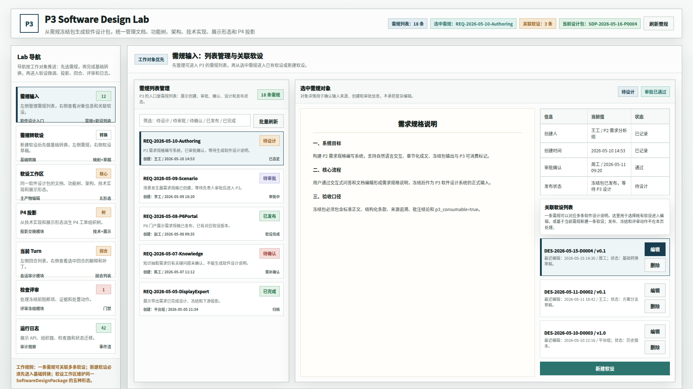
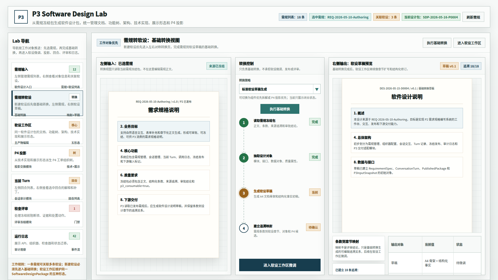
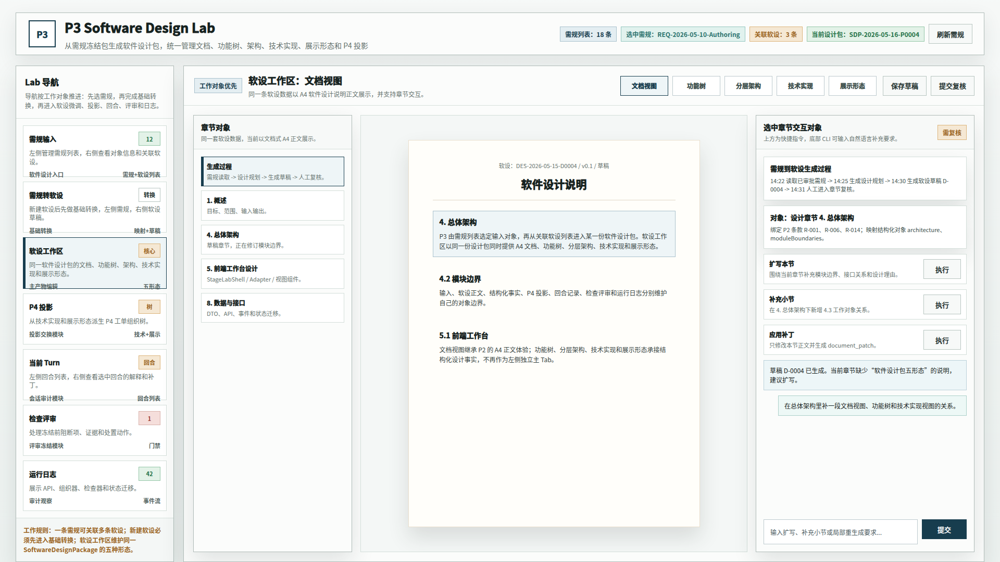
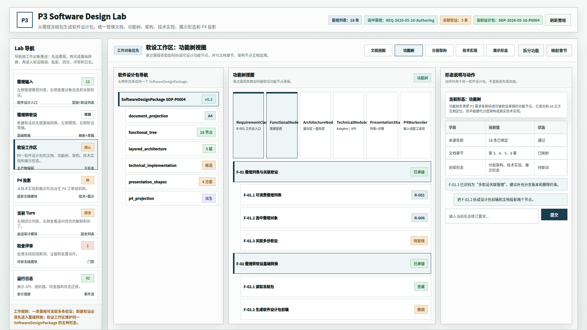
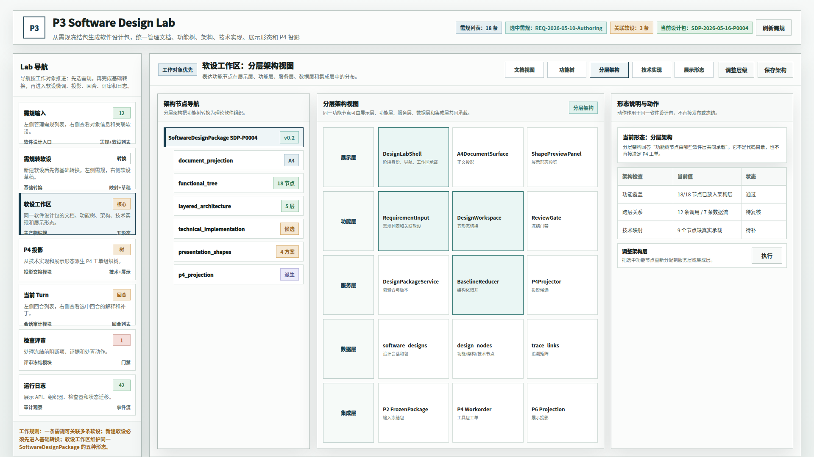
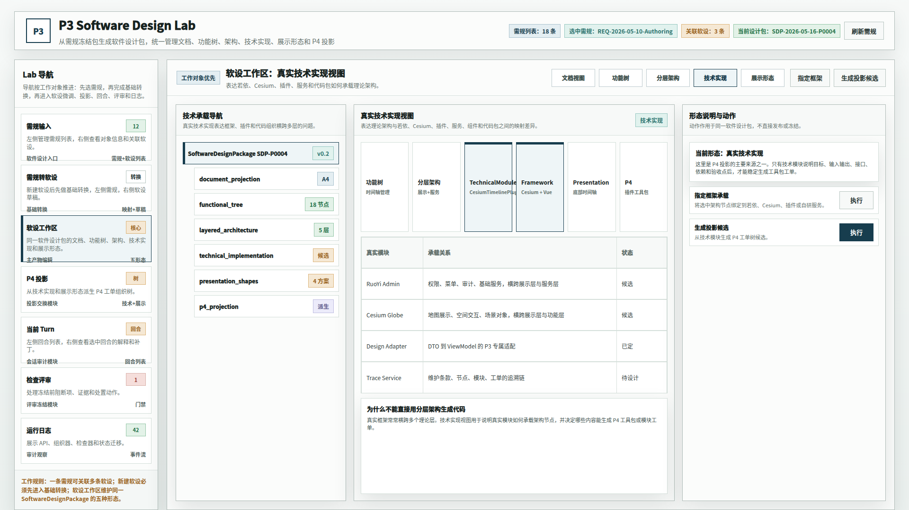
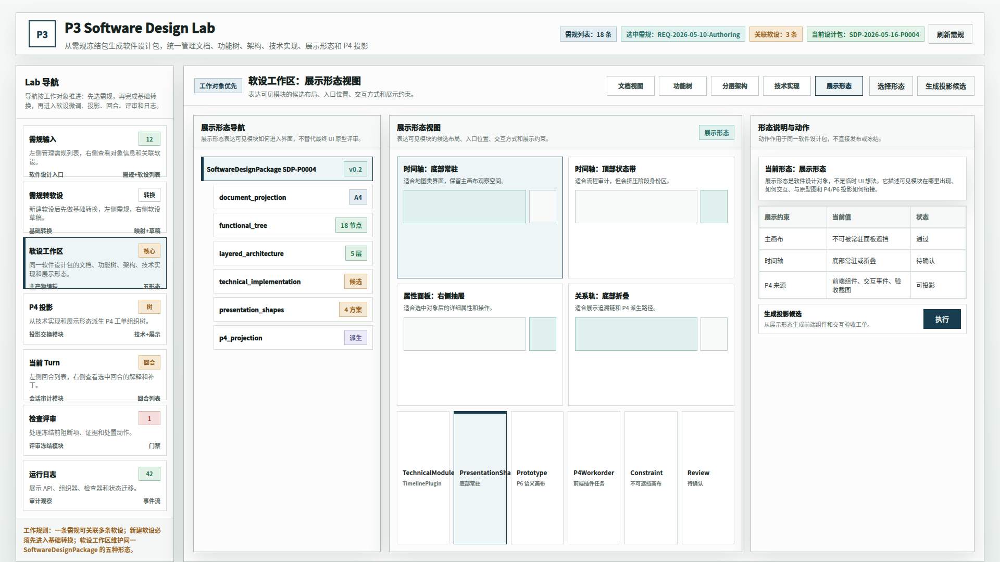
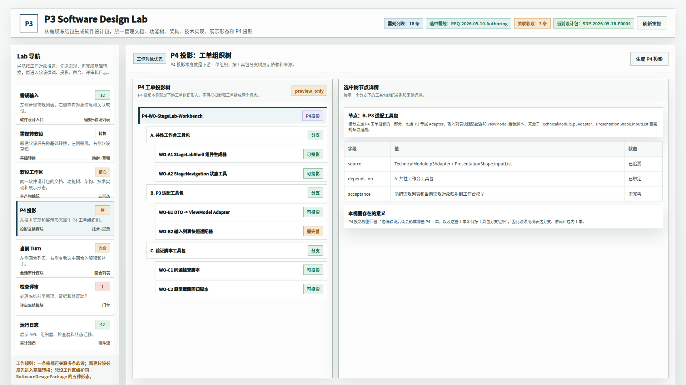
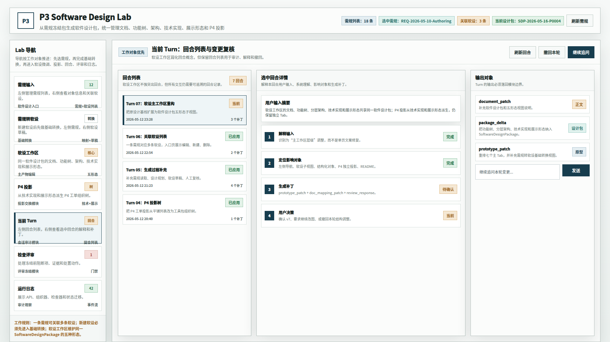

# CodeFactoryV2 P3 Design Lab 多形态软设工作区原型 v8

## 1. 元信息

- 版本包：`2026-05-16-140841-CodeFactoryV2-P3-Design-Lab多形态软设工作区原型-v8`
- 生成时间：2026-05-16 14:08:41
- 当前状态：待用户确认
- 所属范围：`P3` 软件设计系统 / `P3 Design Lab`
- 目标路由：后续实现时映射到 `P3 Design Lab` 主工作台
- 页面主对象：需规列表、关联软设、需规转软设基础转换、`SoftwareDesignPackage`、软件设计说明文档投影、功能树、分层架构、真实技术实现、展示形态、`P4` 工单投影树、回合列表
- 目标画板：桌面整页 `1920 x 1080`
- 源文件：`source/p3-design-lab-multiform-package-prototype.html`

## 2. 本版定位

本版继承 v7 已确认方向：`需规输入 -> 需规转软设 -> 软设工作区 -> P4 投影 -> 当前 Turn -> 检查评审 -> 运行日志`。

本版只深化一个核心问题：软件设计说明不应只是 A4 文档，也不应只有“文档 / 结构化数据”双视图。根据主设计文档，软设事实源应升级为 `SoftwareDesignPackage`，并在软设工作区内表达五种形态：

1. 文档形态。
2. 功能树形态。
3. 分层架构形态。
4. 真实技术实现形态。
5. 展示形态 / 交互形态。

`P4` 投影继续保留为 Lab 一级视图，但它不再直接从 A4 文档或泛化模块列表生成，而是从真实技术实现形态和展示形态派生。

## 3. 非目标

- 不做前后端业务代码实现。
- 不覆盖 v7 原型包。
- 不改变需规输入和需规转软设基础转换的已确认工作流。
- 不把展示形态替代最终 UI 原型评审。
- 不把 `P4` 投影视图下沉为软设工作区二级视图。

## 4. 事实源与设计依据

- 主设计文档：`DOC/CODEX_DOC/02_设计说明/P3_软件设计系统/P3-软件设计系统设计.md`
- 已归并补充案：`P3-软件设计系统设计-260516-0214-软设对象多形态设计补充案.md`
- 前序原型包：`DOC/CODEX_DOC/08_原型与附图/2026-05-15-143041-CodeFactoryV2-P3-Design-Lab需规转软设原型-v7/`
- `P2` 参考原型：`DOC/CODEX_DOC/08_原型与附图/2026-05-12-213000-CodeFactoryV2-P2-Brainstorming-Lab真实系统对齐原型-v6/`

设计判断：

- `P3` 仍应继承 `P2 Lab` 的顶部身份区、左侧导航和右侧任务工作区。
- 软设工作区保留 A4 文档质感，但 A4 正文只是正式文档投影。
- 功能树、分层架构、技术实现和展示形态是同一软件设计包的不同形态，不应变成相互独立的数据源。

## 5. 画板规格与布局预算

- 截图视口：`1920 x 1080`
- 顶部身份区：阶段标识、需规数量、选中需规、关联软设、当前设计包、刷新动作。
- 左侧 Lab 导航：七个主 Tab，保持 v7 工作路径。
- 右侧软设工作区：顶部二级切换按钮覆盖文档、功能树、分层架构、技术实现、展示形态。
- `P4` 投影：仍为独立主 Tab，表达下游工单树。

## 6. 图文证据链

### 6.1 需规输入与关联软设视图

- 评阅状态：继承 v7，待用户确认
- 文件：`01-1920x1080-需规输入与关联软设视图.png`
- 设计依据：P3 入口不是单个需规正文，而是可消费需规列表；一条需规可关联多份软设。



### 6.2 需规转软设基础转换视图

- 评阅状态：继承 v7，待用户确认
- 文件：`02-1920x1080-需规转软设基础转换视图.png`
- 设计依据：新建软设后先进入基础转换，左侧需规、右侧软设草稿，中间只承担转换策略和转换过程。



### 6.3 软设工作区文档视图

- 评阅状态：待用户确认
- 文件：`03-1920x1080-软设工作区文档视图.png`
- 设计依据：A4 软件设计说明仍是人审阅的正式文档投影，支持章节级交互和正文补丁。



### 6.4 软设工作区功能树视图

- 评阅状态：待用户确认
- 文件：`04-1920x1080-软设工作区功能树视图.png`
- 设计依据：功能树负责表达需规条款如何被软设承接，并建立 `RequirementClause -> FunctionalNode` 的起始追溯。



### 6.5 软设工作区分层架构视图

- 评阅状态：待用户确认
- 文件：`05-1920x1080-软设工作区分层架构视图.png`
- 设计依据：分层架构表达功能节点在展示层、功能层、服务层、数据层和集成层中的分布，不等同于代码目录。



### 6.6 软设工作区真实技术实现视图

- 评阅状态：待用户确认
- 文件：`06-1920x1080-软设工作区真实技术实现视图.png`
- 设计依据：真实框架、插件和代码组织可能横跨多个理论层；技术实现视图用于说明真实承载关系，并作为 `P4` 投影来源之一。



### 6.7 软设工作区展示形态视图

- 评阅状态：待用户确认
- 文件：`07-1920x1080-软设工作区展示形态视图.png`
- 设计依据：展示形态是软件设计对象，表达可见模块在哪里出现、如何交互、与原型图和 `P4/P6` 投影如何衔接。



### 6.8 P4 工单投影树视图

- 评阅状态：待用户确认
- 文件：`08-1920x1080-P4工单投影树视图.png`
- 设计依据：`P4` 投影从 `TechnicalModule` 和 `PresentationShape` 派生，仍用树表达工具包分支、依赖和包内工单。



### 6.9 当前 Turn 回合列表视图

- 评阅状态：继承 v7，待用户确认
- 文件：`09-1920x1080-当前Turn回合列表视图.png`
- 设计依据：虽然软设工作区不以 Turn 为唯一中心，但回合列表仍用于解释生成和修订过程。



## 7. 原始材料说明

本版无外部原始图片。`original/README.md` 记录本版引用的仓库内正式文档和历史原型包。

## 8. 原型到实现映射

| 原型区块 | 目标实现映射 |
| --- | --- |
| 顶部身份区、左侧 Lab 导航 | `StageLabShell`、`StageLabNavigation` |
| 需规输入 | `P3InputPackageView`、`RequirementSpecCandidateViewModel`、`RelatedSoftwareDesignViewModel` |
| 需规转软设 | `RequirementToDesignConversionView`、`ConversionController` |
| 文档视图 | `SoftwareDesignDocumentView`、`StandardDocumentViewModel` |
| 功能树视图 | `FunctionalDesignTreeView`、`FunctionalNode` |
| 分层架构视图 | `LayeredArchitectureView`、`ArchitectureNode` |
| 真实技术实现视图 | `TechnicalImplementationView`、`TechnicalModule` |
| 展示形态视图 | `PresentationShapeView`、`PresentationShape` |
| P4 投影 | `P4WorkorderProjectionTreeViewModel`、`P4WorkorderNode` |
| 当前 Turn | `P3CurrentTurnView`、`StageInteractionViewModel` |

## 9. 允许偏差与不可接受偏差

允许偏差：

- 真实实现可根据数据量调整列宽、卡片密度和局部文案。
- 分层架构和技术实现可在实现时替换为更强的图谱组件。
- 展示形态视图的候选布局可根据具体业务模块增加状态图。

不可接受偏差：

- 把设计稿当成布局参考，而不是实现基线。
- 把 A4 文档当作软设唯一事实源。
- 只实现“文档 / 结构化数据”双视图，缺失功能树、分层架构、技术实现和展示形态。
- `P4` 投影直接从 A4 正文或普通模块列表生成，绕过技术实现形态和展示形态。
- 新建软设后绕过需规转软设基础转换页。

## 10. 查看与再生成

打开源文件：

```bash
xdg-open "DOC/CODEX_DOC/08_原型与附图/2026-05-16-140841-CodeFactoryV2-P3-Design-Lab多形态软设工作区原型-v8/source/p3-design-lab-multiform-package-prototype.html"
```

重新生成全部截图：

```bash
base="$PWD/DOC/CODEX_DOC/08_原型与附图/2026-05-16-140841-CodeFactoryV2-P3-Design-Lab多形态软设工作区原型-v8"
html="$base/source/p3-design-lab-multiform-package-prototype.html"
corepack pnpm --dir apps/web exec playwright screenshot --viewport-size=1920,1080 "file://$html#input" "$base/01-1920x1080-需规输入与关联软设视图.png"
corepack pnpm --dir apps/web exec playwright screenshot --viewport-size=1920,1080 "file://$html#conversion" "$base/02-1920x1080-需规转软设基础转换视图.png"
corepack pnpm --dir apps/web exec playwright screenshot --viewport-size=1920,1080 "file://$html#workspace-doc" "$base/03-1920x1080-软设工作区文档视图.png"
corepack pnpm --dir apps/web exec playwright screenshot --viewport-size=1920,1080 "file://$html#workspace-function" "$base/04-1920x1080-软设工作区功能树视图.png"
corepack pnpm --dir apps/web exec playwright screenshot --viewport-size=1920,1080 "file://$html#workspace-architecture" "$base/05-1920x1080-软设工作区分层架构视图.png"
corepack pnpm --dir apps/web exec playwright screenshot --viewport-size=1920,1080 "file://$html#workspace-technical" "$base/06-1920x1080-软设工作区真实技术实现视图.png"
corepack pnpm --dir apps/web exec playwright screenshot --viewport-size=1920,1080 "file://$html#workspace-presentation" "$base/07-1920x1080-软设工作区展示形态视图.png"
corepack pnpm --dir apps/web exec playwright screenshot --viewport-size=1920,1080 "file://$html#p4" "$base/08-1920x1080-P4工单投影树视图.png"
corepack pnpm --dir apps/web exec playwright screenshot --viewport-size=1920,1080 "file://$html#turn" "$base/09-1920x1080-当前Turn回合列表视图.png"
```

## 11. 自检记录

- 2026-05-16：Playwright 渲染 9 张 `1920 x 1080` PNG。
- 2026-05-16：`file *.png` 确认 9 张图片均为 `1920 x 1080`。
- 2026-05-16：人工查看功能树、分层架构、真实技术实现、展示形态 4 张核心图，未发现明显遮挡、裁切或主对象丢失。
- 2026-05-16：源码扫描确认无旧 `workspace-struct`、`结构化数据视图`、`双视图`、`SoftwareDesign.structured` 口径残留。

## 12. 评审结论与后续处理

当前结论：待用户确认。

如果本版通过，可将 v8 作为后续 P3 多形态软设工作区实现基线；实现后必须用运行时截图与本原型图逐项对照。
