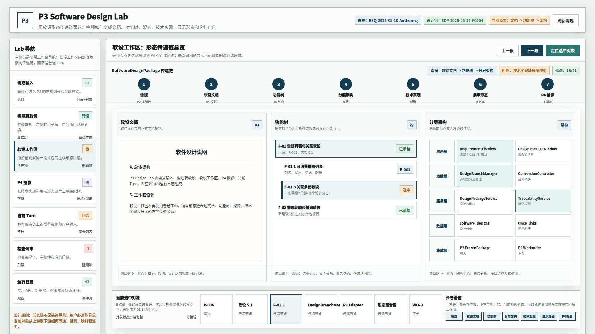
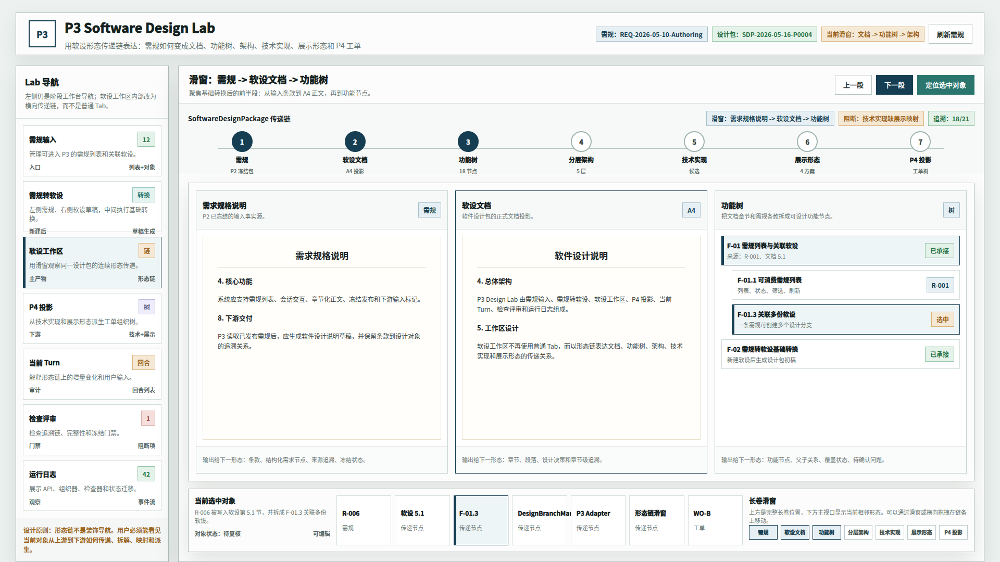
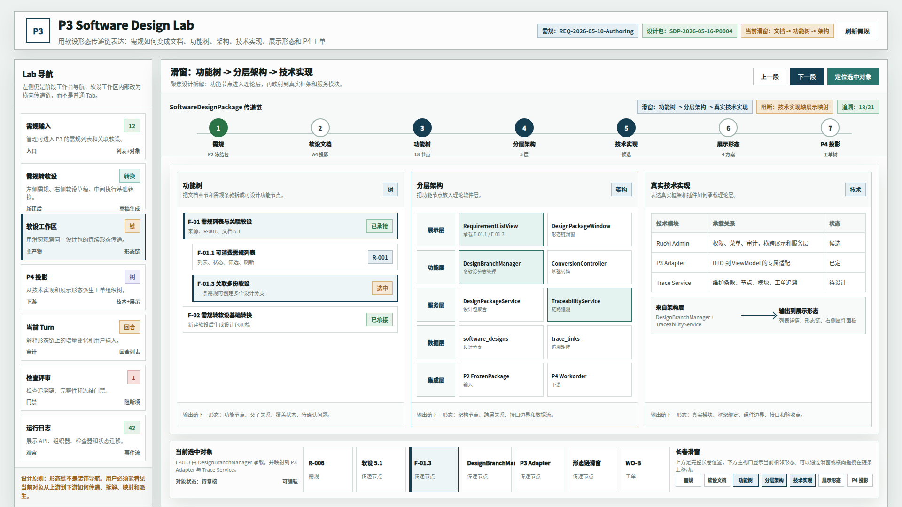
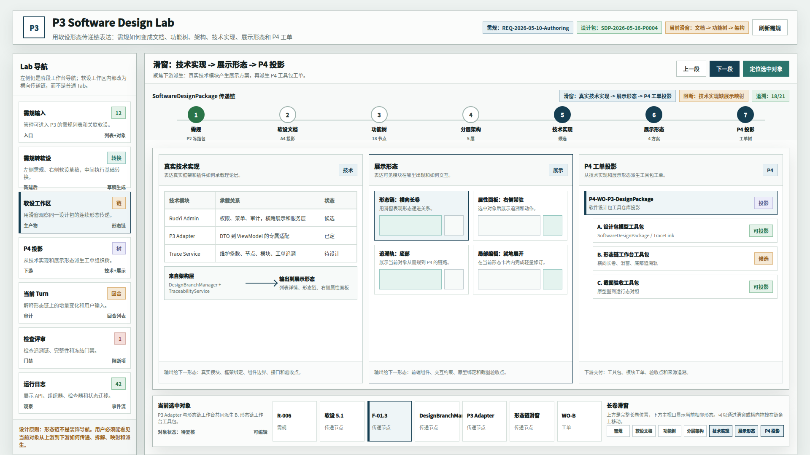

# CodeFactoryV2 P3 Design Lab 软设形态传递链滑窗原型 v9

## 1. 元信息

- 版本包：`2026-05-16-164251-CodeFactoryV2-P3-Design-Lab软设形态传递链滑窗原型-v9`
- 生成时间：2026-05-16 16:42:51
- 当前状态：待用户确认
- 所属范围：`P3` 软件设计系统 / `P3 Design Lab` / 软设工作区组织形式
- 目标路由：后续实现时映射到 `P3 Design Lab` 主工作台中的软设工作区
- 页面主对象：`SoftwareDesignPackage`、形态传递链、滑窗、当前选中对象追溯链
- 目标画板：桌面整页 `1920 x 1080`
- 源文件：`source/p3-design-lab-morph-chain-slider-prototype.html`

## 2. 本版定位

v8 已验证软设有文档、功能树、分层架构、真实技术实现、展示形态和 `P4` 投影等多种表达，但组织方式仍然接近普通 Tab。用户指出这种方式不够直观看出上一个形态如何传递到下一个形态。

v9 专门验证新的组织形式：`软设形态传递链滑窗`。

核心思想：

```text
需规 -> 软设文档 -> 功能树 -> 分层架构 -> 技术实现 -> 展示形态 -> P4 投影
```

它不是普通 Tab，而是一条横向长卷。顶部显示完整链条，主工作区一次展示 2 到 3 个相邻形态，底部显示当前选中对象从上游到下游的端到端追溯。

## 3. 非目标

- 不做运行代码实现。
- 不覆盖 v8 原型包。
- 不取消左侧 Lab 主导航。
- 不要求一次性把七个形态完整铺满在主视口。
- 不把滑窗设计成纯视觉装饰；它必须表达传递、拆解、映射和派生关系。

## 4. 事实源与设计依据

- 用户 2026-05-16 批注：从软设文档到功能树、架构图、技术实现图、展示形态图，应能直观看到传递关系。
- 用户 2026-05-16 批注：希望探讨“长画卷”“横向拖动”“滑窗”这种方式是否可行。
- v8 原型包：`DOC/CODEX_DOC/08_原型与附图/2026-05-16-140841-CodeFactoryV2-P3-Design-Lab多形态软设工作区原型-v8/`
- 主设计文档：`DOC/CODEX_DOC/02_设计说明/P3_软件设计系统/P3-软件设计系统设计.md`

设计判断：

- 多形态软设不是并列视图关系，而是同一对象的连续变换链。
- 普通 Tab 可以保留在 Lab 主导航层，但不适合作为软设工作区内部五形态的主要组织方式。
- 长卷如果一次性全部展开会过宽，因此采用“完整长卷位置 + 主视口滑窗 + 底部追溯轨”的折中方案。

## 5. 画板规格与布局预算

- 截图视口：`1920 x 1080`
- 左侧：Lab 主导航，保持 P2/P3 工作台结构。
- 顶部：阶段身份区和当前设计包信息。
- 软设工作区顶部：完整 `SoftwareDesignPackage` 传递链。
- 中间主视口：一次展示 3 个相邻形态。
- 底部：当前选中对象追溯链和长卷滑窗缩略条。

## 6. 图文证据链

### 6.1 软设形态传递链总览

- 评阅状态：待用户确认
- 文件：`01-1920x1080-软设形态传递链总览.png`
- 设计依据：用户需要看到完整传递关系，而不是孤立 Tab。该图显示完整链条、当前滑窗和底部追溯轨。
- 需要判断：这种“顶部长卷 + 中间滑窗 + 底部追溯”的组织形式是否比 v8 普通 Tab 更符合 P3 核心工作区。



### 6.2 需规到功能树滑窗

- 评阅状态：待用户确认
- 文件：`02-1920x1080-需规到功能树滑窗.png`
- 设计依据：前段滑窗聚焦 `需规 -> 软设文档 -> 功能树`，用于说明输入条款如何进入 A4 正文，再拆成可设计功能节点。



### 6.3 功能树到技术实现滑窗

- 评阅状态：待用户确认
- 文件：`03-1920x1080-功能树到技术实现滑窗.png`
- 设计依据：中段滑窗聚焦 `功能树 -> 分层架构 -> 技术实现`，用于说明功能节点如何被架构层承载，再映射真实框架、插件、服务和代码组织。



### 6.4 技术实现到 P4 投影滑窗

- 评阅状态：待用户确认
- 文件：`04-1920x1080-技术实现到P4投影滑窗.png`
- 设计依据：后段滑窗聚焦 `技术实现 -> 展示形态 -> P4 投影`，用于说明真实技术模块和展示形态如何派生下游工具包工单。



## 7. 原始材料说明

本版无外部原始图片。`original/README.md` 记录引用的仓库内正式文档和历史原型包。

## 8. 原型到实现映射

| 原型区块 | 目标实现映射 |
| --- | --- |
| 顶部完整形态链 | `SoftwareDesignMorphChain` |
| 中间三段滑窗 | `MorphChainViewport` |
| 单个形态卡片 | `MorphStageCard` |
| 底部选中对象追溯轨 | `SelectedObjectTraceRail` |
| 长卷缩略滑窗 | `MorphChainMiniSlider` |
| 当前对象 | `RequirementClause -> FunctionalNode -> ArchitectureNode -> TechnicalModule -> PresentationShape -> P4WorkorderNode` |

## 9. 允许偏差与不可接受偏差

允许偏差：

- 实现时可以用真实横向滚动、拖拽条或分段按钮替代静态 hash 切换。
- 主视口可以根据屏幕宽度从 3 个相邻形态降级为 2 个相邻形态。
- 单个形态卡片内部可以使用更专业的图谱、树或架构组件。

不可接受偏差：

- 回到普通五 Tab，导致形态之间的传递关系不可见。
- 只显示当前形态，不显示上游来源和下游派生。
- 底部没有当前选中对象的端到端追溯链。
- `P4` 投影绕过技术实现和展示形态。

## 10. 查看与再生成

打开源文件：

```bash
xdg-open "DOC/CODEX_DOC/08_原型与附图/2026-05-16-164251-CodeFactoryV2-P3-Design-Lab软设形态传递链滑窗原型-v9/source/p3-design-lab-morph-chain-slider-prototype.html"
```

重新生成截图：

```bash
base="$PWD/DOC/CODEX_DOC/08_原型与附图/2026-05-16-164251-CodeFactoryV2-P3-Design-Lab软设形态传递链滑窗原型-v9"
html="$base/source/p3-design-lab-morph-chain-slider-prototype.html"
corepack pnpm --dir apps/web exec playwright screenshot --viewport-size=1920,1080 "file://$html#overview" "$base/01-1920x1080-软设形态传递链总览.png"
corepack pnpm --dir apps/web exec playwright screenshot --viewport-size=1920,1080 "file://$html#early" "$base/02-1920x1080-需规到功能树滑窗.png"
corepack pnpm --dir apps/web exec playwright screenshot --viewport-size=1920,1080 "file://$html#middle" "$base/03-1920x1080-功能树到技术实现滑窗.png"
corepack pnpm --dir apps/web exec playwright screenshot --viewport-size=1920,1080 "file://$html#late" "$base/04-1920x1080-技术实现到P4投影滑窗.png"
```

## 11. 自检记录

- 2026-05-16：Playwright 渲染 4 张 `1920 x 1080` PNG。
- 2026-05-16：`file *.png` 确认 4 张图片均为 `1920 x 1080`。
- 2026-05-16：人工查看总览图和后段滑窗图，确认顶部完整链、主视口三形态、底部追溯轨均可辨识。
- 2026-05-16：源码扫描确认无旧 `workspace-struct`、`结构化数据视图`、`双视图`、`SoftwareDesign.structured` 口径残留。

## 12. 评审结论与后续处理

当前结论：待用户确认。

如果本版通过，建议将 v9 作为 P3 软设工作区的交互组织基线；v8 保留为多形态内容拆分稿，不作为最终组织形式基线。
