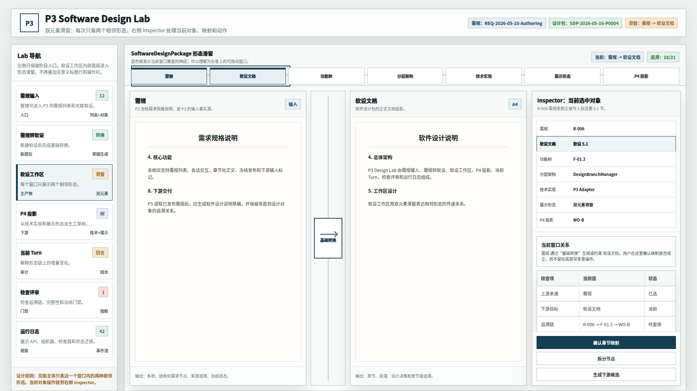
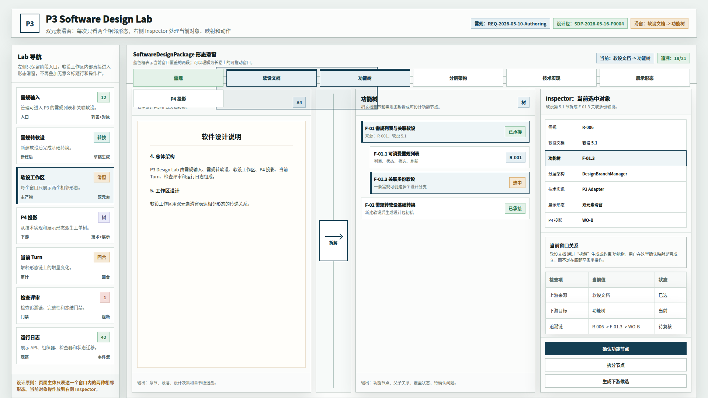
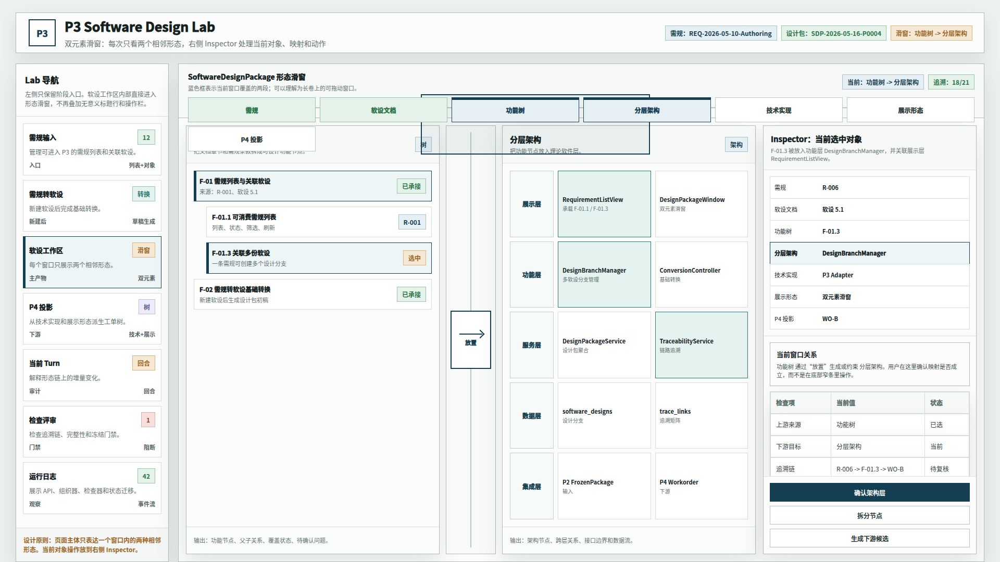
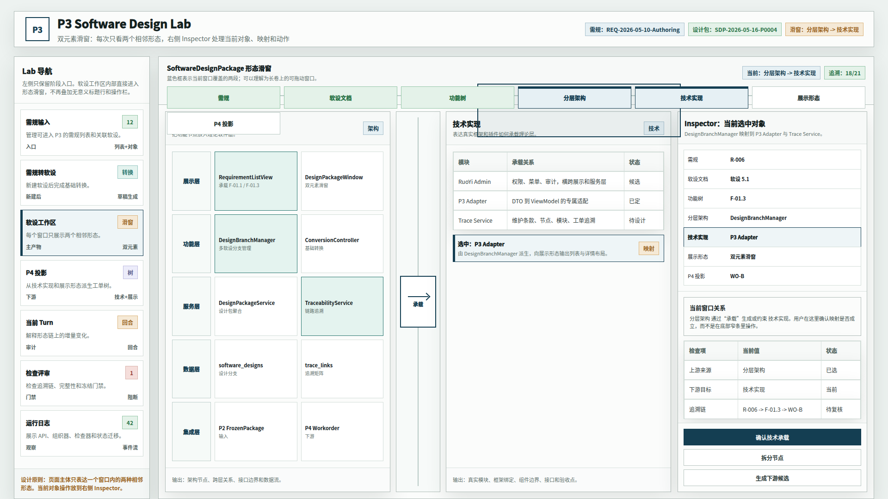
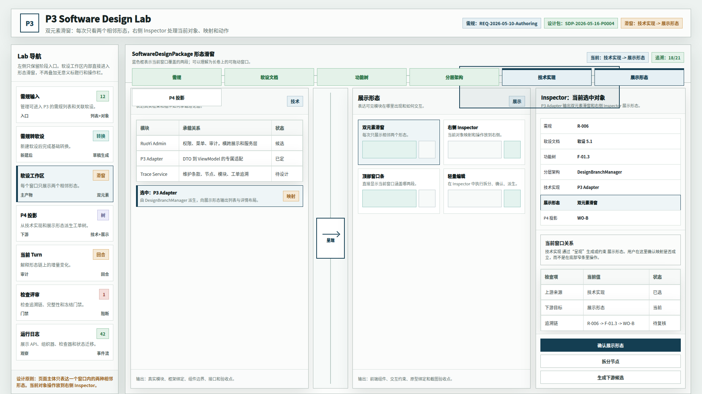
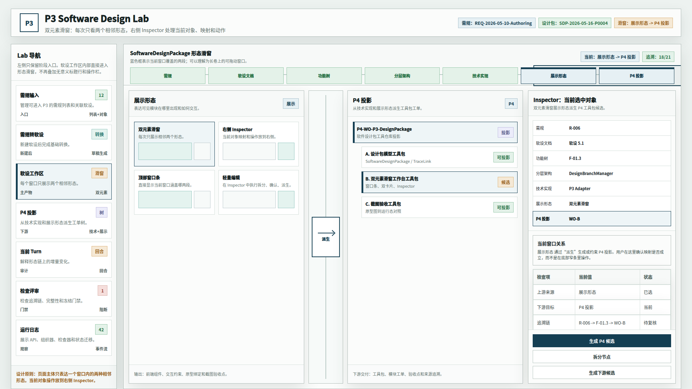

# CodeFactoryV2 P3 Design Lab 双元素形态滑窗原型 v10

## 1. 元信息

- 版本包：`2026-05-16-173547-CodeFactoryV2-P3-Design-Lab双元素形态滑窗原型-v10`
- 生成时间：2026-05-16 17:35:47
- 当前状态：待用户确认
- 所属范围：`P3` 软件设计系统 / `P3 Design Lab` / 软设工作区组织形式
- 目标路由：后续实现时映射到 `P3 Design Lab` 软设工作区
- 页面主对象：双元素形态滑窗、右侧 Inspector、当前对象追溯链
- 目标画板：桌面整页 `1920 x 1080`
- 源文件：`source/p3-design-lab-paired-morph-window-prototype.html`

## 2. 本版定位

v9 已验证“形态传递链”方向，但仍存在三个问题：

1. 主区同时展示三个形态，编辑空间不足。
2. 顶部存在无意义工作区标题和动作按钮。
3. 当前选中对象放在底部窄条，不适合操作。

v10 按用户批注重做组织形式：

- 进入软设工作区后，上来就是形态滑窗。
- 一次只展示两个相邻形态。
- 顶部滑窗条直接显示当前窗口覆盖哪两段。
- 当前对象、映射、检查项和操作全部放在右侧 Inspector。
- 底部追溯窄条取消。

## 3. 非目标

- 不做运行代码实现。
- 不覆盖 v8、v9 原型包。
- 不讨论所有业务内容，只验证软设工作区的组织形式。
- 不保留“上一段 / 下一段 / 定位选中对象”这类无意义标题栏动作。

## 4. 事实源与设计依据

- 用户 2026-05-16 批注：主工作区顶部标题和动作行无意义，应直接进入传递链滑窗。
- 用户 2026-05-16 批注：滑窗应明确展示当前窗口涵盖哪几个段落，而不是单纯线性结构。
- 用户 2026-05-16 批注：一个页面里展示两种类型的要素已足够，不希望三个形态放在一起。
- 用户 2026-05-16 批注：当前选中对象不应放在底部窄条，建议放到右侧 Inspector。
- v9 原型包：`DOC/CODEX_DOC/08_原型与附图/2026-05-16-164251-CodeFactoryV2-P3-Design-Lab软设形态传递链滑窗原型-v9/`

## 5. 画板规格与布局预算

- 截图视口：`1920 x 1080`
- 左侧：Lab 主导航。
- 顶部：阶段身份区，只保留必要对象信息。
- 软设工作区顶部：形态滑窗条，蓝色框表示当前双元素窗口。
- 主体左中：两个相邻形态卡片。
- 两卡之间：传递关系桥，说明当前窗口的转换动作。
- 右侧：Inspector，承载当前选中对象、端到端追溯、检查项和动作。

## 6. 图文证据链

### 6.1 需规到软设文档滑窗

- 文件：`01-1920x1080-需规到软设文档滑窗.png`
- 设计依据：新建软设后，第一段窗口应表达 P2 冻结需规如何生成软件设计说明文档投影。



### 6.2 软设文档到功能树滑窗

- 文件：`02-1920x1080-软设文档到功能树滑窗.png`
- 设计依据：文档章节和设计决策应能拆成可设计功能节点。



### 6.3 功能树到分层架构滑窗

- 文件：`03-1920x1080-功能树到分层架构滑窗.png`
- 设计依据：功能节点进入理论软件层，形成展示层、功能层、服务层、数据层和集成层的架构表达。



### 6.4 分层架构到技术实现滑窗

- 文件：`04-1920x1080-分层架构到技术实现滑窗.png`
- 设计依据：理论架构节点继续映射到真实框架、插件、服务和代码组织。



### 6.5 技术实现到展示形态滑窗

- 文件：`05-1920x1080-技术实现到展示形态滑窗.png`
- 设计依据：真实技术模块需要说明可见模块在哪里出现、如何交互、由哪些界面形态承载。



### 6.6 展示形态到 P4 投影滑窗

- 文件：`06-1920x1080-展示形态到P4投影滑窗.png`
- 设计依据：展示形态和技术实现共同派生 `P4` 工具包工单。



## 7. 原始材料说明

本版无外部原始图片。`original/README.md` 记录引用的仓库内正式文档和历史原型包。

## 8. 原型到实现映射

| 原型区块 | 目标实现映射 |
| --- | --- |
| 顶部形态滑窗条 | `MorphPairWindowTrack` |
| 双元素主视口 | `MorphPairViewport` |
| 左右形态卡片 | `MorphStageCard` |
| 中间传递桥 | `MorphPairBridge` |
| 右侧 Inspector | `MorphObjectInspector` |
| Inspector 追溯链 | `SelectedObjectTraceMap` |
| Inspector 操作 | `MorphObjectActions` |

## 9. 允许偏差与不可接受偏差

允许偏差：

- 真实实现可以把顶部滑窗条做成可拖拽组件。
- 双元素窗口在宽屏下可支持临时展开第三个辅助预览，但默认不应这样做。
- Inspector 内部字段可根据真实对象模型调整。

不可接受偏差：

- 主体又回到三形态或五形态同时展示。
- 当前对象操作回到底部窄条。
- 顶部重新增加与当前窗口无关的工作区标题动作行。
- 滑窗条不能直观看出当前窗口覆盖哪两段。

## 10. 查看与再生成

打开源文件：

```bash
xdg-open "DOC/CODEX_DOC/08_原型与附图/2026-05-16-173547-CodeFactoryV2-P3-Design-Lab双元素形态滑窗原型-v10/source/p3-design-lab-paired-morph-window-prototype.html"
```

重新生成截图：

```bash
base="$PWD/DOC/CODEX_DOC/08_原型与附图/2026-05-16-173547-CodeFactoryV2-P3-Design-Lab双元素形态滑窗原型-v10"
html="$base/source/p3-design-lab-paired-morph-window-prototype.html"
corepack pnpm --dir apps/web exec playwright screenshot --viewport-size=1920,1080 "file://$html#reqdoc" "$base/01-1920x1080-需规到软设文档滑窗.png"
corepack pnpm --dir apps/web exec playwright screenshot --viewport-size=1920,1080 "file://$html#docfunc" "$base/02-1920x1080-软设文档到功能树滑窗.png"
corepack pnpm --dir apps/web exec playwright screenshot --viewport-size=1920,1080 "file://$html#funcarch" "$base/03-1920x1080-功能树到分层架构滑窗.png"
corepack pnpm --dir apps/web exec playwright screenshot --viewport-size=1920,1080 "file://$html#archtech" "$base/04-1920x1080-分层架构到技术实现滑窗.png"
corepack pnpm --dir apps/web exec playwright screenshot --viewport-size=1920,1080 "file://$html#techshape" "$base/05-1920x1080-技术实现到展示形态滑窗.png"
corepack pnpm --dir apps/web exec playwright screenshot --viewport-size=1920,1080 "file://$html#shapep4" "$base/06-1920x1080-展示形态到P4投影滑窗.png"
```

## 11. 自检记录

- 2026-05-16：Playwright 渲染 6 张 `1920 x 1080` PNG。
- 2026-05-16：`file *.png` 确认 6 张图片均为 `1920 x 1080`。
- 2026-05-16：人工查看首图和末图，确认顶部滑窗条不再换行压住主区，当前窗口双段可辨识，右侧 Inspector 可操作。
- 2026-05-16：源码扫描确认无旧 `workspace-struct`、`结构化数据视图`、`双视图`、`SoftwareDesign.structured` 口径残留。

## 12. 评审结论与后续处理

当前结论：待用户确认。

如果本版通过，建议将 v10 作为软设工作区组织形式基线；v8 保留为多形态内容拆分稿，v9 保留为传递链探索稿。
