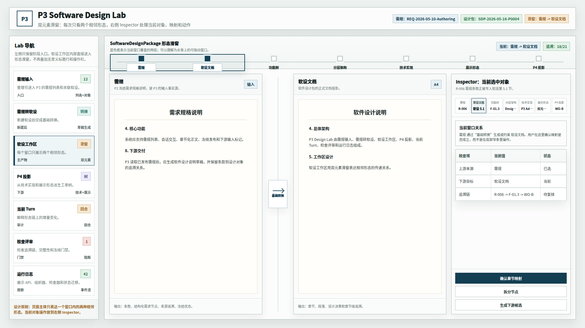
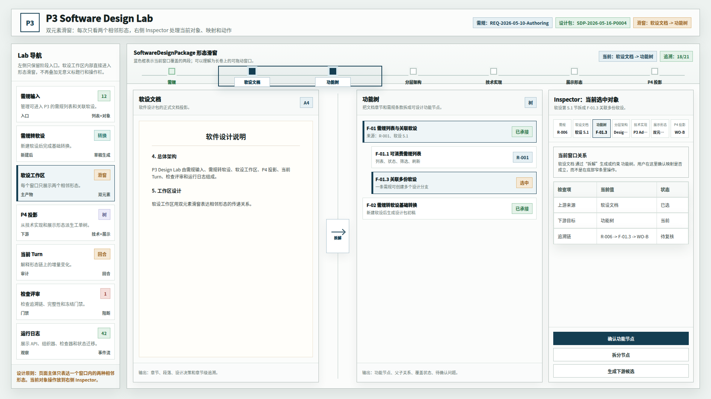
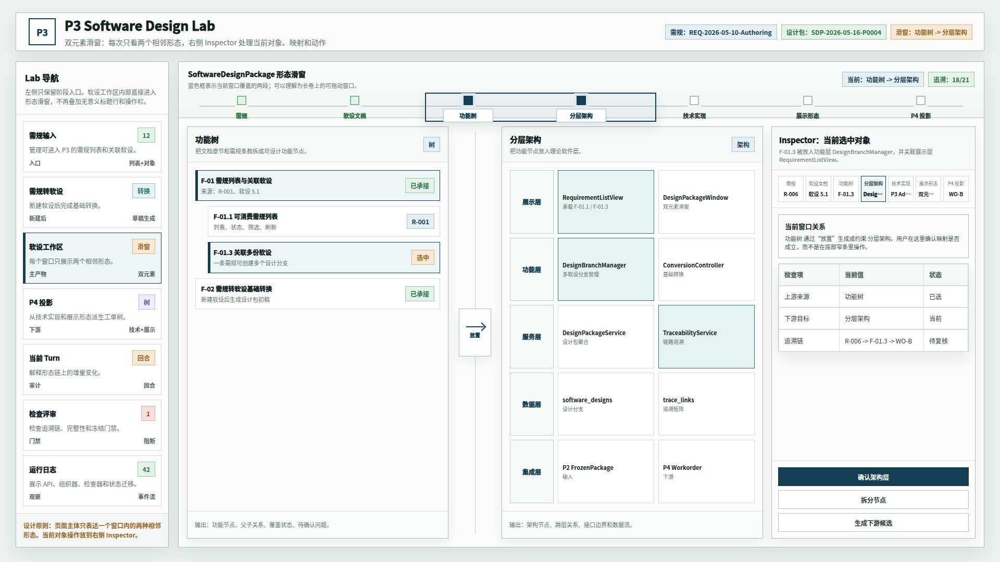
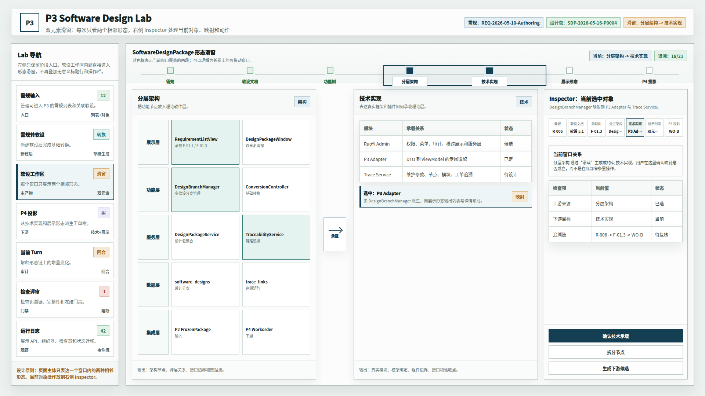
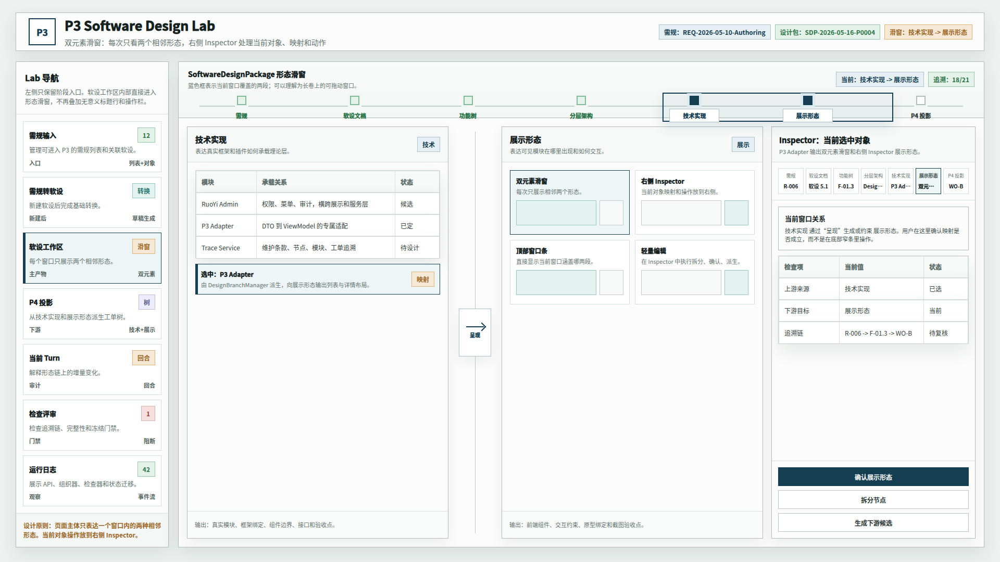
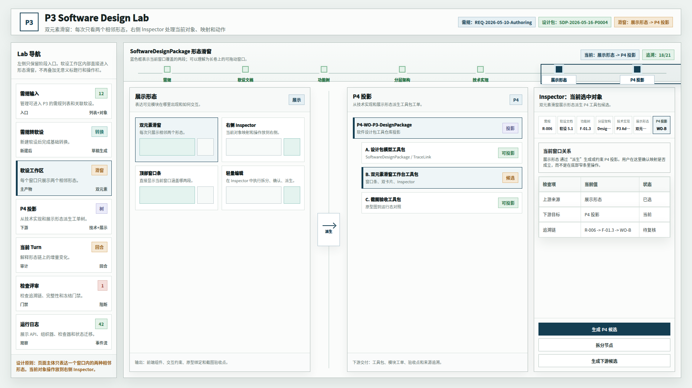

# CodeFactoryV2 P3 Design Lab 双元素形态滑窗排版优化原型 v11

## 1. 元信息

- 版本包：`2026-05-16-183020-CodeFactoryV2-P3-Design-Lab双元素形态滑窗排版优化原型-v11`
- 生成时间：2026-05-16 18:30:20
- 当前状态：待用户确认
- 所属范围：`P3` 软件设计系统 / `P3 Design Lab` / 软设工作区组织形式
- 目标路由：后续实现时映射到 `P3 Design Lab` 软设工作区
- 页面主对象：双元素形态滑窗、右侧 Inspector、当前对象追溯链
- 目标画板：桌面整页 `1920 x 1080`
- 源文件：`source/p3-design-lab-paired-morph-window-polished-prototype.html`

## 2. 本版定位

v10 已确认方向正确，但排版和滑窗细节仍显得乱。本版只优化视觉秩序，不改变已经确认的业务组织方式。

v11 的重点：

- 滑窗条从“一排块状按钮”改为“长轨道 + 节点 + 观察窗口”。
- 当前窗口框明确覆盖两个相邻节点，更接近可拖动滑窗的概念。
- 主区继续只展示两个相邻形态，避免三形态同时挤压编辑空间。
- 中间传递桥收窄，作为关系提示，不抢主内容层级。
- 右侧 Inspector 压缩追溯链密度，保留当前对象、窗口关系、检查项和动作。

## 3. 非目标

- 不做运行代码实现。
- 不覆盖 v8、v9、v10 原型包。
- 不改变双元素滑窗方向。
- 不把软设工作区退回多 Tab 或三形态并列方案。

## 4. 事实源与设计依据

- 用户确认 v10 的方向：“对，是这个意思”。
- 用户批注 v10：“排版有点乱，尤其是滑动窗口，需要优化细节”。
- v10 原型包：`DOC/CODEX_DOC/08_原型与附图/2026-05-16-173547-CodeFactoryV2-P3-Design-Lab双元素形态滑窗原型-v10/`

## 5. 布局说明

- 左侧：Lab 主导航，只保留阶段入口。
- 顶部：系统身份与当前对象信息。
- 工作区顶部：形态滑窗轨道。蓝色外框表示当前观察窗口，深色节点表示窗口内的两个端点。
- 主体：左右两个相邻形态卡片，中间用轻量传递桥表达转换、拆解、放置、承载、呈现或派生关系。
- 右侧：Inspector，用于当前对象追溯、检查与动作，不再放到底部窄条。

## 6. 图文证据链

### 6.1 需规到软设文档滑窗



### 6.2 软设文档到功能树滑窗



### 6.3 功能树到分层架构滑窗



### 6.4 分层架构到技术实现滑窗



### 6.5 技术实现到展示形态滑窗



### 6.6 展示形态到 P4 投影滑窗



## 7. 原型到实现映射

| 原型区块 | 目标实现映射 |
| --- | --- |
| 顶部形态滑窗轨道 | `MorphPairWindowTrack` |
| 滑窗观察框 | `MorphPairWindowFrame` |
| 双元素主视口 | `MorphPairViewport` |
| 左右形态卡片 | `MorphStageCard` |
| 中间传递桥 | `MorphPairBridge` |
| 右侧 Inspector | `MorphObjectInspector` |
| Inspector 追溯链 | `SelectedObjectTraceMap` |
| Inspector 操作 | `MorphObjectActions` |

## 8. 允许偏差与不可接受偏差

允许偏差：

- 真实实现可以让滑窗轨道支持拖拽、键盘切换或滚轮切换。
- Inspector 字段可以按真实 `SoftwareDesignPackage` 模型调整。
- 卡片内部内容可以随真实业务对象增减。

不可接受偏差：

- 滑窗条重新变成一排普通按钮。
- 当前窗口无法看出覆盖哪两个形态。
- 主体重新同时展示三个或更多形态。
- 当前对象操作重新放到底部窄条。

## 9. 查看与再生成

打开源文件：

```bash
xdg-open "DOC/CODEX_DOC/08_原型与附图/2026-05-16-183020-CodeFactoryV2-P3-Design-Lab双元素形态滑窗排版优化原型-v11/source/p3-design-lab-paired-morph-window-polished-prototype.html"
```

重新生成截图：

```bash
base="$PWD/DOC/CODEX_DOC/08_原型与附图/2026-05-16-183020-CodeFactoryV2-P3-Design-Lab双元素形态滑窗排版优化原型-v11"
html="$base/source/p3-design-lab-paired-morph-window-polished-prototype.html"
corepack pnpm --dir apps/web exec playwright screenshot --viewport-size=1920,1080 "file://$html#reqdoc" "$base/01-1920x1080-需规到软设文档滑窗.png"
corepack pnpm --dir apps/web exec playwright screenshot --viewport-size=1920,1080 "file://$html#docfunc" "$base/02-1920x1080-软设文档到功能树滑窗.png"
corepack pnpm --dir apps/web exec playwright screenshot --viewport-size=1920,1080 "file://$html#funcarch" "$base/03-1920x1080-功能树到分层架构滑窗.png"
corepack pnpm --dir apps/web exec playwright screenshot --viewport-size=1920,1080 "file://$html#archtech" "$base/04-1920x1080-分层架构到技术实现滑窗.png"
corepack pnpm --dir apps/web exec playwright screenshot --viewport-size=1920,1080 "file://$html#techshape" "$base/05-1920x1080-技术实现到展示形态滑窗.png"
corepack pnpm --dir apps/web exec playwright screenshot --viewport-size=1920,1080 "file://$html#shapep4" "$base/06-1920x1080-展示形态到P4投影滑窗.png"
```

## 10. 自检记录

- 2026-05-16：Playwright 渲染 6 张 `1920 x 1080` PNG。
- 2026-05-16：人工查看首图、第三图和末图，确认滑窗框、双元素主区、传递桥和右侧 Inspector 没有明显错位。
- 2026-05-16：`file *.png` 确认 6 张图片均为 `1920 x 1080`。
- 2026-05-16：`git diff --check` 通过。

## 11. 评审结论与后续处理

当前结论：待用户确认。

如果本版通过，建议将 v11 作为软设工作区滑窗组织形式的实现基线；v10 保留为方向确认稿，v11 作为排版优化确认稿。
