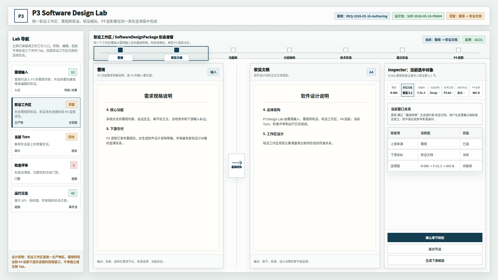
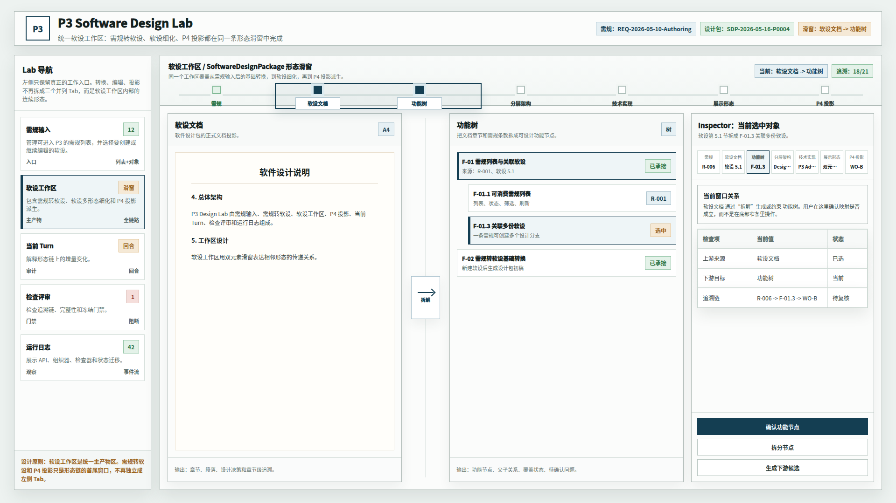
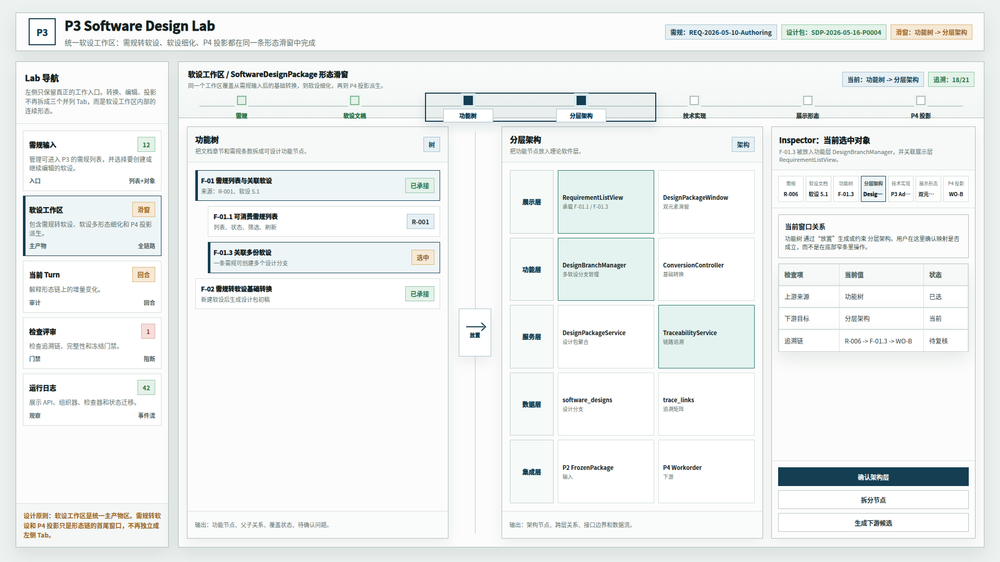
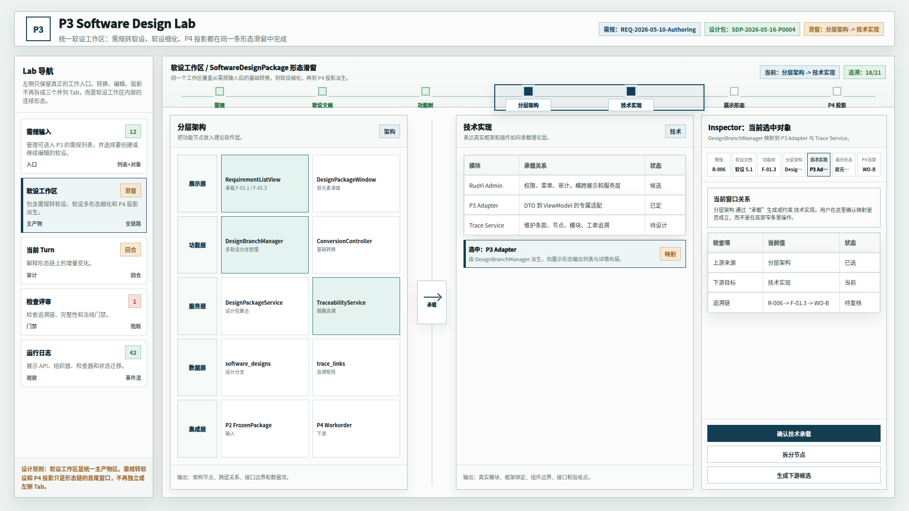
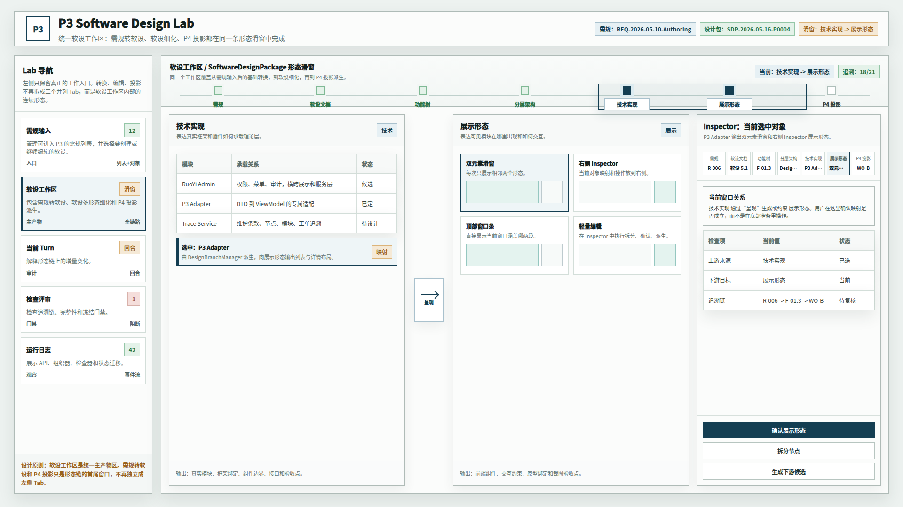
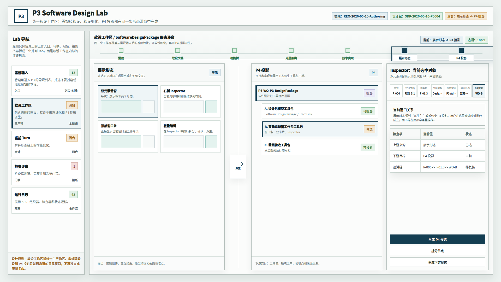

# CodeFactoryV2 P3 Design Lab 软设工作区合并 Tab 原型 v12

## 1. 元信息

- 版本包：`2026-05-16-190120-CodeFactoryV2-P3-Design-Lab软设工作区合并Tab原型-v12`
- 生成时间：2026-05-16 19:01:20
- 当前状态：待用户确认
- 所属范围：`P3` 软件设计系统 / `P3 Design Lab` / 软设工作区导航与形态滑窗
- 目标路由：后续实现时映射到 `P3 Design Lab` 软设工作区
- 页面主对象：统一软设工作区、双元素形态滑窗、右侧 Inspector
- 目标画板：桌面整页 `1920 x 1080`
- 源文件：`source/p3-design-lab-unified-design-workspace-prototype.html`

## 2. 本版定位

v11 已优化双元素滑窗排版。用户进一步指出：按这个逻辑，`需规转软设`、`软设工作区`、`P4 投影` 不应该继续作为三个并列 Tab，而应该合成一个 Tab，统一叫 `软设工作区`。

v12 按该逻辑调整导航事实源：

- `需规输入` 仍是独立入口，负责选择进入 P3 的需规和关联软设。
- `软设工作区` 成为统一主产物区，内部覆盖基础转换、软设文档、功能树、分层架构、技术实现、展示形态和 P4 投影。
- `P4 投影` 不再是左侧并列 Tab，而是软设工作区形态链末端窗口。
- `需规转软设` 不再是左侧并列 Tab，而是软设工作区形态链首段窗口。
- `当前 Turn`、`检查评审`、`运行日志` 仍作为辅助与审计入口保留。

## 3. 非目标

- 不做运行代码实现。
- 不覆盖 v10、v11 原型包。
- 不改变 v11 的双元素滑窗排版方向。
- 不把 P4 投影从形态链中移除。

## 4. 事实源与设计依据

- 用户 2026-05-16 批注：`需规转软设`、`软设工作区`、`P4 投影` 三个 Tab 应合成一个 `软设工作区`。
- v11 原型包：`DOC/CODEX_DOC/08_原型与附图/2026-05-16-183020-CodeFactoryV2-P3-Design-Lab双元素形态滑窗排版优化原型-v11/`

## 5. 导航调整说明

调整前左侧主入口：

- 需规输入
- 需规转软设
- 软设工作区
- P4 投影
- 当前 Turn
- 检查评审
- 运行日志

调整后左侧主入口：

- 需规输入
- 软设工作区
- 当前 Turn
- 检查评审
- 运行日志

其中 `软设工作区` 内部包含完整形态链：

`需规 -> 软设文档 -> 功能树 -> 分层架构 -> 技术实现 -> 展示形态 -> P4 投影`

## 6. 图文证据链

### 6.1 需规到软设文档滑窗



### 6.2 软设文档到功能树滑窗



### 6.3 功能树到分层架构滑窗



### 6.4 分层架构到技术实现滑窗



### 6.5 技术实现到展示形态滑窗



### 6.6 展示形态到 P4 投影滑窗



## 7. 原型到实现映射

| 原型区块 | 目标实现映射 |
| --- | --- |
| 左侧统一软设工作区入口 | `DesignWorkspaceNavItem` |
| 顶部形态滑窗轨道 | `MorphPairWindowTrack` |
| 滑窗观察框 | `MorphPairWindowFrame` |
| 双元素主视口 | `MorphPairViewport` |
| 左右形态卡片 | `MorphStageCard` |
| 中间传递桥 | `MorphPairBridge` |
| 右侧 Inspector | `MorphObjectInspector` |
| Inspector 追溯链 | `SelectedObjectTraceMap` |
| Inspector 操作 | `MorphObjectActions` |

## 8. 允许偏差与不可接受偏差

允许偏差：

- 真实实现可以在统一软设工作区内部增加二级视图切换或快捷定位。
- P4 投影可以在滑窗末端提供更强的树形编辑能力。
- 当前 Turn、检查评审、运行日志可以根据实现状态调整入口文案。

不可接受偏差：

- `需规转软设`、`软设工作区`、`P4 投影` 继续作为左侧三个并列 Tab。
- P4 投影从统一软设工作区形态链中断开。
- 基础转换被设计成与软设工作区无关的独立主流程。
- 主体重新同时展示三个或更多形态。

## 9. 查看与再生成

打开源文件：

```bash
xdg-open "DOC/CODEX_DOC/08_原型与附图/2026-05-16-190120-CodeFactoryV2-P3-Design-Lab软设工作区合并Tab原型-v12/source/p3-design-lab-unified-design-workspace-prototype.html"
```

重新生成截图：

```bash
base="$PWD/DOC/CODEX_DOC/08_原型与附图/2026-05-16-190120-CodeFactoryV2-P3-Design-Lab软设工作区合并Tab原型-v12"
html="$base/source/p3-design-lab-unified-design-workspace-prototype.html"
corepack pnpm --dir apps/web exec playwright screenshot --viewport-size=1920,1080 "file://$html#reqdoc" "$base/01-1920x1080-需规到软设文档滑窗.png"
corepack pnpm --dir apps/web exec playwright screenshot --viewport-size=1920,1080 "file://$html#docfunc" "$base/02-1920x1080-软设文档到功能树滑窗.png"
corepack pnpm --dir apps/web exec playwright screenshot --viewport-size=1920,1080 "file://$html#funcarch" "$base/03-1920x1080-功能树到分层架构滑窗.png"
corepack pnpm --dir apps/web exec playwright screenshot --viewport-size=1920,1080 "file://$html#archtech" "$base/04-1920x1080-分层架构到技术实现滑窗.png"
corepack pnpm --dir apps/web exec playwright screenshot --viewport-size=1920,1080 "file://$html#techshape" "$base/05-1920x1080-技术实现到展示形态滑窗.png"
corepack pnpm --dir apps/web exec playwright screenshot --viewport-size=1920,1080 "file://$html#shapep4" "$base/06-1920x1080-展示形态到P4投影滑窗.png"
```

## 10. 自检记录

- 2026-05-16：Playwright 渲染 6 张 `1920 x 1080` PNG。
- 2026-05-16：人工查看首图和末图，确认左侧不再存在 `需规转软设` 与 `P4 投影` 独立 Tab。
- 2026-05-16：确认首段窗口仍表达 `需规 -> 软设文档`，末段窗口仍表达 `展示形态 -> P4 投影`。
- 2026-05-16：`file *.png` 确认 6 张图片均为 `1920 x 1080`。
- 2026-05-16：`git diff --check` 通过。

## 11. 评审结论与后续处理

当前结论：待用户确认。

如果本版通过，建议将 v12 作为 P3 Design Lab 导航结构和软设工作区组织形式的实现基线。
