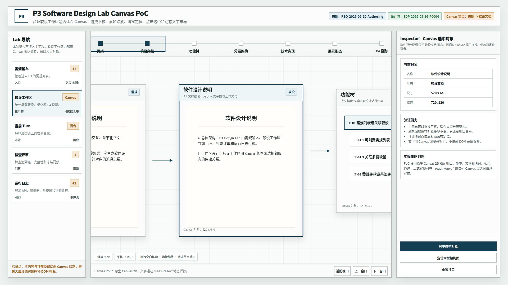

# CodeFactoryV2 P3 Design Lab 软设工作区 Canvas 验证 PoC v13

## 1. 元信息

- 版本包：`2026-05-16-193640-CodeFactoryV2-P3-Design-Lab软设工作区Canvas验证PoC-v13`
- 生成时间：2026-05-16 19:36:40
- 当前状态：待用户验证
- 所属范围：`P3` 软件设计系统 / `P3 Design Lab` / 软设工作区 Canvas 技术验证
- 是否接入主工程：否
- 是否修改业务代码：否
- 源文件：`source/p3-design-workspace-canvas-poc.html`
- 验证脚本：`source/verify-canvas-poc.mjs`
- 初始截图：`01-1920x1080-Canvas软设工作区初始态.png`

## 2. 验证目标

用户确认 v12 的业务组织形态后，提出关键技术判断：软设工作区已经是丰富场景编辑，不适合继续用传统 DIV 强排版。尤其是分层架构、技术实现、P4 投影等对象可能持续膨胀，必须支持拖拽、缩放和稳定文字布局。

本 PoC 验证：

- 顶部滑窗轴是否可以由 Canvas 绘制并驱动画布定位。
- 主软设长卷是否可以由 Canvas 承载，不因大对象膨胀撑坏页面。
- 鼠标拖拽平移是否可用。
- 滚轮缩放是否可用。
- 点击 Canvas 对象后，右侧 Inspector 是否可联动。
- Canvas `measureText` 动态折行是否能支撑中文说明文字。

## 3. 技术实现说明

本版采用原生 Canvas 2D，不引入主工程依赖，不接入 React 路由。

页面结构：

- 左侧导航：HTML，仅保留入口说明。
- 顶部形态滑窗：Canvas。
- 主软设长卷：Canvas。
- 右侧 Inspector：HTML，用于验证选中对象联动。

Canvas 内部对象模型：

`需规 -> 软设文档 -> 功能树 -> 分层架构 -> 技术实现 -> 展示形态 -> P4 投影`

其中 `分层架构` 被故意设计为大型对象，用于验证内容膨胀后是否通过视口拖拽查看，而不是撑开 DOM 布局。

## 4. 使用方式

打开验证页面：

```bash
xdg-open "DOC/CODEX_DOC/08_原型与附图/2026-05-16-193640-CodeFactoryV2-P3-Design-Lab软设工作区Canvas验证PoC-v13/source/p3-design-workspace-canvas-poc.html"
```

可测试动作：

- 拖拽主画布空白区：平移长卷。
- 滚轮：缩放长卷。
- 点击顶部滑窗轴节点：切换相邻形态窗口。
- 点击 Canvas 内对象：右侧 Inspector 更新。
- 点击 `定位大型架构图`：跳转到大型分层架构对象。
- 点击 `适配视口`：查看完整长卷压缩态。

## 5. 自动验证

运行：

```bash
node "DOC/CODEX_DOC/08_原型与附图/2026-05-16-193640-CodeFactoryV2-P3-Design-Lab软设工作区Canvas验证PoC-v13/source/verify-canvas-poc.mjs"
```

当前验证结果：

```text
Canvas PoC verification passed:
- 初始选中软设文档
- 定位大型架构图
- 大型图缩放低于初始
- 拖拽改变平移值
- 滚轮改变缩放值
- 下一窗口更新滑窗文案
initialZoom=缩放 90%; wideZoom=缩放 62%; zoomed=缩放 67%
initialPan=平移 -314,-3; draggedPan=平移 -1337,162
afterNext=Canvas 窗口：分层架构 -> 技术实现
```

## 6. 截图



## 7. 初步结论

本 PoC 支持继续走 Canvas 软设工作区方向。

建议后续正式实现分两层推进：

1. 视口与对象模型层：抽象 `CanvasViewportState`、`MorphCanvasNode`、`MorphCanvasEdge`、`CanvasTextLayout`。
2. 渲染实现层：先评估 `react-konva` 与自研 Canvas 2D 两种方案。若需要大量对象编辑、命中检测、变换控制，优先评估 `react-konva`；若需要完全控制文字布局和性能，保留自研 Canvas 2D 方案。

## 8. 非目标

- 本版不是最终视觉稿。
- 本版不实现真实数据接入。
- 本版不实现完整编辑器能力。
- 本版不接入 P3 主前端工程。
