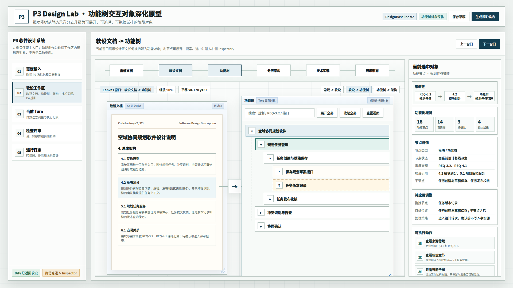

# CodeFactoryV2 P3 Design Lab 功能树交互对象原型 v14

## 1. 元信息

- 版本包：`2026-05-19-171300-CodeFactoryV2-P3-Design-Lab功能树交互对象原型-v14`
- 生成时间：2026-05-19 17:13:00
- 当前状态：待用户确认
- 所属范围：`P3` 软件设计系统 / `P3 Design Lab` / 软设工作区功能树交互对象
- 对应补充设计：`DOC/CODEX_DOC/02_设计说明/P3_软件设计系统/P3-软件设计系统设计-260519-功能树交互对象深化补充案.md`
- 目标画板：桌面整页 `1920 x 1080`
- 源文件：`source/p3-function-tree-interactive-object-prototype.html`

## 2. 本版定位

本版原型用于验证“功能树”阶段对象深化后的界面形态。重点不是替换整个 `P3 Design Lab`，而是展示 `软设文档 -> 功能树` 这个滑窗中，功能树如何从静态示意分支升级为可交互对象。

本版覆盖：

- 左侧仍保留统一 `软设工作区` 主入口。
- 中间 Canvas 展示 `软设文档` 与 `功能树` 两个阶段对象。
- `功能树` 主体只保留搜索、展开、收起、层级结构和选中状态。
- 统计、追溯数量、待确认、派生来源、待应用调整和副编辑动作统一放入右侧 `Inspector`。
- 右侧 `Inspector` 随功能节点选择展示追溯链、功能树概览、节点详情、待应用调整和动作。
- 拖拽节点只形成“待应用调整”，确认前不改写设计基线。

## 3. 非目标

- 不做运行代码实现。
- 不覆盖 v12 统一软设工作区原型。
- 不要求 Dify 已经输出完整 `functional_tree_projection`。
- 不把原型中的派生功能树当作后端事实源。
- 不在本版展示所有滑窗，只聚焦 `软设文档 -> 功能树`。

## 4. 图文证据链

### 4.1 功能树交互对象深化图



## 5. 原型到实现映射

| 原型区块 | 目标实现映射 |
| --- | --- |
| 功能树对象外壳 | `FunctionTreeStageObject` / 后续 `StageObjectFrame` |
| 树工具区 | `FunctionTreeToolbar` |
| 搜索与展开 | `FunctionTreeViewState` |
| 精简树节点 | `FunctionTreeNodeViewModel` + `antd Tree titleRender` |
| 拖拽试排提示 | `FunctionTreeDropEvent` + Inspector 待应用调整状态 |
| 右侧节点详情 | `function_node` 类型 `DesignMorphSelection` |
| 追溯链 | `sourceRefs` + `designRefs` 展示 |
| 功能树统计与派生标识 | `FunctionTreeViewModel.summary` + `origin`，仅在 Inspector 展示 |

## 6. 查看与再生成

打开源文件：

```bash
xdg-open "DOC/CODEX_DOC/08_原型与附图/2026-05-19-171300-CodeFactoryV2-P3-Design-Lab功能树交互对象原型-v14/source/p3-function-tree-interactive-object-prototype.html"
```

重新生成截图：

```bash
base="$PWD/DOC/CODEX_DOC/08_原型与附图/2026-05-19-171300-CodeFactoryV2-P3-Design-Lab功能树交互对象原型-v14"
html="$base/source/p3-function-tree-interactive-object-prototype.html"
corepack pnpm --dir apps/web exec playwright screenshot --viewport-size=1920,1080 "file://$html" "$base/01-1920x1080-软设文档到功能树交互对象深化图.png"
```

## 7. 自检记录

- 2026-05-19：创建 HTML 原型源文件。
- 2026-05-19：使用 Playwright 导出 `1920 x 1080` PNG。
