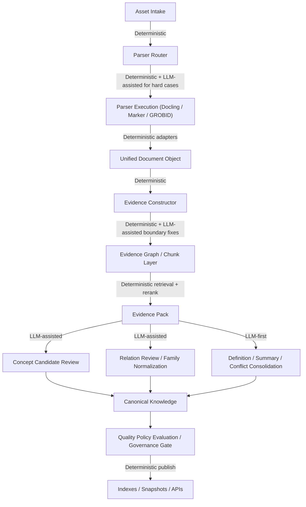

# 知识抽取目标流程蓝图

## 文档目的

本文件用于将知识仓库从原材料到可发布知识的目标处理流程正式固化为项目蓝图。

本蓝图服务于三个目标：

1. 作为后续知识仓库流程重构的统一依据
2. 作为前端“总览 + 运行中心 + 策略/质量”页面重构的结构基础
3. 作为后续质量策略、可视化、运行监控和审计设计的阶段边界定义

本文件只定义目标流程，不直接约束当前代码必须立即实现全部阶段。

## 流程总图

## 设计原则

### 1. 内容生产与技术执行分层

目标流程必须同时区分：

1. 内容对象如何形成
2. 技术工具如何执行
3. 质量标准如何判断

不能再将“抽取逻辑”“工具调用”“质量门槛”混写在一个阶段里。

### 2. 证据中轴化

`Unified Document Object -> Evidence Constructor -> Evidence Graph / Chunk Layer -> Evidence Pack` 是本蓝图的中轴。

所有候选知识、关系、定义、冲突整合都应建立在“证据可追溯、证据可组合、证据可展示”的基础上。

### 3. Canonical 与 Publish 分层

`Canonical Knowledge` 不等于最终发布知识。

`Quality Policy Evaluation / Governance Gate` 是 Canonical 进入 Publish 之前的正式门禁，用于：

1. 判断是否达到内容质量要求
2. 判断是否满足治理状态要求
3. 形成“通过 / 阻断 / 告警 / 人工复核”结论

### 4. 阶段显式化

后续所有运行监控、页面可视化和状态表达都应围绕本蓝图中的阶段，而不是围绕当前零散实现细节。

## 阶段定义

### 1. Asset Intake

#### 定义

原材料接入阶段，负责登记原始文件的来源、归属、接入方式和基本元数据。

#### 输入

- 本地素材目录
- 上传文件
- 外部归档包解压结果

#### 输出

- 已登记的素材记录
- 素材路径和摘要信息
- 素材来源归属信息

#### 关注点

- 文件从哪里来
- 属于哪个知识库
- 是目录扫描接入还是人工上传接入

### 2. Parser Router

#### 定义

解析器路由阶段，负责根据文件类型、内容特征、版式复杂度和已知规则，决定该文件进入哪个解析器。

#### 输入

- 已登记素材记录

#### 输出

- 解析策略选择结果
- 路由原因
- 高风险文件的补充判断记录

#### 处理原则

- 以确定性规则为主
- 对难样本可引入 LLM 辅助判路由
- 路由结果必须可解释

### 3. Parser Execution

#### 定义

执行具体解析器，将原始文件转为结构化文档表示。

#### 输入

- 路由结果
- 原始文件

#### 输出

- 解析结果
- 解析器执行元数据
- 解析告警和失败信息

#### 说明

当前可将 `Docling` 视为主实现路径，`Marker / GROBID` 为扩展槽位，不要求第一阶段全部落地。

### 4. Unified Document Object

#### 定义

统一文档对象层，用于消除不同解析器输出差异，形成后续阶段统一消费的标准文档结构。

#### 输入

- 各解析器输出

#### 输出

- 统一文档对象

#### 作用

- 成为后续证据构造、分块、抽取、对比和展示的单一标准输入

### 5. Evidence Constructor

#### 定义

从统一文档对象中构建基础证据单元，形成可定位、可引用、可追踪的证据对象。

#### 输入

- Unified Document Object

#### 输出

- 证据片段
- 锚点信息
- 证据元数据

#### 作用

- 将“解析结果”转化为“可支撑知识判断的证据对象”

### 6. Evidence Graph / Chunk Layer

#### 定义

将证据单元组织成 chunk 和证据关系层，既保留局部块信息，也保留块间关联。

#### 输入

- 证据单元

#### 输出

- chunk
- chunk 之间的连接关系
- 证据图谱

#### 处理原则

- 以确定性边界划分为主
- 对边界修正和特殊结构可使用 LLM 辅助

### 7. Evidence Pack

#### 定义

围绕具体任务目标，从 chunk / evidence graph 中检索、筛选、重排，形成面向任务的证据包。

#### 输入

- chunk
- 证据图谱

#### 输出

- 概念候选证据包
- 关系候选证据包
- 定义与冲突整合证据包

#### 作用

- 统一后续知识任务的输入语义

### 8. Concept Candidate Review

#### 定义

从证据包中提取并审视概念候选项，形成候选实体、事件、流程等知识对象。

#### 输入

- Concept Evidence Pack

#### 输出

- 概念候选集合
- 候选置信度
- 候选证据链

### 9. Relation Review / Family Normalization

#### 定义

从证据包中提取关系，并完成家族归一、别名归并、近重候选聚合等工作。

#### 输入

- Relation Evidence Pack

#### 输出

- 关系候选集合
- 家族归一结果
- 归并说明

### 10. Definition / Summary / Conflict Consolidation

#### 定义

围绕证据包生成定义、摘要，并对冲突证据和冲突表述进行整理和归并。

#### 输入

- Definition / Summary Evidence Pack

#### 输出

- 定义
- 摘要
- 冲突说明
- 差异整合结果

### 11. Canonical Knowledge

#### 定义

将概念候选、关系候选、定义与冲突整合结果归一成规范知识对象。

#### 输入

- 候选项
- 关系项
- 定义与冲突整合结果

#### 输出

- 规范知识对象
- 工作态规范图结构

#### 说明

该阶段代表“规范化结果”，但尚不代表“可发布结果”。

### 12. Quality Policy Evaluation / Governance Gate

#### 定义

对 Canonical Knowledge 进行质量策略评估和治理门禁判断。

#### 输入

- Canonical Knowledge
- 当前知识库绑定的质量策略
- 治理状态

#### 输出

- 可发布集合
- 阻断集合
- 告警集合
- 人工复核集合
- 评估解释

#### 放置位置

该阶段明确位于：

`Canonical Knowledge -> Indexes / Snapshots / APIs`

#### 设立理由

1. Canonical 不等于可发布
2. 内容质量策略必须在规范对象形成后统一判断
3. 发布前需要一个正式、可解释、可展示的门禁阶段

### 13. Indexes / Snapshots / APIs

#### 定义

将通过门禁的知识对象发布为快照、索引和 API 能力。

#### 输入

- Quality Gate 通过后的结果

#### 输出

- 发布快照
- 图谱索引
- 对外查询接口

## 当前项目与目标蓝图的关系

当前项目已经具备以下雏形：

1. 素材扫描与上传接入
2. 以 `Docling` 为主的正式解析链
3. 统一知识 JSON 产物
4. working / curated / published 的基本分层
5. 候选审核与发布接口

但仍缺以下关键中间层：

1. 正式 Parser Router
2. 一等 Unified Document Object
3. 正式 Evidence Constructor
4. 正式 Evidence Pack
5. 独立的 Quality Policy Evaluation / Governance Gate

## 与前端重构的关系

本蓝图将直接作为“知识库管理页”重构依据。

后续页面设计不再围绕“点抽取 + 看状态”，而是围绕以下三类问题组织：

1. 当前知识库整体处于什么状态
2. 当前或历史运行在每个阶段发生了什么
3. 当前策略和质量门禁是如何影响结果的

因此后续知识库管理页建议重构为：

1. 总览
2. 运行中心
3. 策略 / 质量

## 后续建议

在本蓝图之后，建议继续按以下顺序推进：

1. 固化知识库管理页重构信息架构
2. 明确每个阶段需要对前端暴露的最小信息集合
3. 再决定哪些阶段先落代码、哪些阶段先做可视化壳子
