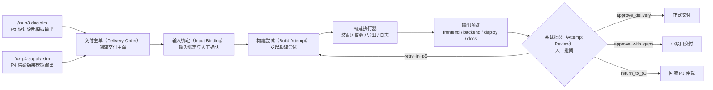
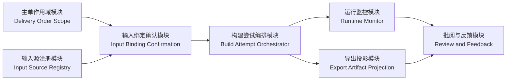
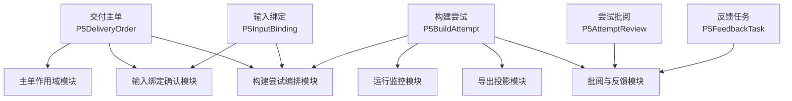
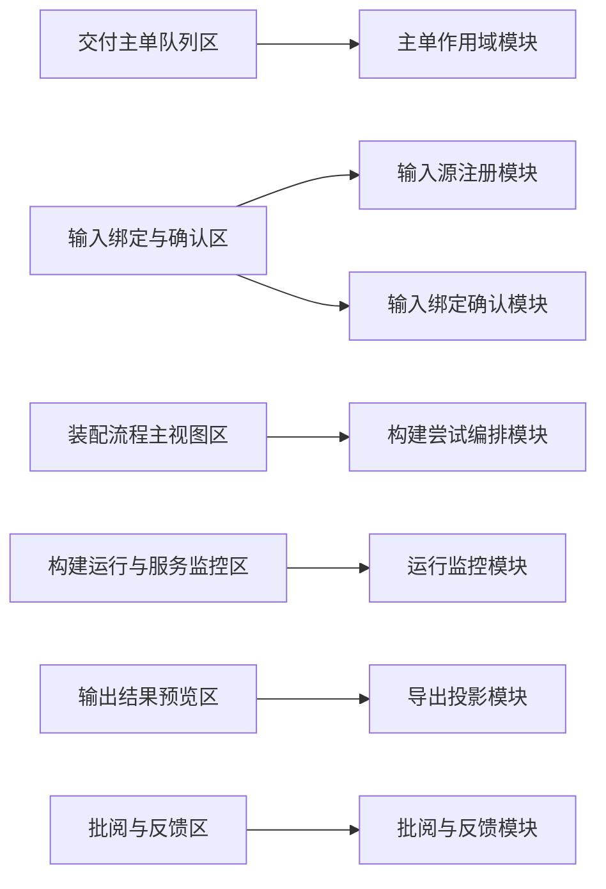

# P5.1 最小构建闭环设计

> 工作层说明：本文件是 `P5.1` 的专项设计草案，已在同一轮同步到正式文档 `DOC/CODEX_DOC/02_设计说明/07A-P5.1-最小构建闭环设计.md`。若后续继续修改本文件，必须同步回写正式文档根目录。

**日期：** 2026-04-20

**对应节点：**
- `P5.1` 最小构建闭环

## 1. 设计定位

`P5` 总体设计不能替代 `P5.1` 节点专项设计。

`P5.1` 必须单独锁定以下内容：

- 最小闭环到底消费什么输入
- 页面到底由哪些工作区组成
- 订单、构建尝试、人工批阅、反馈任务如何流转
- `P3` 与 `P4` 的模拟输出在 `P5.1` 中分别叫什么、放在哪里

当前已有的演示工作台与 `bootstrap demo` 只能视为旧原型，不视为 `P5.1` 已完成的正式基线。

## 2. 目标与边界

`P5.1` 的目标不是“先把目录导出来”，而是形成一条可审查的最小交付闭环：

`P3` 冻结设计说明输入 -> `P4` 已供给结果输入 -> 创建 `P5` 交付主单 -> 绑定输入 -> 发起构建尝试 -> 形成导出结果 -> 人工批阅 -> 交付或回流

`P5.1` 首版必须同时具备：

- 前端独立工作台
- 后端交付主单服务
- 后端构建尝试服务
- 后端运行监控与日志查询
- 后端人工批阅与反馈任务服务
- `P3 / P4` 最小模拟输出接入

`P5.1` 首版不负责：

- 多执行器并行调度
- 全量真实代码生成
- 自动重试编排
- 完整回流追溯图谱

这些属于 `P5.2 / P5.3`。

## 3. 输入输出契约

### 3.1 `P3` 正式输入

`P5.1` 的 `P3` 主输入不是 `xx-p3-sim` 的工具包页面，而是 `P3` 冻结后的设计说明投影。

`P5.1` 首版至少消费以下 `P3` 信息：

- `p3_order_id`
- `requirement_spec_id`
- `software_design_description_id`
- `software_design_baseline_id`
- `application_name`
- `frozen_at`
- 模块摘要
- 设计约束摘要

这里必须明确：

- `xx-p3-sim` 继续承担 `P3 -> P4` 的工具包 / 工单包模拟输入角色
- `P5.1` 不复用 `xx-p3-sim` 充当“设计说明输入台”

### 3.2 `P4` 正式输入

`P5.1` 的 `P4` 输入是已审定、已可查询/可获取的供给结果快照。

最小输入语义至少包括：

- `supply_snapshot_id`
- `tool_demand_sheet_id`
- `reviewed_item_count`
- `supplied_result_refs`
- `unresolved_items`
- `reviewed_at`

### 3.3 `P5.1` 模拟输入命名

`P5.1` 首版新增两类专门模拟输入：

1. `/xx-p3-doc-sim`
   - 只负责模拟 `P3` 冻结设计说明输出
   - 不承担 `P3 -> P4` 工具包发单职责

2. `/xx-p4-supply-sim`
   - 只负责模拟 `P4` 已供给结果输出
   - 不承担 `P4` 内部审定和研制推进职责

命名约束固定如下：

- `/xx-p3-sim`：保留给 `P3 -> P4` 工具包 / 工单包输入链
- `/xx-p3-doc-sim`：专供 `P5.1` 消费 `P3` 设计说明模拟输出
- `/xx-p4-supply-sim`：专供 `P5.1` 消费 `P4` 供给结果模拟输出

### 3.4 `P5.1` 输出

`P5.1` 每次构建尝试至少输出三层结果：

1. 运行事实层
   - `P5BuildAttempt`
   - `P5AttemptReview`

2. 导出物层
   - `frontend/`
   - `backend/`
   - `deploy/`
   - `docs/`
   - `build-manifest.json`

3. 回流层
   - `P5FeedbackTask`
   - `gap-list.md`
   - `delivery-review.md`

## 4. 最小闭环总流程

## 5. 核心对象模型

对象模型回答的是“系统里有哪些稳定事实对象、它们各自保存什么数据”。

它不等于模块设计。

- 对象模型：定义事实载体、字段、状态和关系
- 模块设计：定义职责边界、处理流程和页面/服务归属

因此，`P5.1` 必须同时存在“对象模型”和“模块设计”两层，不能用其中一层替代另一层。

### 5.1 交付主单（Delivery Order / `P5DeliveryOrder`）

主单是 `P5.1` 的第一核心对象。

最小字段至少包括：

- `delivery_order_id`
- `p3_order_id`
- `requirement_spec_id`
- `application_name`
- `status`
- `input_binding_status`
- `latest_attempt_id`
- `review_status`
- `created_at`
- `updated_at`

最小状态至少包括：

- `binding_pending`
- `ready_for_build`
- `building`
- `review_pending`
- `delivered`
- `delivered_with_gaps`
- `returned_to_p3`
- `failed`

### 5.2 输入绑定（Input Binding / `P5InputBinding`）

`P5.1` 不能跳过输入确认。

因此必须显式存在一个输入绑定对象，用于记录本次主单到底绑定了什么：

- `binding_id`
- `delivery_order_id`
- `p3_doc_source_kind`
- `p3_doc_source_id`
- `p4_supply_source_kind`
- `p4_supply_source_id`
- `confirmed_by`
- `confirmed_at`
- `binding_notes`

对象关系约束固定如下：

- 一张交付主单下允许存在多版输入绑定
- 同一时刻只能有 1 个 `active_binding`
- 没有 `active_binding` 的交付主单，不允许进入 `ready_for_build`

### 5.3 构建尝试（Build Attempt / `P5BuildAttempt`）

尝试单记录每一轮实际构建事实。

最小字段至少包括：

- `attempt_id`
- `delivery_order_id`
- `sequence`
- `status`
- `assembly_summary`
- `runtime_snapshot`
- `validation_summary`
- `export_root`
- `exported_files`
- `gap_summary`
- `created_at`
- `updated_at`

最小状态至少包括：

- `queued`
- `assembling`
- `validating`
- `exported`
- `review_pending`
- `retry_required`
- `returned_to_p3`
- `approved_delivery`
- `approved_with_gaps`
- `failed`

对象关系约束固定如下：

- 每次构建尝试必须绑定到 1 个明确的 `binding_id`
- 一张交付主单下允许存在多次构建尝试
- 当前页面默认只展开当前主单下的“最近一次尝试”或人工选中的某次尝试

### 5.4 尝试批阅（Attempt Review / `P5AttemptReview`）

`P5.1` 必须有人工批阅层，不能只有“导出完毕”。

最小字段至少包括：

- `review_id`
- `attempt_id`
- `decision`
- `reviewer`
- `review_comment`
- `created_feedback_task_ids`
- `created_at`

最小决策固定为：

- `approve_delivery`
- `approve_with_gaps`
- `retry_in_p5`
- `return_to_p3`

对象关系约束固定如下：

- 批阅评的是某次构建尝试，不是直接评交付主单
- 批阅结论会反写当前尝试状态，并进一步影响交付主单状态

### 5.5 反馈任务（Feedback Task / `P5FeedbackTask`）

反馈任务是 `P5.1` 的正式输出之一。

最小字段至少包括：

- `task_id`
- `attempt_id`
- `kind`
- `title`
- `detail`
- `target_stage`
- `status`

其中 `kind` 至少包括：

- `design_gap`
- `supply_gap`
- `assembly_or_build_gap`

## 6. 核心功能模块设计

模块设计回答的是“谁负责处理什么动作、接什么输入、产什么输出、依赖谁”。

### 6.1 模块清单

`P5.1` 首版固定拆成以下 7 个核心功能模块：

1. 主单作用域模块（Delivery Order Scope）
2. 输入源注册模块（Input Source Registry）
3. 输入绑定确认模块（Input Binding Confirmation）
4. 构建尝试编排模块（Build Attempt Orchestrator）
5. 运行监控模块（Runtime Monitor）
6. 导出投影模块（Export Artifact Projection）
7. 批阅与反馈模块（Review and Feedback）

### 6.2 模块职责、输入和输出

| 模块 | 主要职责 | 可接受输入 | 产出输出 |
| --- | --- | --- | --- |
| 主单作用域模块 | 创建主单、切换当前主单、维护当前作用域根 | 创建主单请求、主单选择动作 | 当前主单上下文、当前主单状态 |
| 输入源注册模块 | 提供可供绑定的 `P3 DOC` 与 `P4 Supply` 输入候选集 | `P3 DOC` 模拟输出、`P4 Supply` 模拟输出、正式输入登记 | 可绑定输入列表 |
| 输入绑定确认模块 | 在当前主单下创建、切换、确认有效输入绑定 | `p3_doc_source_id`、`p4_supply_source_id`、确认动作 | `P5InputBinding`、`active_binding` |
| 构建尝试编排模块 | 基于有效绑定发起构建尝试并生成装配计划 | `binding_id`、导出配置、重试动作 | `P5BuildAttempt`、装配摘要 |
| 运行监控模块 | 展示执行阶段、日志、阻塞原因、服务状态 | `attempt_id` | 运行快照、阶段日志 |
| 导出投影模块 | 投影导出目录、关键文件、清单、缺口文件 | `attempt_id` | 输出目录树、`manifest`、`gap-list` |
| 批阅与反馈模块 | 接收人工批阅、生成反馈任务、反写状态 | `attempt_id`、批阅决策、批阅意见 | `P5AttemptReview`、`P5FeedbackTask` |

### 6.3 模块依赖关系图

## 7. 对象模型与模块设计关系

对象不是模块，模块也不是对象。

- 对象负责保存事实
- 模块负责消费事实、生成新事实、驱动状态变化

### 7.1 对象归属映射

| 对象 | 主要归属模块 | 被哪些模块消费 |
| --- | --- | --- |
| 交付主单（`P5DeliveryOrder`） | 主单作用域模块 | 输入绑定确认模块、构建尝试编排模块、批阅与反馈模块 |
| 输入绑定（`P5InputBinding`） | 输入绑定确认模块 | 构建尝试编排模块、页面输入绑定区 |
| 构建尝试（`P5BuildAttempt`） | 构建尝试编排模块 | 运行监控模块、导出投影模块、批阅与反馈模块 |
| 尝试批阅（`P5AttemptReview`） | 批阅与反馈模块 | 主单作用域模块、页面批阅区 |
| 反馈任务（`P5FeedbackTask`） | 批阅与反馈模块 | 页面批阅区、后续 `P5.3` 回流链 |

### 7.2 对象与模块关系图

## 8. 数据驱动关系与作用域切换规则

### 8.1 两层数据作用域

`/build` 页面固定区分两层数据：

1. 全局参考层
   - 可选 `P3 DOC` 输入源列表
   - 可选 `P4 Supply` 输入源列表
   - 主单队列列表
   - 枚举、状态字典、校验规则

2. 当前主单作用域层
   - 当前主单上下文
   - 当前 `active_binding`
   - 当前默认选中的构建尝试
   - 当前构建尝试的装配、运行、导出、批阅、反馈

### 8.2 切换交付主单时的替换规则

当 `current_delivery_order_id` 被切换时，必须整体替换当前主单作用域层中的以下数据：

- 当前主单上下文
- 当前激活输入绑定
- 当前默认选中的构建尝试
- 装配流程投影
- 运行监控快照
- 输出结果预览
- 批阅记录
- 反馈任务列表

以下数据不应因为切换主单而丢失：

- 输入候选集
- 主单队列本身
- 状态枚举和决策枚举

### 8.3 输入绑定确认对数据层的影响

输入绑定与确认区只允许写入当前主单作用域层，不允许直接改写全局参考层。

确认动作至少会产生以下变化：

- 在当前主单下创建或切换 `active_binding`
- 把主单状态从 `binding_pending` 推进到 `ready_for_build`
- 刷新当前主单可发起的构建参数

没有有效绑定确认时：

- 不允许发起新的构建尝试
- 不允许把主单置为可交付

### 8.4 构建尝试与批阅对数据层的影响

发起构建尝试至少会写入：

- 新的 `P5BuildAttempt`
- 当前构建尝试的运行快照
- 当前构建尝试的导出投影

人工批阅至少会写入：

- 新的 `P5AttemptReview`
- 当前构建尝试状态
- 当前主单状态
- 新增反馈任务

## 9. 页面级交互设计与模块映射

### 9.1 页面入口与壳层

`P5.1` 正式入口固定为 `/build`。

页面必须采用独立工作台壳层，并满足：

- 不显示知识库主导航
- 不因切换工作区而跳离当前订单上下文
- 当前选中的主单、构建尝试、批阅结论在同一页面内可持续回看

### 9.2 页面区块

`P5.1` 首版页面固定为 6 个区块：

1. 交付主单队列区
2. 输入绑定与确认区
3. 装配流程主视图区
4. 构建运行与服务监控区
5. 输出结果预览区
6. 批阅与反馈区

### 9.3 页面区块到模块映射

| 页面区块 | 对应模块 | 读取数据 | 写入数据 | 会影响的后续模块 |
| --- | --- | --- | --- | --- |
| 交付主单队列区 | 主单作用域模块 | 主单列表、主单状态 | 当前主单选择 | 输入绑定确认模块、构建尝试编排模块、批阅与反馈模块 |
| 输入绑定与确认区 | 输入源注册模块 + 输入绑定确认模块 | `P3 DOC` 输入候选、`P4 Supply` 输入候选、当前绑定 | `active_binding`、确认状态 | 构建尝试编排模块 |
| 装配流程主视图区 | 构建尝试编排模块 | 当前构建尝试装配计划 | 无直接写入 | 运行监控模块、导出投影模块 |
| 构建运行与服务监控区 | 运行监控模块 | 阶段、日志、阻塞原因 | 重试请求 | 构建尝试编排模块 |
| 输出结果预览区 | 导出投影模块 | 导出目录、关键文件、清单 | 无直接写入 | 批阅与反馈模块 |
| 批阅与反馈区 | 批阅与反馈模块 | 当前构建尝试结果、缺口、已有反馈任务 | 批阅决策、反馈任务 | 主单作用域模块、后续 `P5.3` |

### 9.4 页面-模块关系图

### 9.5 关键交互

交付主单队列区至少支持：

- 查看主单列表
- 切换当前主单
- 查看该主单最近一次批阅结果

输入绑定与确认区至少支持：

- 绑定 `/xx-p3-doc-sim` 输出
- 绑定 `/xx-p4-supply-sim` 输出
- 显式确认本次输入组合

装配流程主视图区至少支持：

- 查看模块装配路径
- 区分已命中供给、占位装配、阻塞模块

构建运行与服务监控区至少支持：

- 查看执行阶段
- 查看最近日志
- 查看服务状态与阻塞原因

输出结果预览区至少支持：

- 查看导出目录结构
- 查看关键文件摘要
- 查看构建清单和缺口清单

批阅与反馈区至少支持：

- 做出 4 类批阅决策
- 录入批阅意见
- 生成回流任务

## 10. 后端最小服务设计

`P5.1` 首版至少需要以下服务接口族：

### 10.1 主单与输入绑定

- `POST /api/software-build/orders`
- `GET /api/software-build/orders`
- `GET /api/software-build/orders/{delivery_order_id}`
- `POST /api/software-build/orders/{delivery_order_id}/bindings`

### 10.2 构建尝试与运行监控

- `POST /api/software-build/orders/{delivery_order_id}/attempts`
- `GET /api/software-build/attempts/{attempt_id}`
- `GET /api/software-build/attempts/{attempt_id}/monitor`

### 10.3 人工批阅与反馈任务

- `POST /api/software-build/attempts/{attempt_id}/reviews`
- `GET /api/software-build/attempts/{attempt_id}/reviews`
- `GET /api/software-build/feedback-tasks`

### 10.4 模拟输入接入

- `POST /api/software-build/sim-inputs/p3-doc`
- `POST /api/software-build/sim-inputs/p4-supply`

禁止把用户主入口设计成单个 `bootstrap demo` 动作。

若保留开发辅助初始化接口，也只能作为开发便利能力，不得替代正式页面入口和正式状态流。

## 11. 验收口径

`P5.1` 只有同时满足以下条件，才算达到可评审状态：

1. 存在独立 `P5` 工作台 `/build`
2. 存在独立的 `/xx-p3-doc-sim` 与 `/xx-p4-supply-sim`
3. `P5` 页面显式存在主单、输入绑定、构建尝试、运行监控、输出预览、人工批阅 6 个区块
4. 后端存在主单、构建尝试、运行监控、批阅、反馈任务这 5 类最小服务能力
5. 批阅决策至少支持 `approve_delivery / approve_with_gaps / retry_in_p5 / return_to_p3`
6. 能从一组模拟输入形成一次可导出、可批阅、可回流的最小循环

## 12. 与后续节点的关系

- `P5.2` 在 `P5.1` 之上补执行器深化、重试、多轮对比、正式校验闭合
- `P5.3` 在 `P5.1` 之上补回流仲裁链、跨阶段追溯和反馈任务闭环

因此，`P5.3` 的缺口回流绝不能替代 `P5.1` 的订单、批阅和最小构建闭环。

## 13. 风格继承与正式同步要求

阶段级工作台风格放在 `DOC/CODEX_DOC/02_设计说明/07-P5-软件构建系统设计.md` 中固定。

`P5.1` 工作层过程稿只继承并补充节点例外，当前口径固定为：

- 继承 `P4` 当前已被接受的轻灰画布、浅色页头、白色卡片、分段标签、低饱和活动态
- 不采用深色英雄区
- 不采用门户式顶部导航壳
- 只在主单选中态、运行日志区、缺口提示区和输出预览区做局部例外

若本文件后续继续修改，必须先判断改动属于：

- 节点级模块、页面映射、关键交互
- 还是阶段级边界、阶段级工作台风格

前者回写 `07A`，后者同时回写 `07-P5`。
